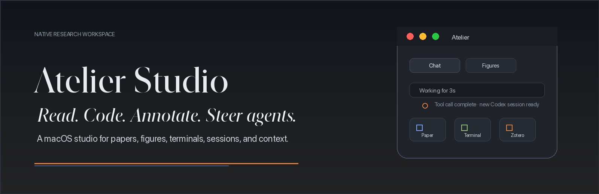
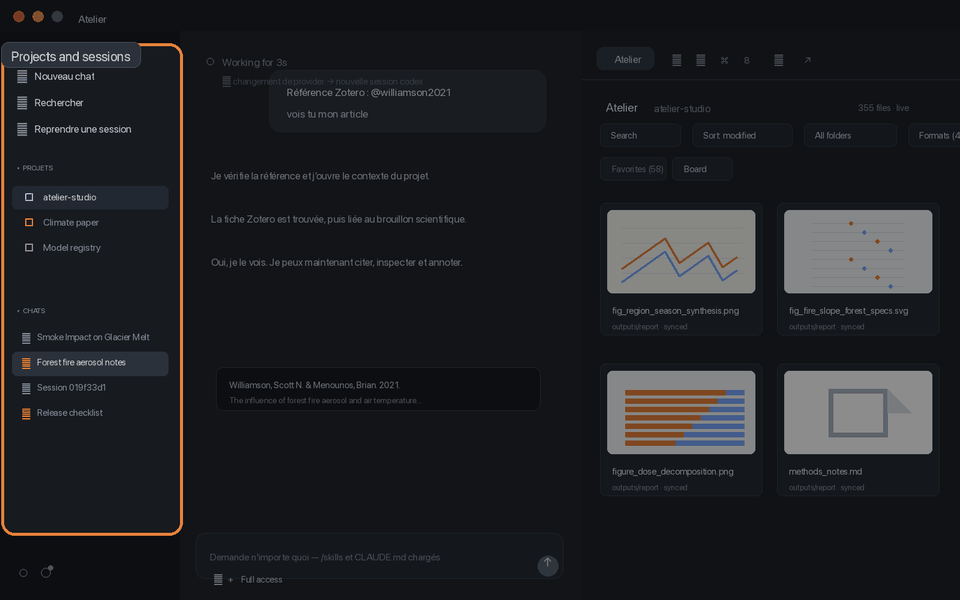
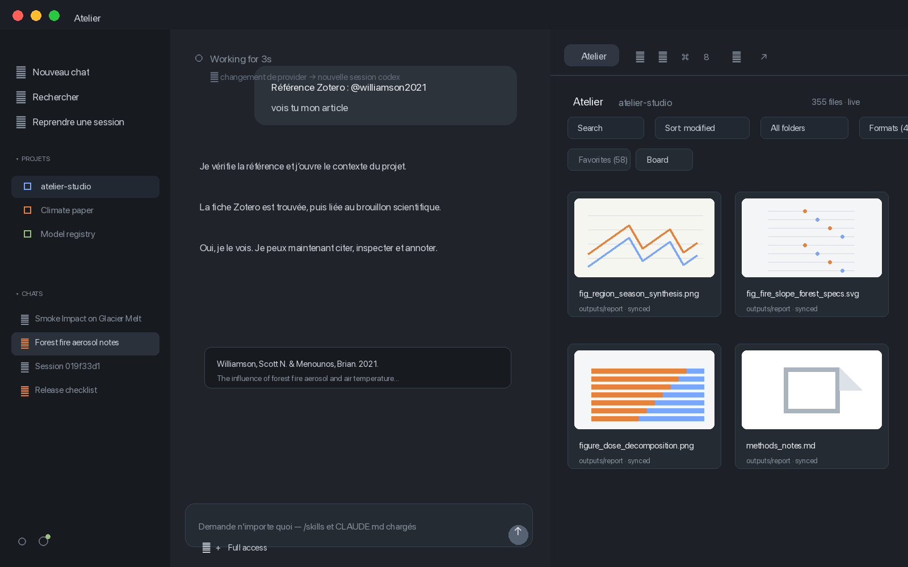
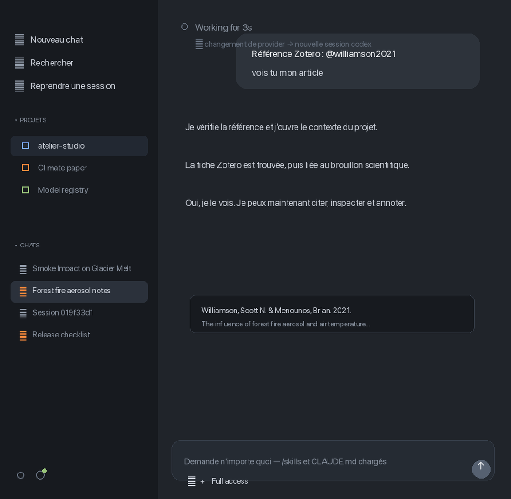
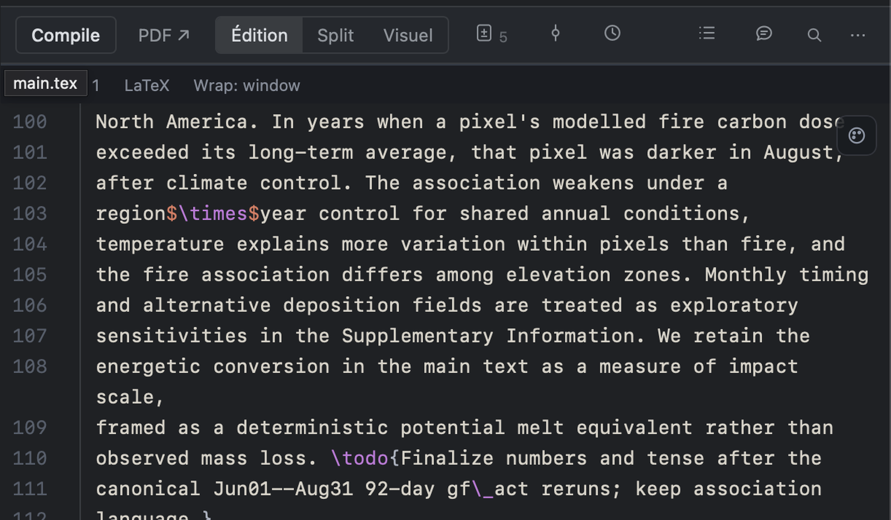
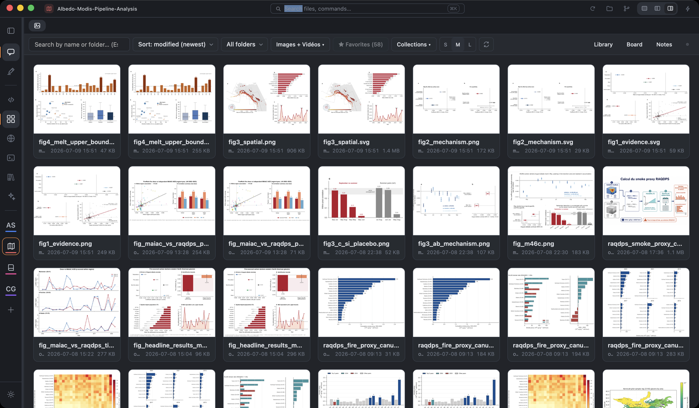
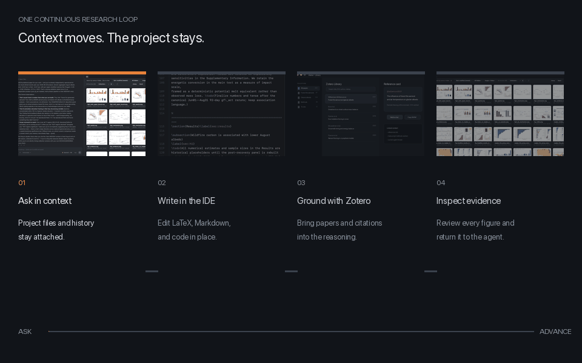
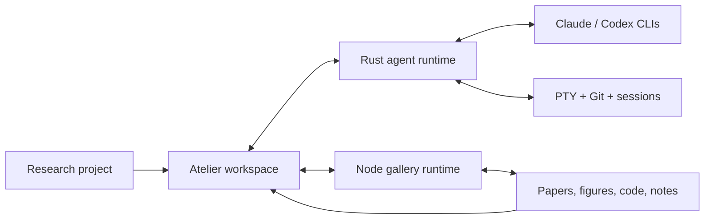

<p align="center">
  
</p>

<p align="center">
  <strong>An agentic environment for building, organizing, and advancing a research project.</strong>
</p>

<p align="center">
  
  
  
  
  
</p>

Atelier Studio keeps the working memory of a research project in one native macOS environment: agent conversations, papers, figures, code, terminals, annotations, project files, and verification state. Instead of moving fragments between unrelated tools, you can ask, inspect, organize, and produce inside the same project context.

## Research, coordinated

<p align="center">
  
</p>

The interface is organized around a continuous research loop:

1. **Ask in context** — Claude and Codex work against the active project, its files, references, instructions, and prior sessions.
2. **Inspect the evidence** — open papers, figures, PDFs, SVGs, LaTeX, Markdown, code, and generated outputs without leaving the workspace.
3. **Organize the project** — keep sessions, favorites, collections, annotations, and project state scoped to the research folder.
4. **Advance the work** — send evidence back to the agent, edit the source, verify the result, and preserve the trail.

## One project, one working memory

<p align="center">
  
</p>

Atelier treats the project as the primary unit of work. The sidebar carries its sessions and working state; the conversation carries reasoning and actions; the atelier carries the evidence being read or produced. Switching surfaces does not discard the project context.

### Work with agents, not isolated chat boxes

<p align="center">
  
</p>

- Claude and Codex can coexist in the same project workflow.
- CLI sessions resume with their real working directory and permissions.
- Files, pasted images, Zotero references, goals, and generated figures can enter the conversation as explicit context.
- Tool activity, diffs, review state, interruption, fork, and revert remain visible without overwhelming the transcript.

### Write and cite inside the project

<p align="center">
  
</p>

The scientific IDE keeps LaTeX, Markdown, code, source/PDF synchronization, comments, diffs, and compilation close to the research conversation. Editing is not a detached final step: it is part of the same project loop as reasoning and verification.

<p align="center">
  
</p>

The local Zotero library brings papers, collections, citekeys, BibTeX, PDFs, and reference metadata directly into the active project. Sources can move into the agent context without breaking the trail between a claim and its evidence.

### Inspect what the project produces

<p align="center">
  
</p>

The per-project atelier is more than an image browser. It is a live index of research artifacts with search, formats, folders, favorites, collections, viewers, editors, annotations, and **Add to chat**. Figures remain connected to the files and conversations that produced them.

### Move evidence through the loop

<p align="center">
  
</p>

Open a figure, inspect the source, annotate a result, compare outputs, then return the relevant evidence to the agent. The interaction is designed around continuity: the next research action should happen where the context already exists.

## Research surfaces

| Surface | Role in the project |
|---|---|
| **Agent workspace** | Claude, Codex, attachments, goals, citations, reviews, fork/revert, and stop controls |
| **Scientific atelier** | Figures, files, collections, viewers, editors, annotations, and Add to chat |
| **Library** | Local Zotero search, collections, citekeys, BibTeX, and reference insertion |
| **Browser** | Native project-adjacent browsing with copyable context |
| **Terminal** | Integrated PTY, ANSI themes, WebGL rendering, and splits |
| **Git** | Status, diffs, staging, commits, and durable project snapshots |
| **Settings** | Providers, models, permissions, themes, review policy, and workspace paths |

## Built around the local project



The desktop backend is Rust-first. The packaged app also embeds a pinned Node 22 runtime for the sidecar and scientific gallery. End users do not need to install Node or Python; Claude Code and Codex remain system CLIs so their existing sign-ins and permissions are reused.

## Install

1. Download `Atelier_1.3.6_aarch64.dmg` from the [latest release](https://github.com/tofunori/atelier-studio/releases).
2. Drag **Atelier** into **Applications**.
3. Launch it and select a research project folder.

If Gatekeeper blocks the development-signed build:

```bash
xattr -cr /Applications/Atelier.app
open /Applications/Atelier.app
```

### Requirements

- macOS on Apple Silicon.
- Signed-in Claude Code CLI for Claude sessions.
- Signed-in Codex CLI for Codex sessions.

<details>
<summary><strong>Development and architecture</strong></summary>

### Repository map

```text
src/                         React 19 interface
src-tauri/                   Tauri 2 shell and native commands
rust/                        Rust agent, workspace, gallery, and remote crates
sidecar/                     Node compatibility runtime and integrations
gallery/                     Scientific gallery, viewers, and editors
packages/atelier-protocol/   Shared desktop/mobile protocol
mobile/                      Companion client
```

### Development

```bash
npm install
(cd sidecar && npm install)
npm run tauri dev
```

Production build:

```bash
npm run tauri build
```

### Verification

```bash
npm run verify
npm run verify:e2e
```

The full verification gate covers TypeScript, the web build, frontend behavior, sidecar behavior, gallery unit/diff coverage, the shared protocol, Rust crates, browser E2E, and visual golden states. The legacy Python gallery parity reference is retained as a local migration check; it is not part of the production runtime.

</details>

<details>
<summary><strong>Regenerating README media</strong></summary>

The README uses versioned visual baselines stored in `docs/ui/baseline/`. Regenerate the editorial hero, product crops, and animations with:

```bash
python3 scripts/generate-readme-media.py
```

The script updates both `docs/media/` and `website/public/`. Replace a baseline with a newer publication-ready capture to refresh the product imagery without changing the README layout.

</details>

## Current boundaries

- macOS Apple Silicon is the current native target.
- Codex steering depends on the capabilities exposed by the locally installed CLI.
- PDF annotations are stored beside project files rather than burned into the PDF.
- Captures and animations are generated from versioned baselines; audit those captures before publishing whenever project content changes.
