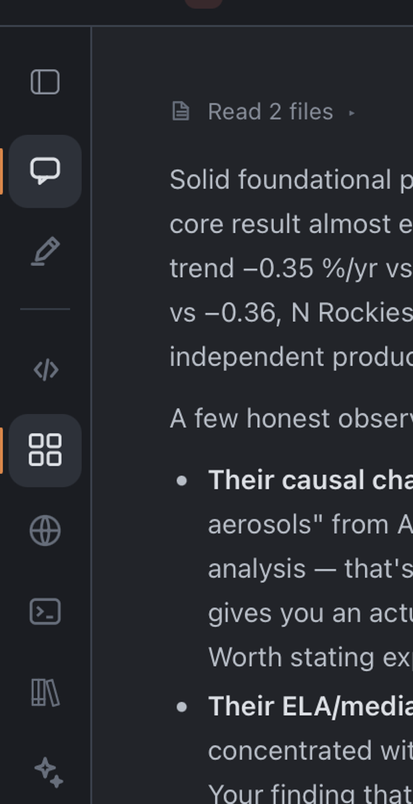
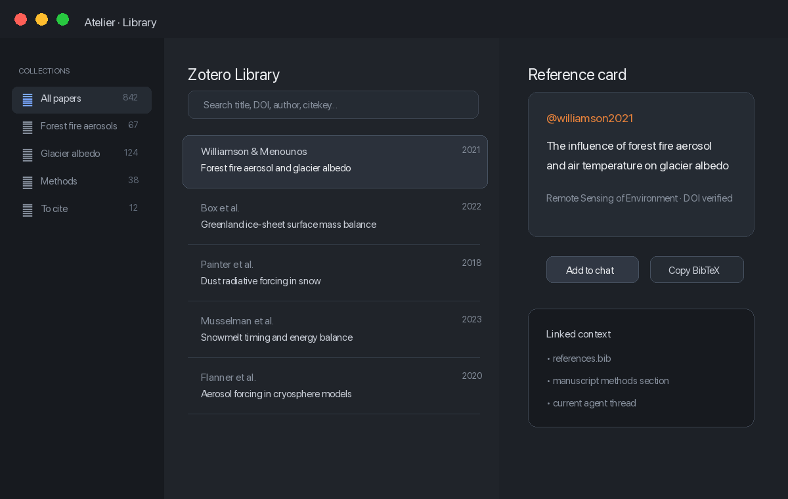
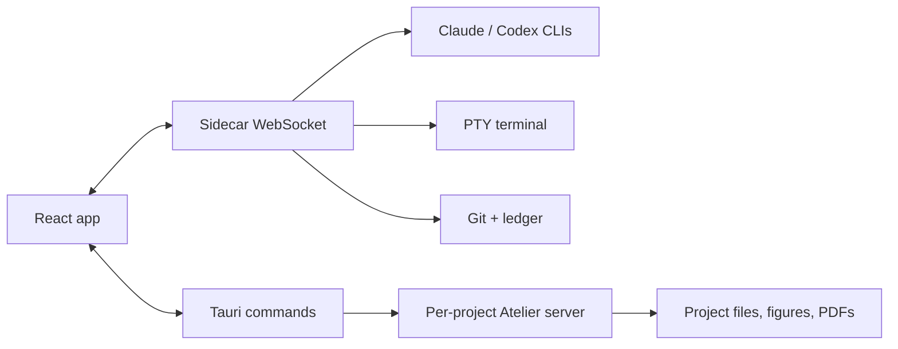

<p align="center">
  
</p>

<p align="center">
  <strong>A native macOS workspace for reading, coding, annotating, and steering agents in one place.</strong>
</p>

<p align="center">
  
  
  
  
  
</p>

Atelier Studio brings multi-agent chat, a scientific gallery, a browser, a terminal, file viewers/editors, and project-aware context into one native window. The goal is simple: keep reasoning, figures, files, references, and verification tools close enough that serious work can stay in flow.

## What's new in 1.0

- **Fully self-contained**: the gallery server now runs on Node — no Python required. Download, drag to Applications, done.
- **Design system across the whole app**: unified type scale, radii, motion, shadows — chat, panels, settings, gallery and all viewers share one visual language.
- **Chat at parity with the CLIs**: Claude runs with the full Claude Code system prompt (cwd, git status, memory); Codex uses your local CLI. Syntax-highlighted code blocks, grouped tool runs, inline diffs.
- **Gallery, redesigned**: always-visible search, destination tabs, S/M/L density, hover actions that never cover the figure, skeleton loading, instant rescans (shell + data split).
- **Independent reviewer (optional)**: verify any agent turn against its execution record, with one-click fixes.

## Overview

<p align="center">
  
</p>

Atelier is organized around three working areas:

- **Project sidebar** for folders, sessions, favorites, and resumed conversations.
- **Agent chat** for Claude/Codex, attachments, goals, citations, and run controls.
- **Live atelier** for browsing figures, opening files, annotating, comparing, and sending context back into the chat.

## What It Does

<table>
  <tr>
    <td width="52%">
      <h3>Multi-agent chat</h3>
      <p>Claude and Codex in the same thread, with CLI session resume, attachments, pasted images, fork, revert, goals, stop controls, context usage, and auto-review.</p>
      <p>The active turn keeps the main working indicator, while tool calls are shown as stable secondary lines so the interface stays calm while work is happening.</p>
    </td>
    <td width="48%"></td>
  </tr>
  <tr>
    <td width="52%">
      <h3>Scientific atelier</h3>
      <p>A per-project figure gallery, PDF/SVG/image viewers, LaTeX/Markdown/code editors, persistent annotations, and an Add to chat action wherever context needs to move back into the conversation.</p>
    </td>
    <td width="48%"></td>
  </tr>
  <tr>
    <td width="52%">
      <h3>Project navigation</h3>
      <p>Project-scoped sessions, favorites, resumed runs, cleaned thread titles, and robust fallbacks for older history entries that are missing newer metadata.</p>
    </td>
    <td width="48%"></td>
  </tr>
  <tr>
    <td width="52%">
      <h3>Zotero library</h3>
      <p>Local reference search, collections, reference cards, citekeys, BibTeX, and direct chat insertion so sources stay in the same workflow as analysis.</p>
    </td>
    <td width="48%"></td>
  </tr>
</table>

## Agentic Workflow

<p align="center">
  
</p>

The Node sidecar coordinates agents, terminal sessions, the gallery, conversation history, usage, review state, and real-time events. The frontend stays responsive even when an external source misbehaves: boot failures and malformed sidecar messages are bounded and displayed instead of leaving a blank window.

## Included Surfaces

| Surface | Role |
|---|---|
| Chat | Claude, Codex, enriched prompts, images, citations, goals, fork/revert, stop |
| Atelier | Figure gallery, tabs, viewers, editors, annotations, Add to chat |
| Browser | Native webview for local or web pages, with copyable context for chat |
| Terminal | Integrated PTY, ANSI themes, WebGL, splits |
| Git | Status, diff, staging, commit helpers |
| Library | Local Zotero search, collections, BibTeX, citekeys, reference insertion |
| Settings | Themes, models, permissions, auto-review, extra workspace paths |

## Architecture

```text
src/                 React 19 UI
src-tauri/           macOS Tauri 2 shell + native commands
sidecar/             Node server: agents, WS, terminal, sessions, git, Zotero
gallery/             Embedded gallery/editors and cmux-gallery assets
docs/media/          README screenshots and animations
```



## Requirements

| Tool | Why |
|---|---|
| macOS Apple Silicon | Current native target |
| Node.js >= 20 | Frontend, sidecar, tooling |
| Rust + Tauri prerequisites | macOS shell build |
| Signed-in Claude Code CLI | Claude engine and session resume |
| Signed-in Codex CLI | Codex engine |

## Installation

1. Download the `.dmg` from the latest GitHub release.
2. Drag Atelier into Applications.
3. If macOS blocks the unsigned app:

```bash
xattr -cr /Applications/Atelier.app
open /Applications/Atelier.app
```

## Development

```bash
npm install
(cd sidecar && npm install)
npm run tauri dev
```

Production build:

```bash
npm run tauri build
```

The app bundle includes the Node sidecar and gallery. Claude/Codex remain the system CLIs so existing sign-ins and permissions are reused.

## Verification

```bash
npx vite build
(cd sidecar && npm test)
```

The full TypeScript check can fail when intentionally invalid `src/test_auto_review_*.ts` files are present. Those files exercise auto-review scenarios and do not necessarily represent an application regression.

## Regenerate Media

README images are generated without real user data.

```bash
python3 scripts/generate-readme-media.py
```

This recreates the PNG/GIF assets in `docs/media/`.

## Known Limitations

- macOS Apple Silicon only (Intel build possible via CI matrix).
- Codex steering depends on the capabilities exposed by the locally available SDK/CLI.
- PDF annotations are stored beside files, not burned into the PDF.
- README screenshots are cleaned demo composites, not real user conversations.
