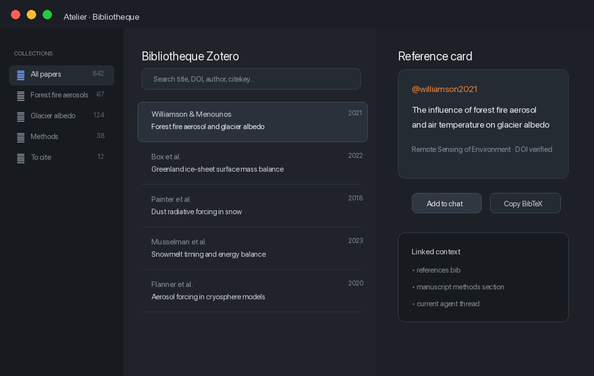
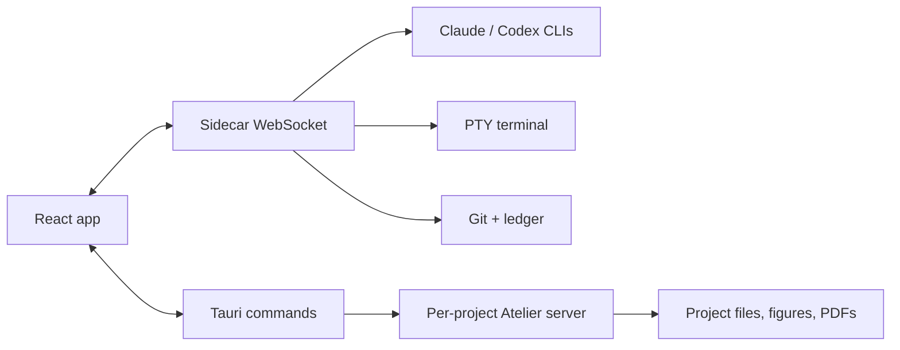

# Atelier Studio

<p align="center">
  
</p>

<p align="center">
  <strong>Un poste de travail macOS pour lire, coder, annoter et piloter des agents dans le meme espace.</strong>
</p>

<p align="center">
  
  
  
  
  
</p>

Atelier Studio combine un chat multi-agent, une galerie scientifique, un navigateur, un terminal, des lecteurs/editeurs de fichiers et une couche de contexte projet. L'idee est simple: garder le raisonnement, les figures, les fichiers et les outils de verification dans une seule fenetre native.

## Apercu

<p align="center">
  
</p>

Atelier est organise en trois zones:

- **Sidebar projet** pour les dossiers, sessions, favoris et reprises de conversations.
- **Chat agentique** pour Claude/Codex, les pieces jointes, goals, citations et controles de run.
- **Atelier vivant** pour explorer les figures, ouvrir des fichiers, annoter, comparer et renvoyer du contexte au chat.

## Ce Que Ca Fait

<table>
  <tr>
    <td width="52%">
      <h3>Chat multi-agent</h3>
      <p>Claude et Codex dans le meme fil, avec reprise de sessions CLI, pieces jointes, images collees, fork, revert, goals, stop, jauge de contexte et auto-review.</p>
      <p>Le statut de travail reste lisible: le tour actif garde son indicateur, tandis que les appels outils sont presentes comme une ligne secondaire stable.</p>
    </td>
    <td width="48%"></td>
  </tr>
  <tr>
    <td width="52%">
      <h3>Atelier scientifique</h3>
      <p>Une galerie de figures isolee par projet, des viewers PDF/SVG/images, un editeur LaTeX/Markdown/code, des annotations persistantes et un bouton Add to chat partout ou le contexte doit remonter.</p>
    </td>
    <td width="48%"></td>
  </tr>
  <tr>
    <td width="52%">
      <h3>Navigation de travail</h3>
      <p>Sessions par projet, favoris, reprise de runs existants, titres nettoyes et fallback robuste pour les anciens historiques incomplets.</p>
    </td>
    <td width="48%"></td>
  </tr>
  <tr>
    <td width="52%">
      <h3>Bibliotheque Zotero</h3>
      <p>Recherche bibliographique locale, collections, fiches de reference, citekeys, BibTeX et injection directe dans le chat pour garder les sources dans le meme flux que l'analyse.</p>
    </td>
    <td width="48%"></td>
  </tr>
</table>

## Workflow Agentique

<p align="center">
  
</p>

Le sidecar Node coordonne les agents, le terminal, la galerie, les sessions, l'historique, les usages, les revues et les evenements temps reel. Le frontend reste reactif meme si une source externe est indisponible: les erreurs de boot et de messages sidecar sont bornee et affichees proprement au lieu de laisser une fenetre vide.

## Surfaces Incluses

| Surface | Role |
|---|---|
| Chat | Claude, Codex, prompts enrichis, images, citations, goals, fork/revert, stop |
| Atelier | Galerie de figures, onglets, viewers, editeurs, annotations, Add to chat |
| Browser | Webview native pour pages locales ou web, avec contexte copiable vers le chat |
| Terminal | PTY integre, themes ANSI, WebGL, splits |
| Git | Statut, diff, staging, commit helpers |
| Bibliotheque | Recherche Zotero locale, collections, BibTeX, citekeys et injection de references |
| Settings | Themes, modeles, permissions, auto-review, chemins additionnels |

## Architecture

```text
src/                 React 19 UI
src-tauri/           Shell macOS Tauri 2 + commandes natives
sidecar/             Serveur Node: agents, WS, terminal, sessions, git, Zotero
gallery/             Galerie/editeurs embarques et assets cmux-gallery
docs/media/          Captures et animations du README
```



## Prerequis

| Outil | Pourquoi |
|---|---|
| macOS Apple Silicon | cible actuelle de l'app native |
| Node.js >= 20 | frontend, sidecar, tooling |
| Rust + Tauri prerequisites | build du shell macOS |
| Claude Code CLI connecte | moteur Claude et reprise de sessions |
| Codex CLI connecte | moteur Codex |
| Python 3 | galerie et outils auxiliaires |

## Installation Beta

1. Telecharger le `.dmg` depuis la derniere release GitHub.
2. Glisser Atelier dans Applications.
3. Si macOS bloque l'app non signee:

```bash
xattr -cr /Applications/Atelier.app
open /Applications/Atelier.app
```

## Developpement

```bash
npm install
(cd sidecar && npm install)
npm run tauri dev
```

Build production:

```bash
npm run tauri build
```

Le bundle embarque le sidecar Node et la galerie. Les CLIs Claude/Codex restent ceux du systeme afin de reutiliser les connexions et permissions existantes.

## Verification

```bash
npx vite build
(cd sidecar && npm test)
```

Le typecheck complet peut echouer si des fichiers de test volontairement invalides sont presents dans `src/test_auto_review_*.ts`; ces fichiers servent aux scenarios d'auto-review et ne representent pas forcement une regression applicative.

## Regenerer Les Medias

Les images du README sont generees sans donnees utilisateur reelles.

```bash
python3 scripts/generate-readme-media.py
```

Cela recree les PNG/GIF dans `docs/media/`.

## Limitations Connues

- Beta macOS Apple Silicon.
- Steer Codex depend des capacites exposees par le SDK/CLI disponible localement.
- Les annotations PDF sont stockees a cote des fichiers, pas gravees dans le PDF.
- Les captures du README sont des demos nettoyees, pas des conversations utilisateur reelles.
