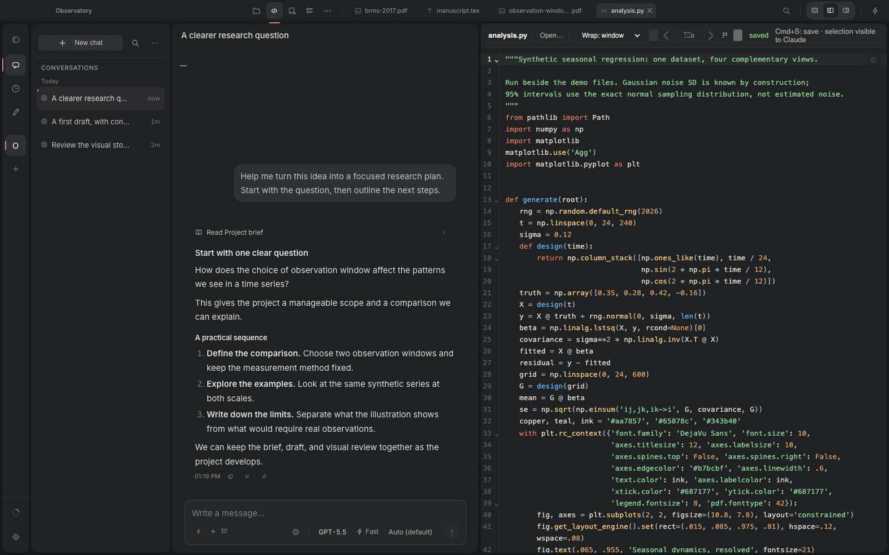
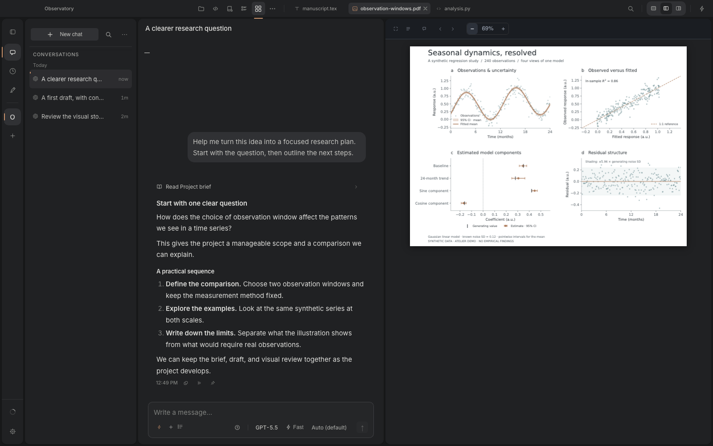
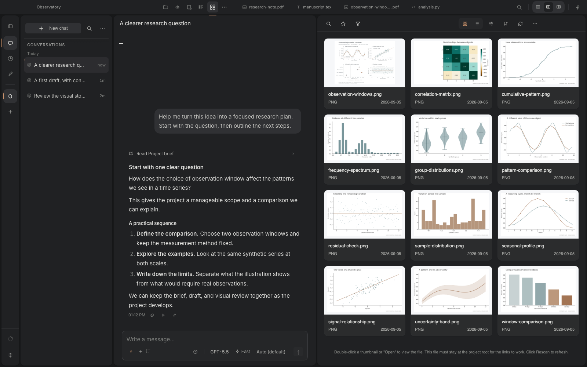
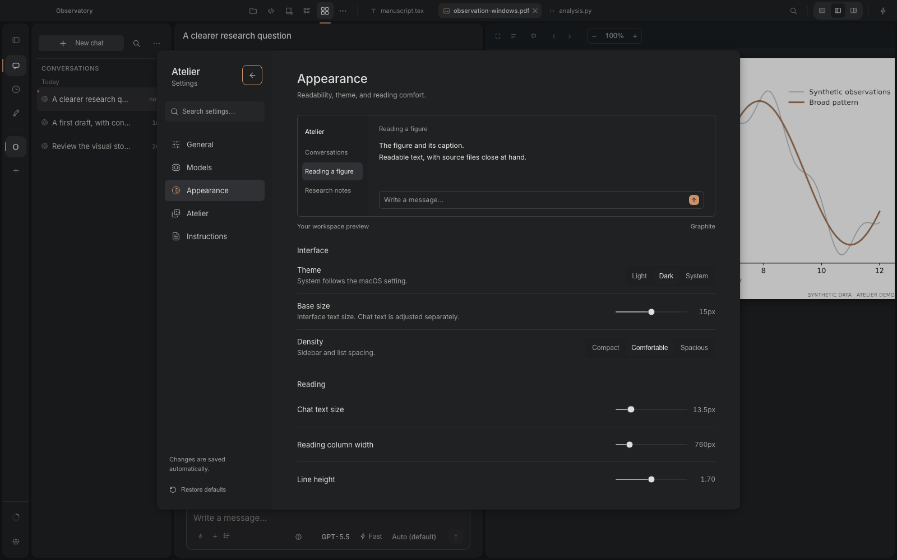
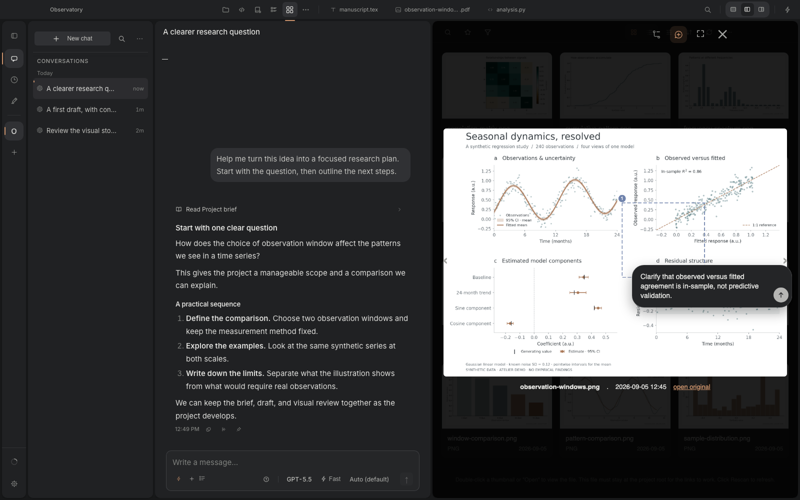
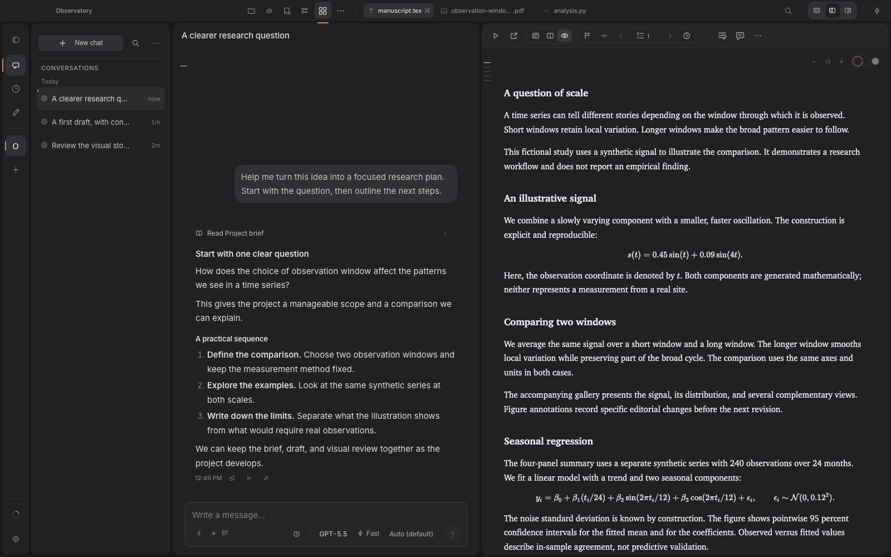
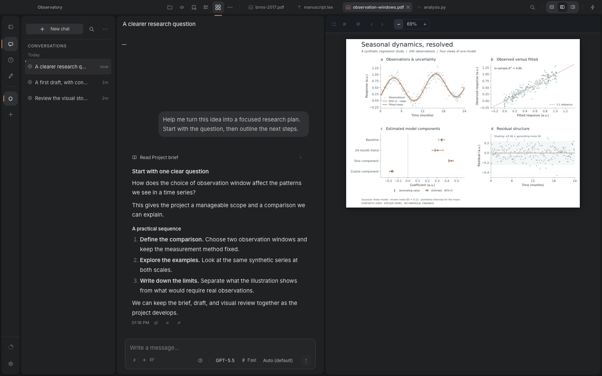
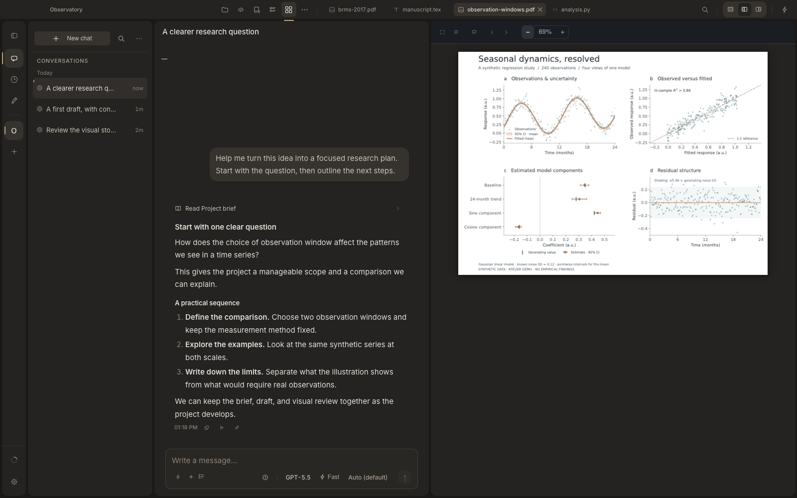
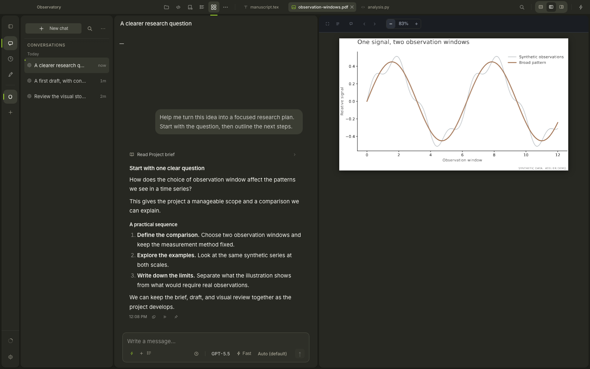

<p align="left"></p>

# Atelier Studio

### Your thesis, in one workspace.

Atelier is a native macOS workspace for scientific research, built for master’s students, PhD candidates, and researchers. Bring your literature, analysis scripts, figures, and thesis chapters together, with AI assistance in context.

[Download for Mac](https://github.com/tofunori/atelier-studio/releases/latest) · [Release notes](https://github.com/tofunori/atelier-studio/releases) · [Installation](#installation) · [Website](https://tofunori.github.io/atelier-studio/)


*Current interface components, captured with a fictional demonstration project. No personal files, conversations, or research data are shown.*

## From research question to manuscript

**Read the literature.** Read papers in the PDF viewer and work with your Zotero library. Bring selected context into conversations as you develop your research question.

**Develop the analysis.** Work on scripts, use the terminal, and inspect outputs in the figure gallery. Mark a region and draft precise feedback for the next revision.

**Write and revise.** Edit thesis chapters and scientific manuscripts in LaTeX or Markdown. Read rendered prose and equations, and work through revisions with Claude Code or Codex.

<details>
<summary>Watch the workspace tour</summary>


[Download the MP4 tour](docs/media/public/atelier-tour.mp4). Conversations and figures are synthetic. The PDF reader shows the original open-access article credited below.

</details>

## Papers, analysis, and writing side by side

| Code editor | PDF reader |
| --- | --- |
|  |  |

| Figure gallery | Appearance settings |
| --- | --- |
|  |  |

| Figure annotation | LaTeX reading view |
| --- | --- |
|  |  |

These panel views keep the conversation beside the research material. The main figure combines a seasonal regression, confidence intervals, coefficient estimates, and residual diagnostics from one synthetic dataset ([view the figure](docs/media/public/research-figure.pdf)). The gallery shows twelve synthetic figures; the annotation view marks a detail for revision; the LaTeX view renders prose and equations in reading mode. Open any image to inspect it at full size.

The workspace also includes terminals, Git tools, a browser, and reference management.

The PDF reader and tour display Bürkner, P.-C. (2017), [*brms: An R Package for Bayesian Multilevel Models Using Stan*](https://doi.org/10.18637/jss.v080.i01), *Journal of Statistical Software*, 80(1), 1–28, under [CC BY 3.0](https://creativecommons.org/licenses/by/3.0/). The publisher’s PDF is unmodified; its pages are shown within Atelier’s interface. This does not imply endorsement.

## Quiet by design

Lighter typography, restrained controls, and themes for different working preferences—including Graphite, Pierre, and Monokai.

<details>
<summary>Preview three dark themes</summary>

**Graphite**



**Pierre**



**Monokai**



</details>

## Installation

1. Download the Apple Silicon DMG from [GitHub Releases](https://github.com/tofunori/atelier-studio/releases/latest).
2. Move **Atelier** to **Applications**, then launch it.
3. Open a project folder and connect your agent provider.

Current builds are not notarized by Apple. If macOS blocks the first launch, review the app in **System Settings → Privacy & Security** and use **Open Anyway** where available. For a downloaded build you trust, the documented terminal alternative is:

```sh
xattr -cr /Applications/Atelier.app
open /Applications/Atelier.app
```

**Requirements**

- macOS on Apple Silicon.
- A supported agent CLI or configured API provider, with your own credentials. Claude Code and Codex sessions use their locally installed CLIs.
- [Poppler](https://poppler.freedesktop.org/) for PDF text extraction.
- A local TeX distribution, such as MacTeX or TeX Live, for LaTeX compilation.

The packaged desktop app includes its Rust backend and gallery runtime. You do not need Node.js or Python just to run Atelier. External providers and optional document tools have their own requirements.

## Project context, under your control

Atelier keeps conversations and project tools close to the files you work on. Context sent to an agent is processed by the provider you choose; a local workspace does not make a cloud model local. Features such as steering and permissions depend on the provider and installed CLI version.

PDF annotations are stored beside the project files rather than burned into the original PDF.

<details>
<summary>Development and architecture</summary>

The desktop frontend uses React and TypeScript in Tauri. The backend and packaged gallery server are Rust. The `sidecar/` and `gallery/server/` JavaScript code remains for compatibility and testing.

```sh
npm ci
npm run typecheck
npm run build:web
npm run test:frontend
```

For a desktop build, follow the complete stop, build, and restart protocol in [AGENTS.md](AGENTS.md). The ordinary build command is `npm run tauri:build:app`; `npm run tauri:build:dmg` is reserved for releases.

- `npm run verify` runs the repository checks.
- `npm run verify:e2e` runs gallery end-to-end checks.
- `npm run test:visual` runs visual regression checks separately.
- [Website](website/README.md): local preview and production build.
- [Public media](scripts/public-demo/README.md): regenerate the fictional demonstration captures.

</details>

## License

MIT — see [LICENSE](LICENSE). Portions adapted from Hermes Desktop (MIT).
