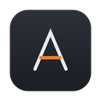
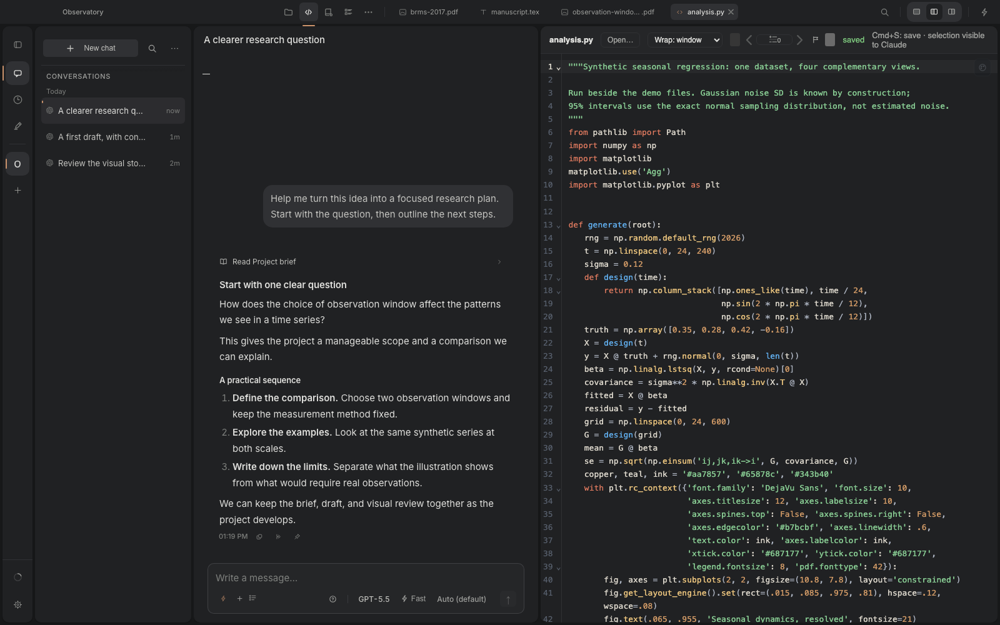
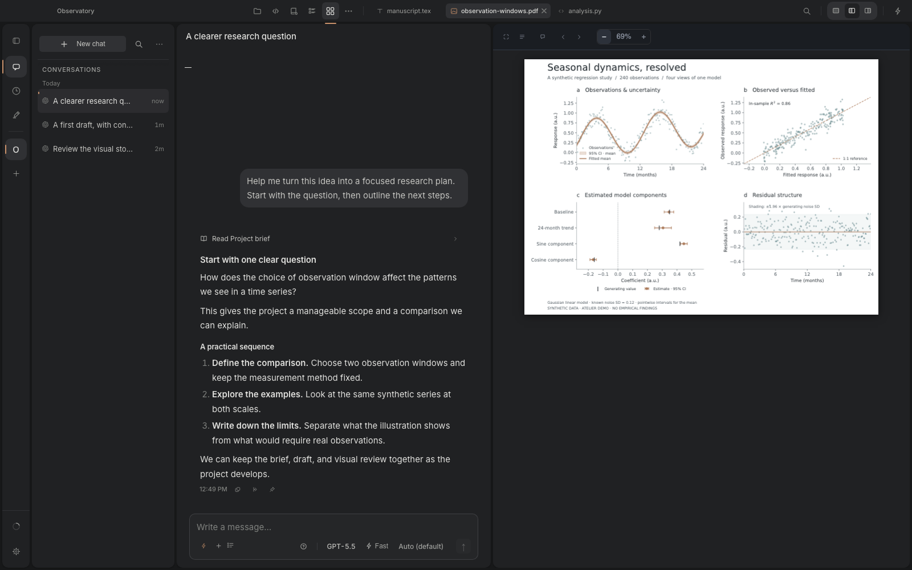
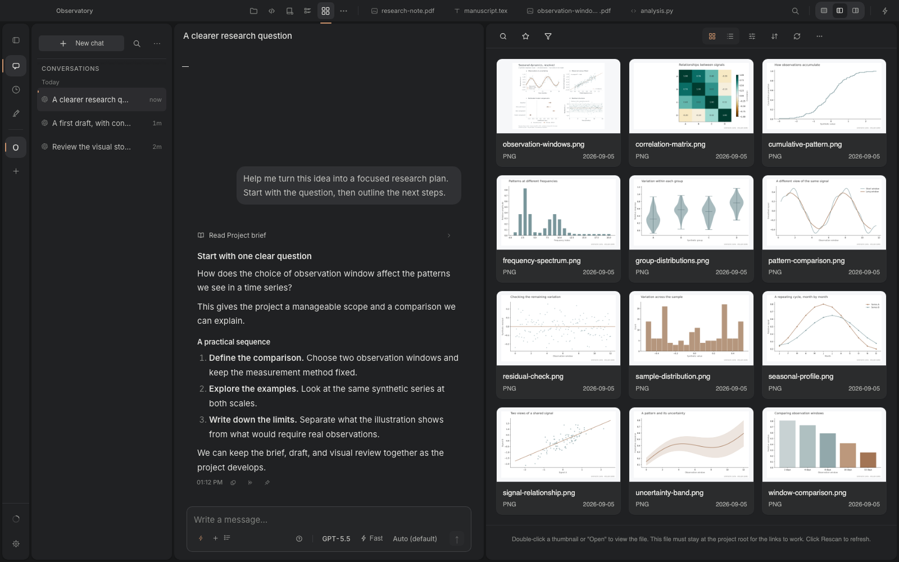
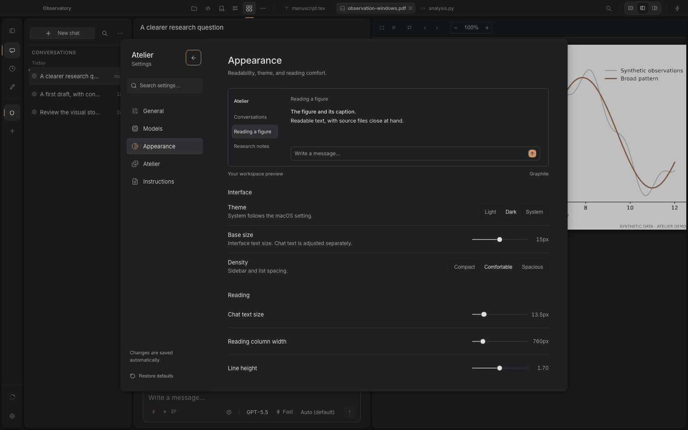
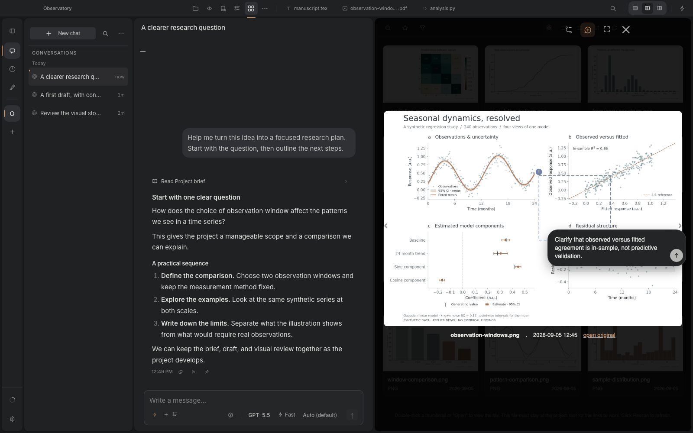
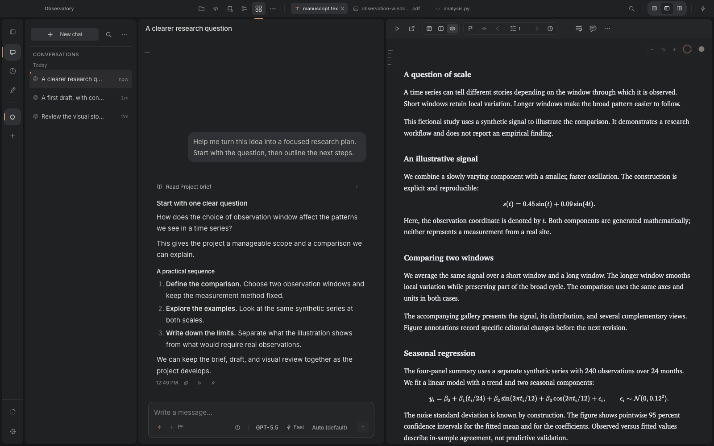
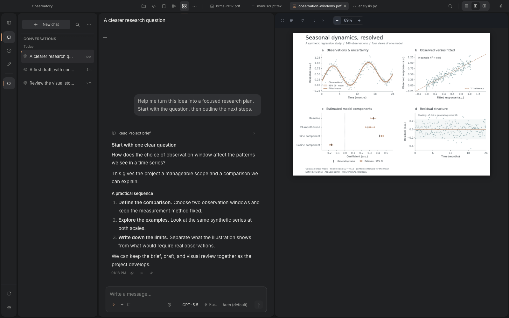
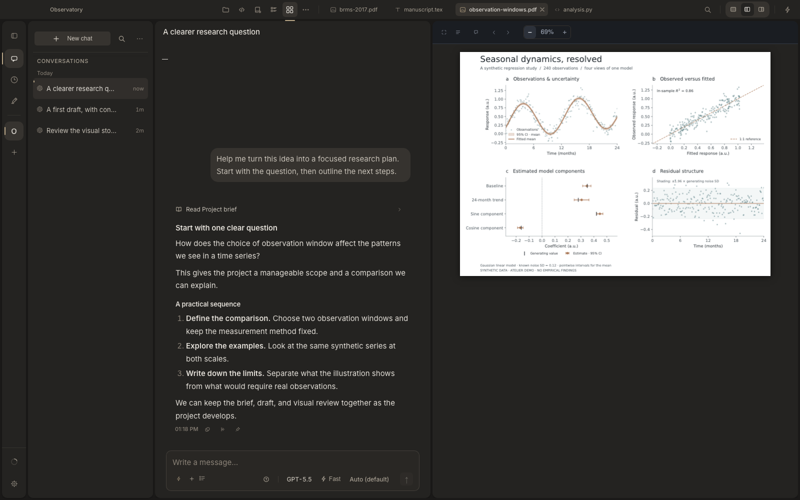
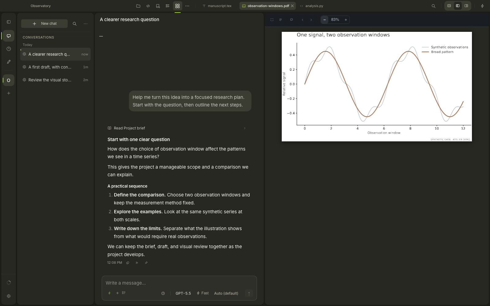

<p align="left"></p>

# Atelier Studio

### Your thesis, in one workspace.

Atelier is a native macOS workspace for scientific research, built for master’s students, PhD candidates, and researchers. Bring your literature, analysis scripts, figures, and thesis chapters together, with AI assistance in context.

[Download for Mac](https://github.com/tofunori/atelier-studio/releases/latest) · [Release notes](https://github.com/tofunori/atelier-studio/releases) · [Installation](#installation) · [Website](https://tofunori.github.io/atelier-studio/)


*Current interface components, captured with a fictional demonstration project. No personal files, conversations, or research data are shown.*

## From research question to manuscript

**Read the literature.** Read papers in the PDF viewer and work with your Zotero library. Bring selected context into conversations as you develop your research question.

**Develop the analysis.** Work on scripts, use the terminal, and inspect outputs in the figure gallery. Mark a region and draft precise feedback for the next revision.

**Write and revise.** Edit thesis chapters and scientific manuscripts in LaTeX or Markdown. Read rendered prose and equations, and work through revisions with Claude Code or Codex.

<details>
<summary>Watch the workspace tour</summary>


[Download the MP4 tour](docs/media/public/atelier-tour.mp4). Conversations and figures are synthetic. The PDF reader shows the original open-access article credited below.

</details>

## Papers, analysis, and writing side by side

| Code editor | PDF reader |
| --- | --- |
|  |  |

| Figure gallery | Appearance settings |
| --- | --- |
|  |  |

| Figure annotation | LaTeX reading view |
| --- | --- |
|  |  |

These panel views keep the conversation beside the research material. The main figure combines a seasonal regression, confidence intervals, coefficient estimates, and residual diagnostics from one synthetic dataset ([view the figure](docs/media/public/research-figure.pdf)). The gallery shows twelve synthetic figures; the annotation view marks a detail for revision; the LaTeX view renders prose and equations in reading mode. Open any image to inspect it at full size.

The workspace also includes terminals, Git tools, a browser, and reference management.

The PDF reader and tour display Bürkner, P.-C. (2017), [*brms: An R Package for Bayesian Multilevel Models Using Stan*](https://doi.org/10.18637/jss.v080.i01), *Journal of Statistical Software*, 80(1), 1–28, under [CC BY 3.0](https://creativecommons.org/licenses/by/3.0/). The publisher’s PDF is unmodified; its pages are shown within Atelier’s interface. This does not imply endorsement.

## Quiet by design

Lighter typography, restrained controls, and themes for different working preferences—including Graphite, Pierre, and Monokai.

<details>
<summary>Preview three dark themes</summary>

**Graphite**



**Pierre**



**Monokai**



</details>

## Installation

1. Download the Apple Silicon DMG from [GitHub Releases](https://github.com/tofunori/atelier-studio/releases/latest) and move **Atelier** to **Applications**.
2. Open it. Builds are not notarized by Apple yet, so macOS asks you to allow the first launch once.
3. The welcome window installs and signs in to Claude Code or Codex for you. Then open a project folder.

Atelier needs macOS 12.3 or later on Apple Silicon. It includes its own backend, so you do not need Node.js or Python. The **[installation guide](docs/INSTALLATION.md)** covers each step, the optional tools for PDF import and LaTeX, Zotero and integrations, updating, and troubleshooting.

## Project context, under your control

Atelier keeps conversations and project tools close to the files you work on. Context sent to an agent is processed by the provider you choose; a local workspace does not make a cloud model local. Features such as steering and permissions depend on the provider and installed CLI version.

PDF highlights and notes are kept in Atelier's own data rather than burned into the original PDF.

<details>
<summary>Development and architecture</summary>

The desktop frontend, browser-side editors and test harnesses use TypeScript, checked with TypeScript 7. The backend, the knowledge-base CLI and the packaged gallery server are Rust (`rust/crates/`); the repository ships no Node runtime. Browser resources are generated JavaScript; edit their TypeScript sources, not the generated files. Development scripts require Node.js 22.18 or newer.

```sh
npm ci
npm run typecheck
npm run build:web
npm run test:frontend
```

To build the desktop app, see [Build from source](docs/INSTALLATION.md#build-from-source). The complete stop, build and restart procedure is [docs/PROTOCOLE_RELANCE.md](docs/PROTOCOLE_RELANCE.md) (in French). The ordinary build command is `npm run tauri:build:app`; `npm run tauri:build:dmg` is reserved for releases.

- `npm run verify` runs the repository checks.
- `npm run verify:e2e` runs gallery end-to-end checks.
- `npm run test:visual` runs visual regression checks separately.
- [TypeScript sources](docs/agent-reference/typescript-sources.md): source locations, dependency setup, generated resources and checks.
- [Website](website/README.md): local preview and production build.
- [Public media](scripts/public-demo/README.md): regenerate the fictional demonstration captures.

</details>

## License

MIT — see [LICENSE](LICENSE). Portions adapted from Hermes Desktop (MIT).
