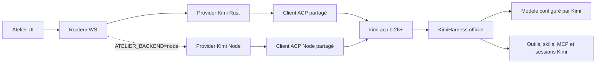

# Plan 046 : Kimi Code 0.26+ natif via ACP, robuste et fidèle (Rust + Node)

> **Instructions d'exécution** : lire ce plan en entier avant toute
> modification. Exécuter les étapes dans l'ordre et valider chaque commande
> avant de continuer. Une condition de la section **STOP conditions** impose
> d'arrêter et de rapporter les faits, sans inventer de repli.
>
> **Dépendance ferme** : le plan 045 doit être révisé, suivi par Git et accepté
> avant le début de ce plan. Au moment de la rédaction, les fichiers
> `acp_rpc.rs`, `acp_map.rs`, `acp_common.mjs` et les tests OpenCode sont encore
> non suivis : ils constituent une base utile, mais pas encore un contrat
> stable sur lequel empiler Kimi.
>
> **Drift check initial** :
>
> ```bash
> git diff --stat 5f48c00..HEAD -- \
>   rust/crates/atelier-providers/src/acp_rpc.rs \
>   rust/crates/atelier-providers/src/acp_map.rs \
>   rust/crates/atelier-providers/src/opencode.rs \
>   rust/crates/atelier-providers/src/traits.rs \
>   rust/crates/atelier-providers/src/registry.rs \
>   rust/crates/atelier-runtime/src/send.rs \
>   rust/crates/atelier-runtime/src/ws_router.rs \
>   rust/crates/atelier-protocol/src/lib.rs \
>   sidecar/providers/acp_common.mjs \
>   sidecar/providers/opencode.mjs \
>   sidecar/providers/registry.mjs \
>   sidecar/index.mjs \
>   sidecar/sessions.mjs \
>   src/App.tsx src/lib/ws.ts \
>   src/components/chat/HarnessInteraction.tsx \
>   src/components/chat/ComposerControls.tsx
> ```
>
> Si un de ces fichiers a changé, comparer le présent document au code réel.
> Une divergence de protocole, de signature de trait ou de schéma WS est une
> condition STOP jusqu'à mise à jour explicite du plan.

## Statut

- **Priority** : P1
- **Effort** : XL, environ 5 à 7 jours d'ingénierie
- **Risk** : HIGH (processus ACP full-duplex, permissions interactives,
  authentification externe, sessions persistantes et parité de deux backends)
- **Depends on** : plan 045 accepté et stabilisé
- **Category** : feature / provider / harness
- **Planned at** : commit `5f48c00`, 2026-07-16
- **Target CLI** : Kimi Code `>= 0.26.0`
- **Backend prioritaire** : Rust
- **Backend de secours obligatoire** : Node

## Résultat attendu

Atelier doit piloter le **véritable harnais Kimi**, et non une imitation ou un
modèle Moonshot appelé à travers un autre agent :



La fidélité recherchée signifie :

1. les outils, politiques, skills, sous-agents et sessions restent ceux de
   Kimi Code ;
2. les modèles sont découverts depuis Kimi, jamais codés en dur dans Atelier ;
3. les permissions sont présentées à l'utilisateur avec les identifiants ACP
   exacts puis retournées sans réinterprétation dangereuse ;
4. le modèle, le thinking et le mode sont alignés avec
   `session/set_config_option` ;
5. `session/load` rejoue l'historique, `session/resume` ne le rejoue pas ;
6. Atelier ne fabrique ni usage tokens, ni coût, ni fenêtre de contexte quand
   Kimi ACP ne les fournit pas ;
7. une erreur d'authentification ou de protocole est visible et actionnable ;
   elle ne déclenche jamais silencieusement OpenCode, Grok ou une API générique.

## Références faisant foi

- Documentation ACP officielle :
  <https://www.kimi.com/code/docs/en/kimi-code-cli/reference/kimi-acp>
- Dépôt officiel : <https://github.com/MoonshotAI/kimi-code>
- Release cible :
  <https://github.com/MoonshotAI/kimi-code/releases/tag/%40moonshot-ai%2Fkimi-code%400.26.0>

En cas de conflit entre ce plan et une version ultérieure du CLI, la réponse
réelle à `initialize` et le schéma du tag installé font foi. Ne jamais adapter
le client à partir d'une supposition.

## Contrat Kimi ACP vérifié le 2026-07-16

### Installation locale

```text
binary:  /Users/tofunori/.kimi-code/bin/kimi
version: 0.26.0
doctor:  OK
provider list: providers={}, models={}
```

La machine n'est pas encore authentifiée/configurée pour un modèle Kimi. Le
handshake est utilisable sans modèle, mais `session/new` retourne :

```json
{"code":-32000,"message":"Authentication required"}
```

### `initialize`

Le probe réel avec `protocolVersion: 1`, filesystem désactivé et terminal
désactivé retourne notamment :

```json
{
  "protocolVersion": 1,
  "agentInfo": { "name": "Kimi Code CLI", "version": "0.26.0" },
  "agentCapabilities": {
    "loadSession": true,
    "promptCapabilities": {
      "image": true,
      "audio": false,
      "embeddedContext": true
    },
    "mcpCapabilities": { "http": true, "sse": true },
    "sessionCapabilities": { "list": {}, "resume": {} }
  }
}
```

`authMethods` contient une méthode terminal `login`. Le client doit ouvrir une
commande de login externe, puis rappeler `authenticate`; le canal ACP sans TTY
ne réalise pas lui-même l'OAuth.

### Méthodes stables utilisées

| Sens | Méthode | Contrat Atelier |
|---|---|---|
| Atelier → Kimi | `initialize` | obligatoire, version/capacités conservées |
| Atelier → Kimi | `authenticate` | vérifie que le token existe après login |
| Atelier → Kimi | `session/new` | crée une session, retourne `sessionId` + `configOptions` |
| Atelier → Kimi | `session/load` | recharge et rejoue l'historique avant la réponse |
| Atelier → Kimi | `session/resume` | recharge sans rejouer l'historique |
| Atelier → Kimi | `session/list` | liste native, filtrable par `cwd`, sans pagination actuelle |
| Atelier → Kimi | `session/prompt` | texte, image, resource, resource_link |
| Atelier → Kimi | `session/cancel` | notification, termine le tour comme `cancelled` |
| Atelier → Kimi | `session/set_config_option` | modèle, thinking, mode |
| Kimi → Atelier | `session/update` | texte, pensée, outils, plan, config, commandes |
| Kimi → Atelier | `session/request_permission` | outils, review de plan, AskUserQuestion |
| Kimi → Atelier | `fs/read_text_file` | non annoncé en v1 Atelier |
| Kimi → Atelier | `fs/write_text_file` | non annoncé en v1 Atelier |

### Configuration native de session

`configOptions` est la source de vérité :

- `id: model`, catégorie `model`, sélection dynamique ;
- `id: thinking`, catégorie `thought_level`, valeurs `off` / `on`, seulement
  lorsque le modèle le supporte ;
- `id: mode`, catégorie `mode`, valeurs `default`, `plan`, `auto`, `yolo`.

La méthode stable à employer est :

```json
{
  "method": "session/set_config_option",
  "params": {
    "sessionId": "session_…",
    "configId": "model|thinking|mode",
    "value": "…"
  }
}
```

Ne pas construire l'intégration autour de l'extension expérimentale
`session/set_model`, même si Kimi la conserve pour compatibilité.

### Permissions et questions

Les identifiants doivent faire un aller-retour opaque :

- outil ordinaire : `approve_once`, `approve_always`, `reject` ;
- review de plan : `plan_opt_<n>`, `plan_approve`, `plan_revise`,
  `plan_reject_and_exit` ;
- question : `q0_opt_<n>`, `q0_skip`.

Réponse attendue :

```json
{"outcome":{"outcome":"selected","optionId":"<id exact>"}}
```

ou, en fermeture/timeout/refus sûr :

```json
{"outcome":{"outcome":"cancelled"}}
```

Kimi ACP réduit actuellement les questions multiples à la première question et
un multiselect à un single-select. Atelier doit refléter cette limitation, pas
prétendre fournir une sémantique que Kimi ne consomme pas encore.

## État actuel d'Atelier et écarts à combler

### Client ACP Rust

`rust/crates/atelier-providers/src/acp_rpc.rs` fournit déjà :

- un process persistant ;
- JSON-RPC 2.0 NDJSON sur stdio ;
- multiplexage par session ;
- pending requests ;
- notifications `session/update` ;
- reset sur mort du process.

Écarts bloquants :

- toute permission est actuellement approuvée automatiquement en
  `allow_once` ;
- les erreurs JSON-RPC sont réduites à une string et perdent `code`/`data` ;
- le résultat de `initialize` est jeté ;
- le dispatcher conserve le mutex du process lorsqu'il écrit la réponse ;
- il n'existe pas de handler async provider/session pour les reverse-RPC ;
- les méthodes filesystem retournent seulement `methodNotFound`.

### Mapping ACP Rust

`acp_map.rs` couvre texte, pensée, outils, diffs et usage OpenCode. Il ignore :

- `plan` ;
- `config_option_update` ;
- `available_commands_update` ;
- la provenance Kimi ;
- la différence entre absence d'usage et usage nul.

### Interaction utilisateur

`rust/crates/atelier-runtime/src/send.rs` et
`src/components/chat/HarnessInteraction.tsx` savent déjà afficher :

- une approbation oui/non/session ;
- une question à choix ou texte ;
- une elicitation MCP.

Ils ne savent pas encore préserver un `optionId` opaque ni afficher une liste
dynamique d'actions d'approbation. Le cache d'approbation Atelier ne doit pas
court-circuiter Kimi : `approve_always` installe déjà la règle dans la session
Kimi, qui reste l'autorité.

### Registres, setup et sessions

- Kimi n'existe dans aucun registre Rust/Node.
- Le setup Rust considère encore tout binaire présent comme authentifié.
- Le setup Node n'a pas de règle Kimi.
- `sidecar/sessions.mjs` fait tomber tout provider inconnu sur les fichiers
  Codex : Kimi doit impérativement avoir une branche explicite.
- Le routeur Rust ne liste nativement que certaines sessions.
- Les images structurées ne sont envoyées qu'à Codex dans `src/App.tsx`.

## Décisions d'architecture verrouillées

1. **ACP officiel uniquement** : `kimi acp`, aucun repli vers OpenCode, Grok,
   streaming JSON ou API compatible OpenAI.
2. **Version minimale 0.26.0** pour éviter les anciens problèmes de catalogue,
   thinking et reprise de session. Une version plus ancienne reste visible dans
   Setup mais n'est pas marquée prête.
3. **Rust d'abord, Node obligatoire** : la feature n'est terminée que lorsque
   les deux backends ont le même comportement utilisateur.
4. **Filesystem ACP désactivé en première livraison** : annoncer
   `readTextFile:false`, `writeTextFile:false`. Kimi utilise alors son
   `LocalKaos`, donc ses vrais outils filesystem locaux.
5. **Terminal ACP désactivé** : Kimi exécute déjà son shell localement. Atelier
   ne doit pas annoncer une capacité terminal qu'il ne sait pas servir.
6. **Permissions sûres** : absence d'UI, timeout, client déconnecté ou option
   inconnue ⇒ `cancelled`, jamais une approbation implicite.
7. **Modèles dynamiques** : ne jamais inscrire `kimi-k3` ou un autre id dans le
   catalogue comme vérité. L'id et le label viennent de Kimi.
8. **Configuration stable** : modèle/thinking/mode via
   `session/set_config_option`; mises à jour confirmées par
   `config_option_update`.
9. **Mapping des modes Atelier → Kimi** :

   | Atelier | Kimi | Sens attendu |
   |---|---|---|
   | `default` | `default` | demander selon la politique Kimi |
   | `plan` | `plan` | planification sans exécution |
   | `acceptEdits` | `auto` | automatisation contrôlée |
   | `bypassPermissions` | `yolo` | autonomie maximale |

   Ce mapping doit être validé contre les descriptions retournées dans
   `configOptions`; si la sémantique ne correspond pas, STOP.
10. **Thinking Atelier** : exposer `off` / `on`, uniquement si l'option Kimi
    existe pour le modèle actif. Ne pas inventer low/medium/high.
11. **Historique** : Atelier garde son journal comme source de vérité pour ses
    propres threads. `session/load` sert seulement à importer/reprendre une
    session Kimi externe ; `session/resume` sert aux threads Atelier ayant déjà
    leur transcript.
12. **Usage inconnu** : sans `usage_update` Kimi, aucun anneau ou compteur
    synthétique. `/usage` peut produire du texte mais ne devient pas une mesure
    structurée.
13. **MCP v1** : envoyer `mcpServers: []` et laisser Kimi charger sa
    configuration disque. Un test réel doit confirmer que les MCP configurés
    dans Kimi restent disponibles. Le forwarding des MCP Atelier est ajouté
    seulement après existence d'une source de configuration générique.

## Scope prévu

### Fichiers à créer

- `rust/crates/atelier-providers/src/kimi.rs`
- `rust/crates/atelier-providers/src/kimi_map.rs`
- `rust/crates/atelier-providers/tests/fixtures/fake_kimi_acp.mjs`
- `sidecar/providers/acp_client.mjs`
- `sidecar/providers/kimi.mjs`
- `sidecar/kimi_acp.test.mjs`
- `sidecar/kimi_setup.test.mjs`

### Fichiers probablement modifiés

- `rust/crates/atelier-providers/src/acp_rpc.rs`
- `rust/crates/atelier-providers/src/acp_map.rs`
- `rust/crates/atelier-providers/src/lib.rs`
- `rust/crates/atelier-providers/src/registry.rs`
- `rust/crates/atelier-providers/src/traits.rs`
- `rust/crates/atelier-protocol/src/lib.rs`
- `rust/crates/atelier-runtime/src/send.rs`
- `rust/crates/atelier-runtime/src/ws_router.rs`
- `sidecar/providers/acp_common.mjs`
- `sidecar/providers/opencode.mjs`
- `sidecar/providers/registry.mjs`
- `sidecar/index.mjs`
- `sidecar/router.mjs`
- `sidecar/sessions.mjs`
- `src/App.tsx`
- `src/lib/ws.ts`
- `src/lib/providers.ts`
- `src/components/chat/HarnessInteraction.tsx`
- `src/components/chat/ComposerControls.tsx`
- tests frontend correspondants
- `plans/README.md` à la fin, si l'index est maintenu sur la branche d'exécution

### Hors scope

- modifier Kimi Code ou forker `MoonshotAI/kimi-code` ;
- remplacer le harnais Kimi par un appel API direct ;
- implémenter `fs/read_text_file` / `fs/write_text_file` avant la synchronisation
  des buffers non sauvegardés ;
- implémenter les reverse-RPC terminal ACP ;
- reproduire les sous-agents Kimi dans Atelier ;
- inventer un support audio ;
- changer le comportement runtime de Grok ;
- réécrire tout le client Codex ou Claude ;
- distribution/notarisation : hors de ce plan.

## Étape 0 — Gate du plan 045 et préflight local

### Actions

1. Vérifier que le plan 045 et ses fichiers ne sont plus non suivis :

   ```bash
   git status --short -- \
     plans/045-acp-client-rust.md \
     rust/crates/atelier-providers/src/acp_rpc.rs \
     rust/crates/atelier-providers/src/acp_map.rs \
     sidecar/providers/acp_common.mjs \
     sidecar/opencode_acp.test.mjs
   ```

2. Relancer ses tests ciblés :

   ```bash
   cargo test -p atelier-providers --manifest-path rust/Cargo.toml --locked
   cd sidecar && npx vitest run opencode_acp.test.mjs
   ```

3. Vérifier Kimi :

   ```bash
   zsh -lic 'command -v kimi && kimi --version && kimi doctor'
   zsh -lic 'kimi provider list --json'
   ```

4. Rejouer un probe `initialize` sans prompt. Conserver la réponse nettoyée
   dans le fixture de l'étape 1.

### Acceptation

- plan 045 accepté et tests verts ;
- `command -v kimi` pointe vers une version `>= 0.26.0` ;
- `initialize.agentInfo.name == "Kimi Code CLI"` ;
- `protocolVersion == 1` ;
- aucun modèle n'est appelé pendant le préflight.

## Étape 1 — Fixture ACP déterministe et matrice de compatibilité

Créer un faux agent ACP `fake_kimi_acp.mjs`, pilotable par variables
d'environnement ou arguments, qui lit/écrit une ligne JSON par message.

### Scénarios obligatoires du fixture

- initialize nominal avec capacités Kimi 0.26 ;
- initialize version trop ancienne ;
- authRequired `-32000` ;
- `session/new` avec `configOptions` modèle/thinking/mode ;
- `session/load` avec historique émis avant la réponse ;
- `session/resume` sans historique ;
- `session/list` avec sessions de deux cwd ;
- prompt texte ;
- prompt image ;
- tool call + tool update + diff ;
- plan/todos ;
- `config_option_update` ;
- `available_commands_update` ;
- permission ordinaire ;
- plan review ;
- AskUserQuestion ;
- cancel ;
- JSON invalide isolé ;
- EOF brutal avec plusieurs requêtes pending ;
- réponse tardive après timeout.

Le même fixture doit être utilisé par les tests Rust et Node afin de prouver la
parité wire, pas seulement deux implémentations testées contre deux mocks
différents.

### Acceptation

- le fixture ne dépend d'aucun token ;
- aucune donnée utilisateur réelle dans les fixtures ;
- les formes viennent du probe 0.26 ou du code officiel taggé 0.26 ;
- un test de framing fragmenté prouve que plusieurs messages et lignes
  partielles sont correctement traités.

## Étape 2 — Durcir le client ACP Rust partagé

### 2.1 Erreurs structurées

Remplacer les `Result<Value, String>` internes par un type structuré :

```rust
pub struct AcpRpcError {
    pub code: Option<i64>,
    pub message: String,
    pub data: Option<Value>,
    pub transport: bool,
}
```

Conserver au minimum :

- `-32000` pour `authRequired` ;
- `-32602` pour `invalidParams` / session inconnue ;
- `-32601` pour méthode absente ;
- distinction transport mort / erreur applicative Kimi.

Le provider ne peut faire un repli `session/load → session/new` que sur une
erreur structurée prouvant que la session n'existe pas. Auth, réseau, process
mort et erreur inconnue ne doivent jamais créer une nouvelle session en
silence.

### 2.2 Résultat `initialize`

`ensure` doit retourner ou mettre en cache :

```rust
pub struct AcpInitializeResult {
    pub protocol_version: u64,
    pub agent_capabilities: Value,
    pub auth_methods: Vec<Value>,
    pub agent_info: Option<Value>,
}
```

Le cache est lié à `generation`; un respawn invalide capacités, sessions et
configurations mémorisées.

### 2.3 Reverse-RPC asynchrone

Ajouter un handler par session :

```rust
pub type ServerRequestHandler = Arc<
    dyn Fn(String, Value) -> Pin<Box<dyn Future<Output = Value> + Send>>
        + Send
        + Sync,
>;
```

Le dispatcher doit :

1. cloner le handler et les données nécessaires sous verrou ;
2. relâcher le mutex ;
3. attendre l'interaction utilisateur dans une tâche séparée ;
4. reprendre brièvement le verrou uniquement pour écrire la réponse ;
5. vérifier que `generation` est toujours la même avant l'écriture.

Invariant : une permission pouvant attendre 120 secondes ne doit bloquer ni
les `session/update`, ni `cancel`, ni les réponses des autres sessions.

### 2.4 Politique par provider

- Kimi sans handler ou timeout : `cancelled` ;
- option inconnue renvoyée par l'UI : `cancelled` ;
- OpenCode conserve provisoirement sa politique du plan 045 dans son propre
  handler, pas dans le client générique ;
- méthode inconnue : JSON-RPC `-32601` ;
- filesystem non annoncé : `-32601` clair, sans deadlock.

### Tests Rust obligatoires

- erreur auth conserve code/message/data ;
- initialize mémorisé par génération ;
- deux sessions multiplexées ;
- permission lente + updates concurrentes, aucun deadlock ;
- cancel pendant permission ;
- process mort draine tous les pending ;
- réponse tardive ignorée ;
- OpenCode conserve ses tests existants ;
- aucune auto-approbation par défaut.

### Verify

```bash
cargo test -p atelier-providers --manifest-path rust/Cargo.toml --locked
```

## Étape 3 — Mapper Kimi sans perdre ses événements

Créer `kimi_map.rs`. Réutiliser les helpers ACP standard lorsque leur forme est
strictement identique, mais ne pas forcer Kimi à porter `source:"opencode"`.

### Table de mapping

| Kimi `sessionUpdate` | Atelier |
|---|---|
| `agent_thought_chunk` | `thinking_delta` |
| `agent_message_chunk` | `delta` |
| `tool_call` | `tool_update` running, `source:"kimi"` |
| `tool_call_update` | tool status/output + `edit` pour les diffs |
| `plan` | singleton `todos` |
| `config_option_update` | état de configuration éphémère, jamais transcript |
| `available_commands_update` | catalogue commandes/skills éphémère |
| inconnu | ignorer + trace debug bornée |

Mapping `plan.entries` :

```text
content -> items[].text
status == completed   -> completed=true,  active=false
status == in_progress -> completed=false, active=true
status == pending     -> completed=false, active=false
```

### Invariants

- `tool_update.output` est toujours une string ;
- `toolCallId` reste exactement celui reçu, incluant le préfixe du turn Kimi ;
- les diffs sont dédupliqués ;
- `config_option_update` et les commandes ne gonflent pas le journal ;
- aucun event usage synthétique ;
- `stopReason:end_turn` et `cancelled` donnent un `done.ok=true` ;
- refus ou erreur donnent un résultat explicite, sans second prompt.

### Verify

Tests unitaires pour chaque ligne de la table et pour l'adjacence des buffers.

## Étape 4 — Provider Kimi Rust minimal mais complet

Créer `KimiProvider` avec :

- `AcpServer` partagé ;
- état par génération ;
- sessions chargées ;
- configOptions courantes par session ;
- turns actifs `thread_id → session_id` ;
- handler d'interaction par session ;
- aucune clé ou token stocké par Atelier.

### Résolution du binaire

Ordre :

1. `ATELIER_KIMI_BIN` ;
2. `PATH` ;
3. `~/.kimi-code/bin/kimi` ;
4. chemins Homebrew usuels uniquement comme dernier recours.

Le Setup doit montrer le chemin réellement choisi et signaler si un ancien
Homebrew masque une installation plus récente.

### Ouverture de session

- thread sans session : `session/new {cwd,mcpServers:[]}` ;
- thread Atelier avec transcript déjà présent : `session/resume` ;
- import explicite depuis le navigateur Kimi : `session/load` ;
- session inconnue `-32602` : proposer/reporter une nouvelle session, ne pas la
  créer silencieusement pendant le même tour ;
- authRequired : erreur actionnable « Connexion Kimi requise » ;
- session ouverte dans une autre génération : re-resume avant prompt.

### Prompt et interruption

1. enregistrer le mapper et le reverse-RPC handler ;
2. aligner model/thinking/mode ;
3. enregistrer le turn actif ;
4. appeler `session/prompt` ;
5. sur annulation, envoyer une seule notification `session/cancel` ;
6. flush des buffers ;
7. retirer tous les handlers dans un bloc de finalisation.

Une erreur après le début de `session/prompt` devient un event `error` et un
`SendResult.ok=false`. Elle ne relance jamais le message sur un autre harnais.

### Capabilities initiales

```text
resume=true
steering=false
queue=true
goals=false
tools=true
tool_output=true
permissions=true
interactive_input=true
mcp_tools=true
skills=true
review=true
compact=true via commande native /compact
durable_history=true côté Kimi, journal Atelier conservé
```

Chaque capability doit être soutenue par un test réel ou une méthode ACP
documentée. Sinon la valeur reste `false`.

## Étape 5 — Permissions, questions et review de plan fidèles

### Schéma WS

Étendre l'interaction sans casser Codex :

```ts
type InteractionChoice = {
  optionId: string;
  label: string;
  description?: string;
  kind?: "allow_once" | "allow_always" | "reject_once";
};
```

Ajouter :

- `choices?: InteractionChoice[]` à l'event interaction ;
- `{ optionId: string; cancelTurn?: boolean }` à `InteractionResponse` ;
- pour les questions, `value?: string` aux options de field afin que l'UI
  affiche le label mais renvoie l'id opaque.

### Traduction

- permission ordinaire : interaction approval avec les trois choix Kimi ;
- plan review : approval dynamique avec toutes les options `plan_*` dans
  l'ordre reçu ;
- `toolCall.title == "AskUserQuestion"` : interaction user_input, une seule
  question, valeurs `q0_opt_*` ;
- `q0_skip`, fermeture ou timeout : outcome cancelled ;
- optionId inconnu : cancelled + warning sans contenu sensible.

### Sécurité

- le cache « toujours autoriser » existant ne répond pas à la place de Kimi ;
- seul le choix `approve_always` transmis à Kimi installe la règle de session ;
- `cancelTurn` envoie aussi `session/cancel` ;
- les détails de commande/diff sont bornés et redacted avant journalisation ;
- aucune valeur de question secrète n'est journalisée.

### Tests

- optionId exact dans l'aller-retour ;
- plan à 3 variantes + revise + reject-and-exit ;
- question + skip ;
- timeout ;
- socket déconnecté ;
- interaction sur deux sessions simultanées ;
- aucune auto-approbation.

## Étape 6 — Modèles, thinking et modes dynamiques

### Source de vérité

À chaque `session/new`, `load`, `resume`, `set_config_option` et
`config_option_update`, conserver le snapshot complet `configOptions`.

Ne pas maintenir une liste K3 manuelle. Le modèle est utilisable uniquement
s'il apparaît dans `configOptions[id=model].options`.

### Alignement avant prompt

Pour chaque axe demandé et différent de `currentValue` :

```text
session/set_config_option(model)
session/set_config_option(thinking)
session/set_config_option(mode)
```

Attendre la réponse, mettre à jour depuis le snapshot retourné, puis vérifier
la notification éventuelle. Un refus du modèle demandé n'est pas best-effort :
le tour doit s'arrêter avec un message clair plutôt que partir sur un modèle
inattendu.

### Catalogue frontend

- Rust : ajouter un probe async de setup/listModels au trait Provider avec une
  implémentation par défaut neutre pour les autres providers ;
- Node : exporter `listModels` dans `kimi.mjs` ;
- après login, découvrir le catalogue sans lancer un prompt ;
- si le catalogue est vide, afficher « aucun modèle Kimi configuré » ;
- rafraîchir le picker quand `config_option_update` change le catalogue ;
- effort Kimi = `off` / `on` seulement ;
- si thinking n'est pas exposé pour le modèle, masquer le contrôle.

### Modes

Le frontend conserve ses quatre libellés existants, le provider applique le
mapping verrouillé. Tester que `plan` n'exécute aucun outil et que `yolo` ne
provoque pas de demande attendue. Si le comportement réel ne correspond pas,
STOP et ajuster le produit, pas seulement le test.

## Étape 7 — Images, resources et MCP

### Capability image

Ajouter une capability provider explicite `imageInput` dans les catalogues
Rust/Node et dans le type frontend. Ne plus réserver `inputs` à Codex dans
`src/App.tsx` : construire les inputs selon les capabilities.

### Conversion Kimi

Pour une image locale :

1. canonicaliser le chemin et vérifier qu'il est lisible ;
2. vérifier l'extension et détecter le MIME ;
3. appliquer une limite de taille documentée et testée ;
4. encoder en base64 uniquement au dernier moment ;
5. envoyer `{type:"image", data, mimeType}` ;
6. ne jamais journaliser le base64.

Une image invalide doit échouer avant le prompt avec le nom de fichier, jamais
être ignorée silencieusement.

### Resources

- texte/paste structuré : `resource` avec URI stable lorsque possible ;
- lien contextuel : `resource_link` ;
- blob non supporté : avertissement utilisateur, pas de drop silencieux.

### MCP

Pour cette livraison, `mcpServers:[]`. Test E2E obligatoire : un MCP déjà
configuré dans Kimi reste listé via `/mcp`. Si la liste vide écrase la config
disque, STOP et modifier le contrat avant livraison.

## Étape 8 — Sessions natives et historique sans doublons

### Liste native

Utiliser `session/list {cwd}`. Mapping exact :

```text
sessionId -> id
title     -> title ou préfixe de l'id
updatedAt -> mtime affichable
cwd       -> filtre/vérification du projet
```

Node et Rust doivent router `listSessions(provider="kimi")` vers le provider
Kimi. Il est interdit de tomber sur le parser de fichiers Codex.

### Load vs resume

- sélection d'une session externe : `load`, capture de la replay historique ;
- thread Atelier déjà journalisé : `resume`, aucune replay ;
- les events de replay sont marqués `origin:"legacy-import"` et ne sont
  importés qu'une fois ;
- la réponse de `load` ne doit être traitée qu'après tous les updates de replay ;
- les updates historiques ne deviennent jamais des events du nouveau turn ;
- le prochain prompt utilise la même sessionId.

### Tests

- deux projets avec sessions distinctes ;
- titre null ;
- timestamp invalide ;
- load historique ordonné ;
- resume sans doublon ;
- session supprimée entre list et load ;
- respawn Kimi suivi d'un resume.

## Étape 9 — Parité Node sans troisième implémentation divergente

Créer `acp_client.mjs`, client processus partagé générique. Extraire de façon
mécanique le framing/pending/generation/handler entrant utilisé par OpenCode,
puis faire passer ses tests existants avant d'ajouter Kimi.

### Contraintes

- ne pas modifier Grok au-delà des helpers déjà partagés par le plan 045 ;
- OpenCode garde son comportement et son fallback existants ;
- Kimi utilise `acp_client.mjs` sans fallback ;
- même fixture `fake_kimi_acp.mjs` que Rust ;
- même mapping d'optionId, auth et session ;
- même limite image et même comportement MCP ;
- les exports `run`, `interrupt`, `listModels`, `listSessions`, `history` sont
  explicitement testés.

### Verify intermédiaire

```bash
cd sidecar && npx vitest run opencode_acp.test.mjs kimi_acp.test.mjs kimi_setup.test.mjs
```

## Étape 10 — Registres, setup et authentification

### Registres

Ajouter `kimi` dans :

- `ProviderId` Rust, parse et `as_str` ;
- `build_registry` ;
- ids réservés pour empêcher une collision API ;
- `builtin_providers()` ;
- registre Node ;
- imports et objet providers du sidecar.

Entrée initiale : label `Kimi Code`, modèles vides, modèle par défaut vide.
Les valeurs réelles arrivent par discovery.

### Setup

États distincts :

```text
not_installed
version_unsupported
login_needed
model_config_needed
ready
protocol_error
```

Probe sans quota :

1. résoudre le binaire ;
2. `--version` ;
3. `initialize` ;
4. `authenticate(login)` ou tentative contrôlée de `session/list` ;
5. discovery modèles ;
6. ne jamais lancer `session/prompt`.

### Login

Le bouton Setup utilise la commande exacte annoncée dans `authMethods` :

```text
kimi acp --login
```

ou le legacy annoncé `kimi login`. Il doit s'ouvrir dans le terminal Atelier,
pas dans le canal stdio ACP. Après fin du login :

1. rappeler `authenticate {methodId:"login"}` ;
2. rafraîchir setup et modèles ;
3. ne pas redémarrer l'app entière.

Les tokens restent sous `~/.kimi-code`; Atelier ne les lit ni ne les copie.

## Étape 11 — Tests de non-régression et parité

### Rust ciblé

```bash
cargo test -p atelier-providers --manifest-path rust/Cargo.toml --locked
```

Couverture minimale :

- client ACP partagé ;
- Kimi provider ;
- mapper ;
- interactions ;
- auth ;
- modèles/config ;
- session list/load/resume ;
- image ;
- process death/cancel/concurrence.

### Workspace Rust

```bash
npm run test:rust-workspace
cargo fmt --all --manifest-path rust/Cargo.toml -- --check
cargo clippy --workspace --all-targets --manifest-path rust/Cargo.toml -- -D warnings
```

### Node

```bash
cd sidecar && npx vitest run
```

Ajouter Kimi à `sidecar/scripts/parity_ws_compare.mjs` pour au moins :

- providerStatus ;
- setupStatus sans auth ;
- send avec fake ACP ;
- permission ;
- cancel ;
- listSessions.

### Frontend

```bash
npx tsc --noEmit
npx vite build
```

Tests UI minimum :

- provider Kimi visible seulement quand installé/autorisé par le catalogue ;
- modèles dynamiques ;
- thinking masqué/affiché ;
- mapping des modes ;
- permission dynamique ;
- plan review ;
- AskUserQuestion ;
- image structurée pour Kimi ;
- aucune data base64 dans l'event utilisateur ou le journal.

## Étape 12 — Smoke réel authentifié

Cette étape consomme potentiellement un petit appel modèle et exige l'accord
opérateur si le compte n'est pas déjà prêt.

### Parcours Rust

1. Setup affiche Kimi 0.26+ et `ready`.
2. Les vrais modèles du compte apparaissent.
3. Créer une session texte avec une réponse courte.
4. Vérifier thinking on/off si supporté.
5. Vérifier mode plan avec une tâche qui demanderait normalement un outil.
6. Vérifier une permission de commande : reject, approve once, approve always.
7. Vérifier AskUserQuestion.
8. Vérifier une modification de fichier dans un projet temporaire.
9. Vérifier cancel en cours de génération.
10. Fermer/réouvrir Atelier puis reprendre la session sans doublon.
11. Lister/importer une session Kimi créée dans le CLI.
12. Envoyer une petite image.

### Parcours Node

Répéter les étapes essentielles avec `ATELIER_BACKEND=node` : texte, outil,
permission, cancel, reprise, image et sessions.

### Comparaison avec le CLI

Sur une tâche temporaire identique, comparer :

- modèle sélectionné ;
- mode/thinking ;
- liste des outils ;
- type de demande de permission ;
- fichiers produits ;
- capacité à reprendre la session.

Une différence de formulation du texte est normale. Une différence d'outil,
de permission, de modèle ou de fichiers indique une perte de fidélité.

## Étape 13 — Validation app selon le protocole AGENTS.md

Après toute implémentation :

```bash
cd ~/Documents/atelier-studio

npx tsc --noEmit
npx vite build
(cd sidecar && npx vitest run)

pkill -9 -f tauri-app
pkill -9 -f "Resources/sidecar/index.mjs"
pkill -9 -f "sidecar/index.mjs"
pkill -9 -f "atelier-studio-server"
pkill -9 -f "Resources/rust-server/atelier-studio-server"
for p in $(lsof -nP -iTCP -sTCP:LISTEN 2>/dev/null | grep node | awk '{print $2}' | sort -u); do
  case "$(ps -p $p -o command= 2>/dev/null)" in *"server/main.mjs"*) kill -9 $p;; esac
done
sleep 1

rm -rf src-tauri/target/release/bundle/dmg
npm run tauri build > /tmp/tauri-build.log 2>&1
grep -iE "error" /tmp/tauri-build.log | grep -v dmg

open src-tauri/target/release/bundle/macos/Atelier.app
sleep 4
pgrep -f tauri-app >/dev/null && echo "OK" || echo "ÉCHEC — investiguer"
```

Vérifier ensuite la convergence sidecar pid/lock/health conformément à
`AGENTS.md`. Tester l'app buildée, jamais seulement le sidecar manuel.

## Ordre de commits recommandé

Branche : `codex/046-kimi-acp-native`

1. `test(acp): add deterministic kimi acp fixture`
2. `refactor(acp): support structured errors and async reverse rpc`
3. `feat(kimi): add native rust acp provider`
4. `feat(kimi): bridge permissions config images and sessions`
5. `feat(kimi): add node backend parity`
6. `feat(setup): expose kimi auth and dynamic models`
7. `test(kimi): cover ui parity and live smoke guards`
8. `docs(plan): mark plan 046 implementation status`

Ne pas mélanger le durcissement ACP générique et le provider Kimi dans un seul
commit : la revue doit pouvoir prouver séparément que le changement commun ne
régressionne pas OpenCode.

## Done criteria

Tous les critères doivent être vrais :

- [ ] plan 045 accepté et suivi par Git ;
- [ ] Kimi version minimale contrôlée ;
- [ ] aucun modèle Kimi codé en dur comme source de vérité ;
- [ ] aucune auto-approbation Kimi ;
- [ ] optionId permissions/questions/plans préservé exactement ;
- [ ] erreurs ACP structurées conservées ;
- [ ] dispatcher non bloquant pendant une interaction ;
- [ ] Rust et Node utilisent le même fixture ;
- [ ] session/new/load/resume/list testés ;
- [ ] load rejoue, resume ne rejoue pas ;
- [ ] config model/thinking/mode dynamique ;
- [ ] images fonctionnelles sans base64 journalisé ;
- [ ] MCP disque vérifié ;
- [ ] aucune donnée d'auth Kimi copiée dans Atelier ;
- [ ] aucune mesure d'usage inventée ;
- [ ] suite Rust provider verte ;
- [ ] workspace Rust, fmt et clippy verts ;
- [ ] suite sidecar complète verte ;
- [ ] TypeScript et Vite verts ;
- [ ] parité WS Rust/Node verte ;
- [ ] smoke réel Rust accepté ;
- [ ] smoke réel Node accepté ;
- [ ] app buildée relancée sans zombie et health convergé ;
- [ ] historique sans doublon après reprise ;
- [ ] Setup distingue absent, ancien, login, config modèle et ready.

## STOP conditions

Arrêter et rapporter sans improviser si :

1. le plan 045 reste non suivi/non accepté ou ses tests ne sont pas verts ;
2. `kimi acp` n'annonce plus `protocolVersion:1` ;
3. `agentInfo.name` n'identifie plus Kimi Code CLI ;
4. une version ultérieure modifie le framing NDJSON ;
5. `session/new` ne retourne plus `configOptions` ;
6. les modes ne sont plus `default/plan/auto/yolo` ;
7. `session/request_permission` ne conserve plus les optionId documentés ;
8. l'UI ne peut pas corréler une permission à sa session et son toolCall ;
9. une attente utilisateur bloque les updates ou cancel ;
10. Kimi demande `fs/read_text_file` alors qu'Atelier a annoncé false ;
11. `mcpServers:[]` désactive la configuration MCP disque ;
12. le catalogue est vide après un login confirmé ;
13. K3 n'apparaît pas dans le catalogue Kimi du compte : ne pas l'inventer ;
14. une image exige de journaliser sa base64 ;
15. `session/load` duplique l'historique Atelier ;
16. Rust et Node divergent sur auth, permissions, fichiers ou sessions ;
17. une modification hors scope est nécessaire pour seulement masquer un test ;
18. un test existant OpenCode, Grok, Codex ou Claude régresse ;
19. l'app buildée utilise un ancien sidecar ou un serveur galerie zombie ;
20. le smoke réel consommerait un quota sans accord opérateur.

## Définition de « fidèle » pour la revue finale

L'intégration est fidèle uniquement si Atelier agit comme un client IDE du
CLI officiel : le processus enfant reste `kimi acp`, les capacités et choix
proviennent de son handshake, et Atelier se limite à transporter le prompt,
afficher les événements, demander les décisions humaines et conserver son
journal. Toute logique qui choisit un modèle absent, approuve à la place de
l'utilisateur, simule un outil Kimi ou reconstruit un agent parallèle est une
non-conformité, même si la démo produit une réponse correcte.

---

## Statut d'implémentation — 2026-07-16 (branche `codex/046-kimi-acp-native`)

Exécution par Claude Fable 5. Commits (dans l'ordre du plan) : `3aea16f`
fixture, `1dad946` durcissement ACP, `140b066` provider Rust, `72c5518`
pont permissions/config/images/sessions, `3b2b9f3` parité Node, `c6c69b6`
setup/modèles dynamiques, `9f6b705` harnais de parité live.
Nota : l'automation galerie du repo a absorbé une partie des fichiers de
l'étape 11 dans ses commits `auto:` (`d82b94e` : corpus parité + override
`ATELIER_APP_DIR` sidecar ; `1773722` : remédiation des lints clippy
préexistants + tests composer kimi) — la ventilation exacte est dans les
messages de commit.

### Done criteria

- [x] plan 045 accepté et suivi par Git (47 tests Rust + 14 sidecar verts au gate)
- [x] Kimi version minimale contrôlée (0.26.0 vérifié ; `version_unsupported` sinon)
- [x] aucun modèle Kimi codé en dur comme source de vérité
- [x] aucune auto-approbation Kimi (sans UI/timeout/option inconnue ⇒ cancelled)
- [x] optionId permissions/questions/plans préservé exactement (tests des deux côtés + parité live)
- [x] erreurs ACP structurées conservées (AcpRpcError code/message/data/transport, miroir Node)
- [x] dispatcher non bloquant pendant une interaction (test permission lente + updates concurrentes)
- [x] Rust et Node utilisent le même fixture (`tests/fixtures/fake_kimi_acp.mjs`)
- [x] session/new/load/resume/list testés
- [x] load rejoue, resume ne rejoue pas (fixture + tests des deux backends)
- [x] config model/thinking/mode dynamique (`session/set_config_option`, refus = arrêt du tour)
- [x] images fonctionnelles sans base64 journalisé (limite 5 Mo documentée + testée)
- [ ] MCP disque vérifié — test E2E `/mcp` REQUIERT le smoke réel authentifié
- [x] aucune donnée d'auth Kimi copiée dans Atelier (tokens jamais lus ; login via terminal)
- [x] aucune mesure d'usage inventée (done sans clé usage — contrat 0.26 {stopReason} seul)
- [x] suite Rust provider verte (100 tests)
- [x] workspace Rust, fmt et clippy verts (`-D warnings` = 0 ; a nécessité la remédiation
      de lints PRÉEXISTANTS hors périmètre : narval.rs, svg_edits.rs, hostcheck.rs,
      claude.rs, ws_router.rs, gallery — mécaniques, sans changement de comportement)
- [x] suite sidecar complète verte (461 tests)
- [x] TypeScript et Vite verts
- [x] parité WS Rust/Node verte (`parity_kimi_send.mjs` : 0 divergence sur probe setup,
      permission optionId, cancel, sessions natives ; corpus read-only étendu)
- [ ] smoke réel Rust — BLOQUÉ : machine non authentifiée (`kimi login` requis, accord opérateur)
- [ ] smoke réel Node — idem
- [x] app buildée relancée sans zombie et health convergé (protocole AGENTS.md, voir ci-dessous)
- [x] historique sans doublon après reprise (native_history importe une fois par génération)
- [x] Setup distingue absent, ancien, login, config modèle et ready (+ protocol_error)

### Écarts au plan, décidés en exécution

1. **capability `review` = false** (le plan listait `review=true` à l'étape 4, mais sa
   propre règle exige une méthode ACP documentée : les builtins 0.26 sont
   compact/status/usage/mcp/tasks/help — pas de review).
2. **`-32602` au resume** : la nouvelle session est différée au tour SUIVANT via un
   marquage `invalid_sessions` (le plan laissait « proposer/reporter » ouvert).
3. **Parité live** : script dédié `sidecar/scripts/parity_kimi_send.mjs` (boot des
   deux backends isolés) plutôt qu'étendre le corpus mutating de
   `parity_ws_compare.mjs` (read-only par construction).

### Reste à faire (opérateur)

1. `kimi login` + configurer un provider/modèle Kimi (`kimi provider`), puis Étape 12 :
   smoke réel Rust (12 points) et Node (`ATELIER_BACKEND=node`), comparaison CLI.
2. Vérif MCP disque (`/mcp`) pendant ce smoke — STOP 11 si la config disque est écrasée.
