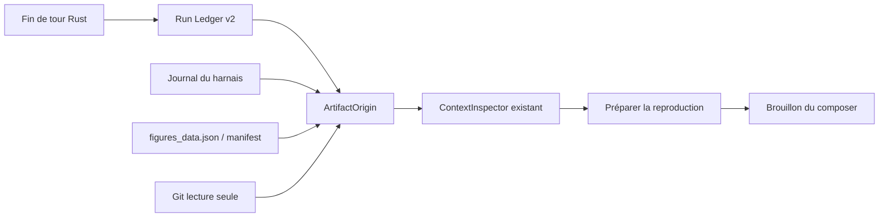

# Plan 048 : Artifact Origin + « Préparer la reproduction »

> **Objectif** : relier le Run Ledger, le journal du harnais, Git et la
> provenance de la galerie dans l'inspecteur existant, puis préparer un brouillon
> de reproduction vérifiable par l'utilisateur. Ce plan ne construit pas un
> moteur de notebook et n'exécute aucune commande.
>
> **Executor instructions** : lire le plan en entier avant toute modification.
> Implémenter les lots A, B et C dans cet ordre, avec un commit réversible par
> lot. Exécuter chaque vérification avant de passer au lot suivant. Si une
> condition STOP apparaît, arrêter et rapporter le blocage sans élargir le
> périmètre. À la fin, mettre à jour la ligne 048 dans `plans/README.md`, sauf si
> un réviseur a explicitement gardé la propriété de l'index.
>
> **Drift check obligatoire** :
>
> ```bash
> git log --oneline -5 -- \
>   rust/crates/atelier-store/src/ledger.rs \
>   rust/crates/atelier-store/src/journal.rs \
>   rust/crates/atelier-runtime/src/send.rs \
>   rust/crates/atelier-runtime/src/ws_router.rs \
>   rust/crates/atelier-core/src/gallery_builder.rs \
>   src/components/GitSurface.tsx \
>   src/components/ContextInspector.tsx \
>   src/App.tsx src/lib/ws.ts
> ```
>
> Le plan a été écrit le **2026-07-17** depuis `d18e810`. Si un fichier
> in-scope a changé depuis, comparer l'état vivant aux constats ci-dessous et
> adapter seulement les emplacements, jamais les invariants produit ou sécurité.

## Statut et décision produit

| Champ | Valeur |
|---|---|
| Priorité | P1 — fondation de la recherche reproductible |
| Effort visé | M, en trois lots indépendants |
| Risque | MED — finalisation des tours et nouvelle agrégation de données |
| Dépendances | backend Rust stable ; redaction du journal Rust terminée avant d'exposer un résumé de commande |
| Compatible avec | plan 047 : aucun ajout au runtime Node ni au bundle |
| Hors dépendance | aucune dépendance de code ou de runtime à Open Science |

Recommandation de séquence : ne pas lancer ce plan pendant un incident ouvert
du soak Rust du plan 047. Il n'est toutefois pas nécessaire d'attendre le
retrait physique complet de Node : la nouvelle voie est exclusivement Rust.

## Résultat attendu, en une phrase

Quand l'utilisateur inspecte un artefact, Atelier explique **d'où il vient**, à
quel tour et à quel état Git il est relié, avec quel niveau de confiance, puis
peut ajouter au composer un brouillon « reproduis ce résultat » — sans envoyer
le message et sans exécuter la commande.



Le flux s'arrête au brouillon. Il n'existe aucune flèche vers un shell, un
kernel, `/regenerate`, un job distant ou une modification de fichier.

## Pourquoi ce plan reste léger

Ce plan reprend d'Open Science trois idées utiles : une origine unifiée, une
chaîne d'éléments probants et un point d'entrée « reproduce ». Il ne reprend ni
son workspace complet, ni un modèle de notebook, ni un gestionnaire
d'environnements, ni un graphe d'exécution.

### Budget de complexité obligatoire

- aucun nouveau sidecar, daemon, serveur HTTP, worker de fond ou route Tauri ;
- aucune nouvelle page : une section dans `ContextInspector` seulement ;
- aucune nouvelle base SQLite ni nouvel index d'artefacts persistant ;
- aucune dépendance npm ou crate supplémentaire ; `sha2` existe déjà dans
  `atelier-store` ;
- un seul nouveau module Rust de résolution et un seul module TypeScript de
  contrat/préparation au maximum ;
- aucune lecture de provenance au boot : résolution uniquement à l'ouverture de
  l'inspecteur ;
- aucune copie de l'artefact, des sorties de tools ou de l'environnement ;
- réponse WS plafonnée à 64 KiB et brouillon de reproduction plafonné à 8 KiB ;
- si la production dépasse environ 1 200 lignes hors tests, arrêter et scinder
  le travail : ce serait le signal que le MVP est devenu une plateforme.

## État courant confirmé

### 1. Le Ledger existe, mais le runtime Rust ne l'alimente pas

- [`atelier-store/src/ledger.rs`](../rust/crates/atelier-store/src/ledger.rs)
  sait ajouter et lire `ledger/<slug>.jsonl` et plafonne une lecture de projet à
  1 000 entrées.
- [`ws_router.rs`](../rust/crates/atelier-runtime/src/ws_router.rs) répond déjà à
  `getLedger`, et [`GitSurface.tsx`](../src/components/GitSurface.tsx) affiche les
  entrées, fichiers, outils et le lien vers le chat.
- Le runtime Node historique écrit une entrée à la fin d'un événement `done`
  dans [`sidecar/router.mjs`](../sidecar/router.mjs).
- Le chemin Rust par défaut démarre un `turnId`, crée un snapshot, sérialise un
  terminal unique et enrichit `done` avec `filesChanged` et `checkpoint` dans
  [`send.rs`](../rust/crates/atelier-runtime/src/send.rs), mais n'appelle jamais
  `append_ledger`.

Conséquence : l'UI Journal peut sembler complète alors que les nouveaux tours
du backend de production n'y sont pas durablement attribués.

### 2. L'identité actuelle d'un projet peut entrer en collision

`slug_for()` utilise uniquement le dernier segment du chemin. Deux projets
comme `/Volumes/A/thesis` et `/Users/me/thesis` partagent donc le même fichier
`thesis.jsonl`. Une provenance fiable ne peut pas se construire sur cette
ambiguïté.

### 3. Les preuves existent déjà, mais restent séparées

- le journal `harness-history` conserve les événements durables avec
  `threadId`, `turnId`, ordre et identité provider ;
- le Ledger expose le résumé d'un tour ;
- Git fournit snapshot, diff et commit ;
- la galerie lit `.atelier-provenance.json`, valide les `argv`, marque les
  commandes exactes `declared`, et conserve l'inférence de même stem comme
  `same-stem` dans
  [`gallery_builder.rs`](../rust/crates/atelier-core/src/gallery_builder.rs) ;
- `figures_data.json` contient déjà ce résultat enrichi pour les artefacts de
  galerie.

Le plan doit agréger ces sources à la demande. Il ne doit pas les recopier dans
un second magasin nommé « provenance ».

### 4. L'inspecteur est déjà la bonne surface

[`ContextInspector.tsx`](../src/components/ContextInspector.tsx) rend aujourd'hui
les métadonnées reçues, sans faire lui-même de requête. `App.tsx` possède la
sélection, le cycle d'ouverture/fermeture et l'ajout au contexte. Cette frontière
doit rester intacte : l'hôte charge l'origine ; l'inspecteur ne fait que la
présenter.

### 5. `/regenerate` n'est pas le bouton de ce plan

La galerie possède une route qui exécute directement un `argv` déclaré dans le
projet courant, avec un timeout de 900 secondes. Elle ne crée pas de worktree,
ne protège pas les sorties existantes et ne compare pas le résultat. Le bouton
« Préparer la reproduction » ne doit jamais appeler cette route.

## Contrat de données cible

### Run Ledger v2

Introduire dans `atelier-store` un type sérialisable explicite, tout en gardant
la lecture JSON tolérante des anciennes lignes :

```ts
type RunLedgerEntryV2 = {
  schemaVersion: 2;
  projectId: string;        // sha256 du projectRoot canonique
  projectRoot: string;
  startedAt: string;
  endedAt: string;
  status: "done" | "error" | "interrupted";
  threadId: string;
  turnId: string;
  threadTitle: string | null;
  provider: string;
  model: string | null;
  effort: string | null;
  promptExcerpt: string;    // 500 caractères maximum
  usage: {
    context?: number | null;
    output?: number | null;
    cost?: number | null;
    turns?: number | null;
  } | null;
  tools: Array<{ name: string; status?: string | null }>;
  filesChanged: string[];
  snapshotSha: string | null;
};
```

Invariants :

- exactement une entrée par `turnId` terminal, que le terminal vienne du
  provider ou du filet synthétique ;
- `interrupted` est décidé par le drapeau d'annulation du tour, pas par une
  recherche textuelle dans le message d'erreur ;
- les sorties brutes des tools, prompts complets, variables d'environnement,
  tokens et valeurs de champs secrets ne sont jamais copiés dans le Ledger ;
- `tools` et `filesChanged` sont dédupliqués, bornés et ordonnés de façon
  déterministe ;
- une erreur d'écriture du Ledger produit un log structuré sans faire échouer ni
  retarder la réponse finale du chat ;
- l'écriture disque synchrone passe par `spawn_blocking` ;
- la déduplication est défensive : si une finalisation est rappelée, une entrée
  ayant le même `turnId` ne doit pas être ajoutée une seconde fois.

### Identité et compatibilité des fichiers Ledger

Les nouvelles écritures utilisent :

```text
<slug-lisible>--<12-premiers-hex-du-sha256(projectRoot-canonique)>.jsonl
```

La lecture par projet :

1. lit le nouveau fichier hashé ;
2. lit aussi l'ancien `<slug>.jsonl` s'il existe ;
3. ne garde d'une ligne legacy que ce qui peut être attribué sans ambiguïté ;
4. fusionne du plus récent au plus ancien ;
5. déduplique par `turnId`, puis par une clé legacy
   `ts + threadId + snapshotSha` lorsque `turnId` manque ;
6. ne réécrit et ne supprime jamais les anciens fichiers automatiquement.

Une ligne legacy sans `projectRoot` reste affichable dans le Journal, mais elle
est toujours non attribuable pour `ArtifactOrigin` : le resolver ne peut pas
savoir si un autre projet de même basename a jadis partagé ce fichier. Elle ne
peut donc jamais devenir une preuve `observed` pour un artefact.

### ArtifactOrigin v1

Le resolver Rust retourne un contrat borné et lisible par l'UI :

```ts
type ArtifactOriginConfidence =
  | "declared"
  | "observed"
  | "inferred"
  | "unknown";

type ArtifactOrigin = {
  schemaVersion: 1;
  projectRoot: string;
  rel: string;
  confidence: ArtifactOriginConfidence;
  generator: string | null;
  command: string[] | null; // uniquement un argv validé et déclaré
  git: {
    provenanceCommit: string | null; // valeur enregistrée avec la provenance
    currentCommit: string | null;    // HEAD au moment de la résolution
  };
  latestRun: null | {
    startedAt: string;
    endedAt: string;
    status: "done" | "error" | "interrupted";
    threadId: string;
    turnId: string;
    threadTitle: string | null;
    provider: string;
    model: string | null;
    effort: string | null;
    snapshotSha: string | null;
    tools: Array<{ name: string; status?: string | null }>;
  };
  evidence: Array<{
    source: "manifest" | "gallery" | "ledger" | "journal" | "git";
    confidence: ArtifactOriginConfidence;
    label: string;
    ref: string | null;
  }>;
  blockers: string[];
  canPrepareReproduce: boolean;
};
```

Règles de confiance :

| Source | Niveau maximal | Règle |
|---|---|---|
| commande exacte de `.atelier-provenance.json` validée | `declared` | seule source autorisée à remplir `command` |
| `filesChanged` contient exactement `rel` pour un tour v2 attribuable | `observed` | prouve que le tour a changé le fichier, pas que chaque tool l'a généré |
| provenance galerie `same-stem` | `inferred` | affichée comme hypothèse, jamais promue |
| commit enregistré ou HEAD courant seul | `unknown` | état de contexte, pas preuve de génération |

Si plusieurs preuves existent, elles sont toutes retournées. La confiance
globale prend la preuve la plus forte sans modifier le niveau des autres.
`canPrepareReproduce` vaut `true` pour une commande `declared` ou un tour
`observed` exact. Une inférence de stem ou Git seul ne suffit pas.

## API WS cible

Ajouter un seul message entrant et un seul message sortant :

```json
{
  "type": "getArtifactOrigin",
  "projectRoot": "/projet/canonique",
  "rel": "figures/albedo.png"
}
```

```json
{
  "type": "artifactOrigin",
  "projectRoot": "/projet/canonique",
  "rel": "figures/albedo.png",
  "origin": { "schemaVersion": 1 },
  "error": null
}
```

Contraintes :

- refuser `rel` vide, absolu, contenant `..` ou résolvant hors du projet ;
- ne lire que le Ledger du projet, la tranche pertinente du journal, le
  `.atelier-provenance.json`, le `figures_data.json` du projet et Git en lecture
  seule ;
- ne jamais envoyer le contenu de l'artefact ni les sorties des tools ;
- conserver le plafond existant de 1 000 entrées Ledger ;
- réponse corrélée par `projectRoot + rel` afin qu'un résultat tardif du fichier
  A ne remplace pas l'inspecteur déjà passé au fichier B ;
- les erreurs sont structurées et locales à l'inspecteur ; elles ne deviennent
  pas une bannière globale ni une déconnexion du sidecar.

Le resolver appartient à `atelier-runtime` parce qu'il orchestre des sources
existantes. Il n'obtient aucun accès en écriture et ne crée pas
`artifact-origin.json`, `provenance.db` ou équivalent.

## Règles de résolution

Pour un seul `projectRoot + rel` :

1. normaliser et confiner le chemin ;
2. lire directement `.atelier-provenance.json` et retrouver la clé exacte
   `rel` ; elle est l'unique autorité d'une commande `declared` ;
3. accepter son `command` seulement si l'argv respecte la validation existante
   de la galerie : 1–32 chaînes, non vides, 2 000 caractères maximum chacune ;
4. lire `figures_data.json` si présent pour les preuves déjà calculées par la
   galerie, notamment `same-stem`. Une commande mise en cache dans ce fichier
   n'est réutilisable que si elle correspond encore au manifeste direct ;
5. lire au plus 1 000 entrées du Ledger du projet et choisir le plus récent tour
   v2 dont `filesChanged` contient exactement `rel` ;
6. consulter le journal uniquement pour ce `threadId + turnId`, afin de confirmer
   les métadonnées durables disponibles sans recopier les sorties ;
7. distinguer le commit enregistré par la provenance du `HEAD` courant ; aucun
   des deux ne prouve à lui seul la génération ;
8. produire les preuves, blockers et `canPrepareReproduce`.

Ne jamais faire une correspondance par sous-chaîne. Normaliser les séparateurs
et le préfixe `./`, mais conserver la casse du système de fichiers. Un renommage
non enregistré reste « origine inconnue » dans ce MVP.

## UX cible dans l'inspecteur

Ajouter une section **Origine** entre Source et Contexte. Ne pas créer d'onglet
global ni de nouvel inspecteur.

États :

- `loading` : deux rangées squelette ou un statut compact non bloquant ;
- `ready` : badge de confiance, générateur/commande déclarée, dernier tour,
  modèle, commit de provenance et HEAD courant disponibles ;
- `partial` : preuves présentes avec blockers explicitement visibles ;
- `unknown` : « Origine non enregistrée », sans deviner ;
- `error` : erreur inline + action Réessayer ; l'ouverture du fichier et
  l'ajout au contexte restent utilisables.

Actions :

- **Ouvrir le chat** si `latestRun.threadId` est présent ;
- **Préparer la reproduction** si `canPrepareReproduce` est vrai ;
- le bouton existant **Ajouter au chat** garde son contrat actuel ;
- les fichiers listés dans le Journal de `GitSurface` deviennent des boutons
  qui ouvrent ce même inspecteur via un événement applicatif unique. Aucun
  panneau parallèle n'est créé.

L'état de requête appartient à `App.tsx`. `ContextInspector` reste un composant
de rendu pur recevant `originState`, `origin`, `onRetryOrigin`,
`onOpenOriginThread` et `onPrepareReproduce`. Au changement de fichier, l'hôte
annule logiquement la réponse précédente avec une clé de requête ; aucune
promesse non annulable ne doit pouvoir afficher une origine obsolète.

Accessibilité : le niveau de confiance ne dépend pas seulement de la couleur,
les changements d'état utilisent une région `role=status`, les actions restent
au clavier et le contrat Escape/retour de focus du plan 018 demeure intact.

## Contrat de « Préparer la reproduction »

Créer une fonction TypeScript pure et testée, par exemple
`buildReproduceDraft(item, origin)`. Elle retourne un texte déterministe et une
pièce de contexte structurée ; elle n'a pas accès au WebSocket.

Le brouillon demande à l'agent de :

1. vérifier les preuves disponibles et signaler les hypothèses ;
2. retrouver le générateur, les données d'entrée et prérequis manquants ;
3. vérifier le commit et l'état Git courant ;
4. proposer les commandes exactes sans les exécuter ;
5. demander une confirmation explicite avant toute exécution future ;
6. si l'exécution est ensuite autorisée, écrire dans un chemin temporaire ou un
   worktree et comparer au résultat actuel, jamais l'écraser silencieusement.

Le texte inclut seulement : `rel`, confiance, générateur, argv déclaré,
références de thread/turn, modèle, snapshot, commit de provenance et HEAD
courant clairement distingués. Il exclut les sorties de tools, l'environnement
complet et tout secret.

Au clic :

- ajouter le brouillon au composer ou à son contexte avec le mécanisme existant ;
- laisser le focus dans le composer ;
- ne pas appeler `sendPrompt` ;
- ne pas envoyer un message WS `send` ;
- ne pas appeler la route galerie `/regenerate` ;
- ne pas fermer l'inspecteur avant l'accusé local.

## Lots d'implémentation

### Lot A — rendre le Run Ledger Rust vrai et non ambigu

Responsabilité probable :

- `rust/crates/atelier-store/src/ledger.rs`
- `rust/crates/atelier-store/src/journal.rs`
- `rust/crates/atelier-store/src/lib.rs`
- `rust/crates/atelier-runtime/src/send.rs`

Étapes :

1. écrire des tests de caractérisation de la lecture legacy actuelle ;
2. introduire le chemin hashé, les types v2 et la fusion rétrocompatible ;
3. ajouter un accumulateur éphémère borné par tour pour outils, usage et
   fichiers ; il observe les événements normalisés mais ne conserve aucune
   sortie brute ;
4. finaliser l'entrée une seule fois, après la pompe d'événements et le terminal
   synthétique éventuel ;
5. écrire via `spawn_blocking` ; journaliser l'échec sans altérer le terminal ;
6. faire accepter les entrées v1 et v2 par `GitSurface` sans régression.

Tests obligatoires :

- deux racines de même basename produisent deux fichiers différents ;
- lecture fusionnée legacy + v2, ordre newest-first et limite conservée ;
- ligne JSON corrompue ignorée sans perdre les autres ;
- `done` natif, `done` synthétique, `error` et interruption produisent chacun
  exactement une entrée ;
- steering/queue ne réattribuent pas les événements au mauvais `turnId` ;
- échec d'append : chat terminé normalement, diagnostic présent ;
- aucune sortie de tool ou donnée secrète dans le JSONL.

Porte A : le Journal affiche un nouveau tour Rust réel après redémarrage de
l'app. Si ce n'est pas vrai, ne pas commencer `ArtifactOrigin`.

### Lot B — résoudre et afficher ArtifactOrigin

Responsabilité probable :

- nouveau `rust/crates/atelier-runtime/src/artifact_origin.rs`
- `rust/crates/atelier-runtime/src/lib.rs`
- `rust/crates/atelier-runtime/src/ws_router.rs`
- nouveau `src/lib/artifactOrigin.ts`
- `src/App.tsx`
- `src/components/ContextInspector.tsx`
- `src/components/ContextInspector.test.tsx`
- `src/components/GitSurface.tsx`
- `src/components/WsBench.tsx`
- `src/lib/i18n.ts`
- `src/styles/inspector.css`

Étapes :

1. implémenter le resolver comme fonction pure autour d'adaptateurs de lecture ;
2. ajouter les fixtures `declared`, `observed`, `inferred`, `unknown` et conflit ;
3. ajouter les deux messages WS et la protection contre les réponses obsolètes ;
4. étendre l'inspecteur avec la section Origine et ses cinq états ;
5. brancher Ouvrir le chat sur l'événement existant ;
6. rendre les chemins `filesChanged` du Journal inspectables ;
7. vérifier qu'aucun chargement n'a été ajouté au démarrage de l'app.

Tests obligatoires :

- `declared` gagne globalement mais les preuves `observed` restent visibles ;
- un match exact `filesChanged` est `observed` ;
- un même stem reste `inferred` et ne remplit jamais `command` ;
- Git seul reste `unknown` ;
- chemin absolu, `..` et symlink hors racine refusés ;
- réponse A tardive ignorée après passage à B ;
- états loading/ready/partial/unknown/error accessibles ;
- clic d'un fichier du Journal ouvre le même `ContextInspector` ;
- aucune requête n'est faite lorsque l'inspecteur est fermé.

Porte B : sur trois artefacts réels — un déclaré, un modifié par agent, un sans
provenance — l'inspecteur ne surévalue jamais la confiance.

### Lot C — préparer, sans exécuter

Responsabilité probable :

- `src/lib/artifactOrigin.ts` et son test
- `src/App.tsx`
- `src/components/ContextInspector.tsx` et son test
- `src/lib/i18n.ts`

Étapes :

1. écrire d'abord les tests du builder de brouillon ;
2. borner et assainir chaque champ injecté ;
3. ajouter le brouillon au composer par le flux existant ;
4. conserver une confirmation locale accessible ;
5. prouver par espion WebSocket que le clic n'envoie rien.

Tests obligatoires :

- ordre et contenu du brouillon déterministes ;
- `argv` déclaré conservé argument par argument, sans reconstruction shell ;
- champs trop longs tronqués et contrôle caractères neutralisés ;
- aucun output, environnement ou secret présent ;
- `canPrepareReproduce=false` masque ou désactive l'action avec explication ;
- clic : composer préparé, zéro `send`, zéro `/regenerate`, zéro mutation fichier.

Porte C : l'utilisateur peut relire et modifier le brouillon avant tout envoi.

## Découpage Git recommandé

1. `fix(ledger): persist terminal Rust turns with stable project identity`
2. `feat(inspector): resolve and show artifact origin`
3. `feat(reproduce): prepare a reviewed reproduction draft`

Chaque commit doit passer ses tests ciblés et rester fonctionnel seul. Ne pas
mélanger une refonte visuelle, un nettoyage général ou le retrait Node du plan
047 à ces commits.

## Vérifications

### Tests ciblés pendant l'implémentation

```bash
cargo test --manifest-path rust/Cargo.toml -p atelier-store -p atelier-runtime --locked
npx vitest run \
  src/components/ContextInspector.test.tsx \
  src/lib/artifactOrigin.test.ts
```

Ajouter le ou les fichiers de test exacts créés par l'implémentation à la
seconde commande. Si `GitSurface` reçoit un test dédié, l'exécuter également.

### Validation globale obligatoire

```bash
npx tsc --noEmit
npx vite build
(cd sidecar && npx vitest run)
cargo test --manifest-path rust/Cargo.toml --locked
```

Puis suivre **exactement** le protocole de relance d'`AGENTS.md` : tuer app,
sidecars et serveurs galerie, construire le bundle, ouvrir l'app buildée et
vérifier sa convergence. `gallery/` n'est pas in-scope ; si elle est malgré tout
touchée, lancer aussi `parity.mjs` et `diff_suite.mjs` puis justifier le drift.

### Smoke natif d'acceptation

Dans un projet jetable au chemin connu :

1. effectuer un tour Rust qui crée ou modifie un petit artefact ;
2. attendre le terminal et redémarrer Atelier ;
3. ouvrir Git → Journal : une seule entrée v2, bon thread, bon turn, bon fichier ;
4. cliquer le fichier : l'inspecteur indique `observed` et ouvre le bon chat ;
5. tester un artefact avec commande manifeste : `declared`, argv exact ;
6. tester un artefact sans preuve : `unknown`, aucune fausse origine ;
7. cliquer Préparer : texte présent dans le composer, rien n'est envoyé ;
8. vérifier que les fichiers et l'état Git n'ont pas changé après ce clic.

## Définition de DONE

- [ ] Chaque tour terminal Rust produit au plus une entrée Ledger v2 durable.
- [ ] Deux projets de même nom ne partagent plus leurs nouvelles entrées.
- [ ] Les Ledger legacy restent lisibles sans migration destructive.
- [ ] L'origine est calculée seulement à l'ouverture de l'inspecteur.
- [ ] Les niveaux `declared`, `observed`, `inferred`, `unknown` sont fidèles et
      testés.
- [ ] Aucune inférence n'est présentée comme une observation.
- [ ] Le Journal et l'inspecteur ouvrent le bon thread et le bon artefact.
- [ ] Préparer crée un brouillon relisible, jamais une exécution ni un envoi.
- [ ] Aucune dépendance, page, daemon, base ou tâche de boot n'a été ajouté.
- [ ] Tests ciblés, validation globale, build Tauri et smoke natif sont verts.
- [ ] `plans/README.md` contient le statut et le commit accepté.

## Conditions STOP

- la redaction du journal Rust n'est pas terminée et l'implémentation veut
  exposer une commande issue du journal : arrêter ou omettre ce champ ;
- il faut modifier le sidecar Node pour obtenir la fonctionnalité : arrêter —
  le plan 047 impose Rust pour les nouvelles features ;
- le resolver exige un scan de fond, une base, un watcher ou un nouveau service :
  arrêter et proposer un plan séparé avec mesures justifiant ce coût ;
- l'implémentation veut appeler `/regenerate`, un shell, un notebook, Narval ou
  un kernel : arrêter ;
- une correspondance same-stem est promue en `observed` ou remplit `command` :
  arrêter ;
- un prompt, output de tool, environnement ou secret complet est copié dans le
  Ledger, la réponse WS ou le brouillon : arrêter ;
- la finalisation du Ledger peut retarder ou casser le terminal du chat :
  arrêter et remettre l'écriture hors du chemin critique ;
- un fichier hors scope contient des changements utilisateur qui doivent être
  écrasés ou réorganisés : arrêter et demander la frontière d'édition ;
- les budgets 64 KiB / 8 KiB ou le budget structurel sont dépassés : arrêter et
  réduire le contrat avant de continuer.

## Explicitement différé

À ne pas glisser dans ce plan :

- exécution dans un worktree ou un dossier temporaire ;
- capture et restauration de Conda, renv, Julia, Docker ou Nix ;
- notebooks exécutables et kernels persistants ;
- comparateurs spécialisés PNG/SVG/PDF/NetCDF/GeoTIFF/Parquet ;
- graphe global artefact → données → script → figure ;
- index de provenance de tout le projet ;
- reproduction distante sur Narval/Rorqual ;
- verdict automatisé « identique/différent » ;
- historique complet des versions d'un artefact ;
- bouton d'exécution directe dans l'inspecteur.

Un futur plan « Reproduce in isolated worktree » ne doit être écrit qu'après
validation humaine de ce MVP sur au moins dix artefacts réels, sans fausse
attribution critique. Ce futur plan devra avoir son propre threat model,
comparateurs, politique d'environnement et confirmation destructive.

## Limite de la comparaison avec Open Science

La référence analysée est `ai4s-research/open-science` au commit
`70b0e7966be69069d64985f7fe9a87f79d7bda0c`. Atelier emprunte ici un modèle
produit, pas du code : aucun fichier, composant ou schéma de ce dépôt n'est
copié. Le MVP d'Atelier reste centré sur ses sources existantes et sur la
vérifiabilité de leur niveau de confiance.
