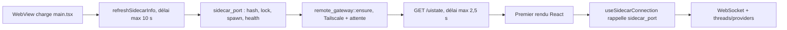
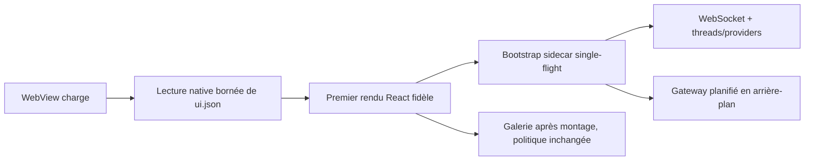

# Plan 051 : Démarrage interactif rapide — état natif, sidecar asynchrone et gateway hors chemin critique

> **Instructions d'exécution** : lire ce plan en entier avant toute
> modification. Exécuter les tranches P0 → P5 dans l'ordre et conserver chaque
> tranche dans un commit réversible. Ne pas pusher sans demande explicite.
> Après toute modification, suivre `AGENTS.md` et
> `docs/PROTOCOLE_RELANCE.md` exactement pour le build et la relance.
>
> Ce plan optimise d'abord le **temps jusqu'à une interface fidèle et
> utilisable**. Il ne raccourcit pas les garde-fous de health, ne masque pas une
> panne et ne met aucun provider sur le chemin bloquant du premier rendu.
>
> **Drift check initial** :
>
> ```bash
> git status --short
> git worktree list --porcelain
> git log --oneline -8 -- \
>   src/main.tsx \
>   src/lib/sidecarInfo.ts \
>   src/lib/uiStateWriteThrough.ts \
>   src/lib/uistate.ts \
>   src/lib/ws.ts \
>   src/hooks/useSidecarConnection.ts \
>   src-tauri/src/lib.rs \
>   src-tauri/src/sidecar.rs \
>   src-tauri/src/remote_gateway.rs
> pgrep -fl "tauri-app|atelier-studio-server|atelier-gallery-server|server/main.mjs" || true
> ```
>
> Si l'app visible ne vient pas du checkout canonique à mesurer, STOP : ne pas
> produire de baseline à partir d'un autre worktree. Les fichiers non suivis
> existants dans `src-tauri/rust-server-dist/` appartiennent au travail local de
> l'utilisateur : ne pas les supprimer, les écraser ou les inclure par défaut.

## Statut

- **Priority** : P1 — gain perceptible quotidien, sans nouvelle surface produit
- **Effort** : L — 6 tranches, dont une tranche de mesure et une de soak
- **Risk** : HIGH — ordre d'hydratation, reconnexion et lifecycle process
- **Depends on** : build canonique de `main` identifiable et relançable
- **Compatible avec** : plan 047 ; aucun nouveau chemin runtime Node
- **Category** : performance / fiabilité / bootstrap desktop
- **Planned at** : 2026-07-18, `main`
- **Status** : TODO

## Résultat attendu

Atelier doit afficher rapidement une interface fidèle aux données persistées,
même lorsque le sidecar est froid, Tailscale est lent ou le premier lancement
post-build déclenche des consultations macOS. Le sidecar, la galerie et le
gateway continuent ensuite à converger en arrière-plan avec les contrôles
d'identité actuels.

Le plan distingue trois jalons :

1. **Interface fidèle** : projets, réglages, thème et navigation proviennent de
   `ui.json` avant le premier rendu — jamais d'écran vierge ni de flash des
   valeurs par défaut.
2. **Chat prêt** : sidecar vérifié, WebSocket ouvert, threads et providers
   chargés.
3. **Services annexes prêts** : galerie du projet et gateway Remote Control
   disponibles sans avoir retardé les deux jalons précédents.

## État courant vérifié à l'écriture du plan

Le chemin actuel est séquentiel :



Constats précis :

- `src/main.tsx` attend `refreshSidecarInfo()` jusqu'à 10 s avant le premier
  `ReactDOM.createRoot(...).render(...)`.
- Si le sidecar est disponible, `main.tsx` attend ensuite `/uistate` jusqu'à
  2,5 s pour préserver le pont de stockage `localhost:1420` ↔ `tauri://`.
- `sidecar_port` appelle `remote_gateway::ensure` avant de rendre la main. Le
  gateway exécute les sondes Tailscale et peut attendre 20 × 150 ms après son
  spawn.
- Après le rendu, `connectSidecar()` appelle de nouveau
  `refreshSidecarInfo()`.
- `useAtelierServer()` démarre déjà la galerie dans un effet React : elle ne
  précède pas le premier rendu. On ne la déplacera que si les mesures montrent
  une contention significative après le montage.
- Le démarrage du provider Codex est paresseux (`ensure()` au premier send) :
  il affecte le premier tour, pas le premier rendu de l'app.

## Budget et définitions

Toutes les durées sont mesurées dans l'`.app` release canonique. `p50` et `p95`
sont calculés sur les échantillons définis en P0/P5 ; une capture isolée ne
suffit pas.

| Mesure | Début | Fin | Cible initiale |
|---|---|---|---|
| `firstMeaningfulPaintMs` | entrée de `run()` dans le process Tauri | premier frame avec thème + projet fidèles | warm p95 ≤ 1,2 s ; cold p95 ≤ 2 s |
| `sidecarReadyMs` | entrée de `run()` | `sidecar_port` vérifié | warm p95 ≤ 2 s |
| `wsReadyMs` | entrée de `run()` | WebSocket ouvert + hello envoyé | warm p95 ≤ 2,5 s ; cold normal p95 ≤ 8 s |
| `galleryReadyMs` | entrée de `run()` | URL du projet répond et identité correcte | observation, sans gate P1-P3 |
| `postBuildConvergenceMs` | ouverture après rebuild | sidecar + lock + health compatibles | ≤ 30 s, contrat macOS/TCC existant |

Les cibles peuvent être ajustées après la baseline uniquement si les valeurs,
la machine, le scénario et la justification sont inscrits dans ce plan avant
l'implémentation. Il est interdit de déplacer silencieusement une cible pour
faire passer le résultat.

## Architecture cible



Décisions contraignantes :

- `ui.json` reste la source de synchronisation inter-origines au démarrage.
- La lecture initiale de `ui.json` ne dépend plus du sidecar HTTP.
- Le rendu React ne dépend pas de la disponibilité du sidecar.
- Une seule promesse frontend possède l'initialisation `sidecar_port` à la fois.
- Le gateway Remote Control conserve son démarrage automatique, mais hors du
  retour bloquant de `sidecar_port`.
- Les retries et validations `bundleHash`/token/service restent en place.
- Aucun `codex app-server`, `thread/start`, provider ACP ou appel modèle ne
  démarre avant le premier rendu.

## P0 — Instrumentation et baseline canonique

### Objectif

Mesurer le chemin réel avant de le modifier et rendre les mesures répétables
dans l'app empaquetée.

### Implémentation

Créer `src/lib/bootMetrics.ts` avec un contrat sans données utilisateur :

```ts
type BootMetricName =
  | "frontendEvaluated"
  | "uiStateHydrated"
  | "reactCommitted"
  | "firstMeaningfulPaint"
  | "sidecarReady"
  | "wsReady"
  | "galleryReady";

type BootMetricsV1 = {
  schemaVersion: 1;
  appVersion: string;
  bootId: string;
  nativeProcessElapsedAtFrontendEvalMs: number;
  marksMs: Partial<Record<BootMetricName, number>>;
  flags: {
    uiStateSource: "native" | "localStorage-fallback" | "legacy-http";
    sidecarPath: "in-process" | "lock-reuse" | "spawn" | "unknown";
    gatewayDeferred: boolean;
  };
};
```

- Créer côté Tauri un `BootClock(Instant)` au tout début de `run()` et exposer
  son temps écoulé au frontend. Combiner cet offset natif avec
  `performance.now()` : les métriques couvrent ainsi le lancement du process,
  la création du WebView et l'évaluation du bundle, pas seulement le JavaScript.
- Utiliser exclusivement des deltas monotones pour les budgets ; l'horloge
  murale sert seulement à dater le run.
- Poser `reactCommitted` dans un minuscule `BootProbe` monté dans la racine et
  `firstMeaningfulPaint` au `requestAnimationFrame` suivant.
- Ne jamais enregistrer token, port, chemin de projet, titre de thread, modèle,
  prompt ou contenu de `ui.json`.
- Exposer le dernier snapshot sous `window.__ATELIER_BOOT_METRICS__` pour les
  tests/diagnostics locaux.
- Ajouter une commande Tauri bornée `record_boot_metrics` qui upsert le run par
  `bootId` dans
  `~/Library/Application Support/atelier-studio/boot-metrics.json`. Conserver
  au maximum les 100 derniers runs, par écriture atomique ; fichier invalide
  sauvegardé à part puis recréé, jamais concaténé sans borne.
- Ajouter `scripts/summarize-boot-metrics.mjs` : lecture seule du fichier,
  filtres par scénario/build et sortie n/min/p50/p95/max. Aucun accès aux
  prompts, projets ou threads.
- Ajouter au `SidecarInfo` un champ de diagnostic `lifecycle` déterminé dans
  `sidecar_port` (`in-process`, `lock-reuse`, `spawn`) ; aucune logique produit
  ne dépend de ce champ.

### Baseline

Sur la même build release canonique :

- 10 ouvertures warm : sidecar compatible déjà sain ;
- 5 ouvertures cold normales : seuls les PID Atelier explicitement identifiés
  sont arrêtés selon le protocole ;
- 3 premières ouvertures post-build si une reconstruction est déjà nécessaire
  à la validation ; ne pas rebuild trois fois uniquement pour fabriquer des
  chiffres ;
- un scénario Tailscale connecté et un scénario Tailscale indisponible.

Reporter dans la section « Résultats d'exécution » : commit, bundle exact,
macOS, scénario, n, p50, p95, min et max.

### Tests et acceptation

- Test frontend : ordre monotone des marques et absence de données interdites.
- Test Rust : rejet des métriques surdimensionnées ou de schéma inconnu.
- `boot-metrics.json` existe après un run de l'app buildée, ne contient que le
  schéma prévu et reste borné à 100 entrées.
- Le script de synthèse retrouve les mêmes quantiles qu'une fixture contrôlée.
- Baseline inscrite avant P1.

### Commit suggéré

`perf(boot): instrument packaged startup milestones`

## P1 — Hydratation native rapide de `ui.json`

### Objectif

Préserver l'invariant « état disque avant premier rendu » sans attendre le
sidecar, son port, son health ou le gateway.

### Backend Tauri

Créer `src-tauri/src/ui_state.rs` et enregistrer `ui_state_snapshot` dans
`src-tauri/src/lib.rs`.

Contrat :

```rust
#[tauri::command]
fn ui_state_snapshot() -> Result<HashMap<String, String>, String>
```

Contraintes :

- chemin fixe : `~/Library/Application Support/atelier-studio/ui.json` ;
- aucun chemin fourni par le frontend ;
- taille maximale 2 MiB avant parsing ;
- objet JSON uniquement ; valeurs string uniquement ;
- seules les clés préfixées `atelier-studio` sont renvoyées ;
- fichier absent → objet vide ;
- fichier invalide → erreur actionnable, sans suppression ni écrasement ;
- lecture seule : aucune création de dossier ou mutation du store dans cette
  commande.

Extraire une fonction pure `read_ui_state(path)` afin de tester sur répertoire
temporaire sans toucher au vrai Application Support.

### Frontend

Dans `src/main.tsx` :

1. appeler `ui_state_snapshot` dès la fin des branches visual-bench ;
2. borner l'attente à 500 ms ;
3. appliquer les paires reçues dans `localStorage` ;
4. en cas d'absence/erreur/timeout, conserver le `localStorage` actuel et poser
   `uiStateSource=localStorage-fallback` ;
5. ne jamais appliquer une réponse tardive après le premier rendu — elle
   pourrait écraser une modification utilisateur faite entre-temps.

Le comportement de précédence doit rester identique au boot actuel : les clés
présentes sur disque remplacent leurs homologues locales ; les clés locales
absentes du snapshot ne sont pas supprimées.

### Write-through pendant le sidecar froid

Adapter `src/lib/uiStateWriteThrough.ts` pour pouvoir l'installer juste après
l'hydratation native et avant React :

- toute écriture locale marque le bridge `dirty` ;
- si aucun `SidecarInfo` n'est encore disponible, l'état sale reste en attente
  au lieu d'être considéré comme flushé ;
- le contrôleur retourné expose `flushNow()` et `dispose()` ;
- lorsque le bootstrap sidecar finit, `flushNow()` envoie le snapshot local
  complet à `/uistate` ;
- `pagehide` conserve le comportement `keepalive` et n'enchaîne aucun refresh
  asynchrone non borné.

Le bridge ne relit jamais `/uistate` après le rendu : le sens après montage est
localStorage → disque, ce qui ferme la course « réponse tardive écrase un clic ».

### Tests et acceptation

- Rust : fichier absent, valide, corrompu, trop grand, tableau au lieu d'objet,
  valeur non-string, clé hors préfixe.
- Frontend : snapshot disque prioritaire, fallback local, réponse tardive
  ignorée, aucune suppression de clé locale absente du disque.
- Write-through : une écriture faite avant `sidecarReady` est envoyée au premier
  `flushNow()` ; aucune perte lors d'un pagehide.
- Au premier frame, le projet actif, le thème et les réglages correspondent au
  fichier `ui.json` réel ; aucun flash des valeurs par défaut.

### STOP conditions

- Un test montre une divergence entre build `tauri://` et dev
  `localhost:1420`.
- Une écriture utilisateur peut être perdue pendant la fenêtre pré-sidecar.
- Le code doit dupliquer les migrations de `loadSettings()` côté Rust : STOP,
  Rust doit seulement transporter les strings.

### Commit suggéré

`perf(boot): hydrate ui state without waiting for sidecar`

## P2 — Premier rendu immédiat et bootstrap sidecar single-flight

### Objectif

Monter React dès que P1 est terminé, puis connecter le cœur en arrière-plan
sans invocation concurrente ou réutilisation d'une adresse périmée.

### `src/main.tsx`

- Retirer l'attente bloquante de 10 s sur `refreshSidecarInfo()`.
- Retirer le `GET /uistate` HTTP pré-rendu, remplacé par P1.
- Monter React immédiatement après l'hydratation native bornée.
- Après le premier frame, déclencher le bootstrap partagé du sidecar.
- Conserver l'état `connecting` existant du Research Home ; ne pas afficher une
  erreur pendant le démarrage normal.

### `src/lib/sidecarInfo.ts`

Implémenter une machine minimale :

```ts
let current: SidecarInfo | null;
let inFlight: Promise<SidecarInfo> | null;

ensureSidecarInfo(): Promise<SidecarInfo>   // current, sinon single-flight
refreshSidecarInfo(): Promise<SidecarInfo>  // single-flight forcé
invalidateSidecarInfo(): void               // après fermeture/identité invalide
```

Invariants :

- au plus un `invoke("sidecar_port")` simultané par WebView ;
- deux consommateurs reçoivent la même promesse ;
- un rejet vide `inFlight`, permettant un retry ;
- `current` n'est remplacé qu'après une résolution valide ;
- une déconnexion invalide l'adresse avant le retry ;
- le flusher UI utilise toujours le couple port/token courant.

### `src/lib/ws.ts` et `src/hooks/useSidecarConnection.ts`

- La première connexion utilise `ensureSidecarInfo()`.
- Après `onclose`, invalider puis appeler `refreshSidecarInfo()` avant d'ouvrir
  le nouveau WebSocket.
- Conserver l'AbortController, le backoff exponentiel et l'unicité de socket
  sous StrictMode.
- Publier `sidecarReady` et `wsReady` dans les métriques P0.
- À `sidecarReady`, appeler une fois le `flushNow()` du bridge P1.

Ne pas lancer un bootstrap séparé dans `main.tsx` et dans le hook : les deux
peuvent demander `ensureSidecarInfo()`, mais la promesse single-flight doit en
faire une seule invocation native.

### Tests et acceptation

- Deux appels simultanés à `ensureSidecarInfo()` → un seul `invoke`.
- Rejet puis retry → un nouvel `invoke`, pas une promesse rejetée mémorisée.
- `onclose` → ancienne info invalidée avant la tentative suivante.
- StrictMode monte/démonte deux fois → une seule socket active, aucun timer
  orphelin.
- Le sidecar froid peut prendre plus de 10 s sans empêcher React de s'afficher.
- Si le sidecar échoue définitivement, l'interface locale reste utilisable et
  la bannière existante apparaît après l'échec réel.

### Commit suggéré

`perf(boot): render before single-flight sidecar startup`

## P3 — Gateway Remote Control hors chemin critique

### Objectif

Empêcher Tailscale et le démarrage du gateway iPhone de retarder
`sidecar_port`, tout en conservant le comportement Remote Control actuel.

### Refactor Tauri

Dans `src-tauri/src/sidecar.rs` :

- après validation ou réutilisation du `SidecarInfo`, retourner ce résultat au
  frontend sans attendre `remote_gateway::ensure` ;
- planifier l'ensure sur une tâche bloquante dédiée, avec clone de l'AppHandle
  et du `SidecarInfo` ;
- dédupliquer la planification par identité `(port, tokenHash)` afin que deux
  appels rapprochés n'exécutent pas deux sondes Tailscale ;
- journaliser succès/échec sans remonter l'échec comme panne du sidecar chat.

Dans `src-tauri/src/remote_gateway.rs` :

- conserver la vérification du lock, du token hash et du health ;
- conserver le log `remote/gateway.log` et la terminaison d'un gateway
  incompatible ;
- ne tenir aucun mutex global pendant une attente qui empêcherait
  `sidecar_port` de répondre ;
- exposer un statut testable `idle | starting | ready | failed` si nécessaire
  au panneau Remote Devices, sans nouvelle bannière globale.

Ce plan ne rend pas le gateway opt-in. Une éventuelle préférence « activer le
contrôle distant » est une décision produit séparée.

### Tests et acceptation

- `sidecar_port` retourne sans attendre une commande Tailscale artificiellement
  bloquée dans le test.
- Deux planifications identiques → un seul spawn/ensure.
- Nouvelle identité sidecar → ancien gateway remplacé, nouveau token utilisé.
- Tailscale absent → chat et galerie restent sains ; statut Remote en erreur
  locale seulement.
- Le parcours iPhone existant reste fonctionnel après convergence.

### Commit suggéré

`perf(boot): defer remote gateway until after sidecar readiness`

## P4 — Réduction du travail post-rendu uniquement sur preuve

### Galerie

Mesurer la contention entre `useAtelierServer()` et la connexion sidecar après
le premier rendu. Ne modifier la politique que si la baseline montre que le
spawn/build galerie retarde `wsReadyMs` d'au moins 10 % ou 250 ms p95.

Si le seuil est franchi :

- projet dont la surface Atelier/galerie est visible → démarrage au frame
  suivant ;
- autre surface visible → démarrage après `wsReady` ou via
  `requestIdleCallback` avec fallback timer 1 s ;
- tout clic « Galerie » court-circuite l'attente et démarre immédiatement ;
- aucun changement à l'identité, au rescan ou au watcher.

Sinon : inscrire « aucun changement galerie justifié » dans les résultats et
laisser `useAtelierServer()` intact.

### Hash et health sidecar

Mesurer séparément le fingerprint du binaire et le premier `/health`. Ne cacher
le hash Rust que s'il dépasse 50 ms p95 : un `OnceLock` est acceptable pour le
binaire immuable d'une app release, mais pas pour le fallback Node en mode dev,
dont le répertoire peut changer pendant que Tauri reste ouvert.

Ne réduire ni le nombre ni les délais des retries de démarrage froid dans cette
tranche. Ils sont hors du premier rendu après P2 et protègent le cas TCC.

### Premier tour Codex — explicitement après le boot

Le préchauffage Codex n'est pas requis pour déclarer le plan 051 DONE. S'il est
réalisé dans une tranche ultérieure :

- déclencheur : provider Codex actif + première saisie non vide ;
- action : démarrer seulement `codex app-server` ;
- interdit : `thread/start`, création de conversation, appel modèle ou lecture
  de prompt avant Send ;
- échec silencieusement récupérable au vrai send ;
- métrique distincte du temps de démarrage de l'app.

## P5 — Validation native, budgets et soak

### Tests automatisés

Exécuter au minimum :

```bash
npx vitest run \
  src/lib/sidecarInfo.test.ts \
  src/lib/uiStateWriteThrough.test.ts \
  src/lib/ws.test.ts \
  src/hooks/useSidecarConnection.test.tsx
cargo test --manifest-path src-tauri/Cargo.toml --locked
npm run verify
```

Puis les vérifications obligatoires de `AGENTS.md` avant le build :

```bash
npx tsc --noEmit
npx vite build
(cd sidecar && npx vitest run)
```

Si `gallery/` n'est pas modifié, les suites parity/diff ne sont pas imposées
par le protocole. Si P4 touche `gallery/` ou ses assets, les exécuter toutes les
deux avant le build.

### Build et relance

Appliquer `docs/PROTOCOLE_RELANCE.md` sans variante : tuer les processus ciblés,
retirer seulement le dossier DMG prévu, builder, inspecter les erreurs hors DMG,
ouvrir le bundle canonique et vérifier `tauri-app` + health. Ne jamais lancer
`npm run tauri dev` depuis l'agent.

### Matrice native obligatoire

| Scénario | Précondition | Preuve attendue |
|---|---|---|
| Warm | sidecar compatible vivant | premier frame fidèle, un invoke, WS p95 dans le budget |
| Cold normal | aucun service Atelier ciblé vivant | UI avant sidecar, puis convergence sans flash |
| Lock périmé | lock contrôlé pointant vers identité incompatible | UI visible, ancien PID remplacé, un sidecar final |
| Sidecar lent | délai injecté >10 s dans un build de test | UI locale utilisable pendant l'attente |
| Tailscale absent | CLI absente ou non connectée | chat prêt, Remote seul dégradé |
| `ui.json` absent | fichier déplacé de façon récupérable dans un profil test | fallback local, aucun crash |
| `ui.json` corrompu | profil temporaire uniquement | erreur diagnostique, aucun écrasement |
| Post-build TCC | première ouverture de la build finale | premier frame rapide, convergence totale <30 s |
| Reconnexion | tuer uniquement le sidecar identifié | ancienne info invalidée, un respawn, WS rétabli |

Ne pas corrompre ou déplacer le vrai `ui.json` de l'utilisateur pour les tests :
utiliser un `ATELIER_APP_DIR` temporaire dans les tests unitaires/harness.

### Soak d'acceptation

- 3 jours d'usage quotidien sur la build canonique pour détecter flicker,
  perte d'état, fausse bannière et reconnexions ;
- au moins 20 ouvertures warm enregistrées ;
- au moins 5 ouvertures cold normales ;
- aucun incident ouvert lié à l'ordre d'hydratation ou au lifecycle ;
- ce soak valide le plan 051 seulement et ne remplace pas le soak 2–3 semaines
  du plan 047 avant retrait de Node.

## Risques et parades

| Risque | Symptôme | Parade |
|---|---|---|
| Rendu trop tôt | projets/thème par défaut puis saut | snapshot natif P1 avant React, gate visuel |
| Réponse tardive | un clic utilisateur est écrasé | aucune hydratation disque post-rendu |
| Double bootstrap | sidecars rivaux ou mutex long | promesse single-flight + test d'invoke |
| Écriture pré-sidecar perdue | réglage absent de `ui.json` | état `dirty` + `flushNow` à sidecarReady |
| Gateway cassé | iPhone ne rejoint plus Atelier | mêmes checks en tâche de fond + smoke Remote |
| Faux gain | fenêtre visible mais chat bloqué plus longtemps | budgets distincts first paint/WS, comparaison p95 |
| Retry raccourci | régression premier boot TCC | ne pas réduire les retries dans ce plan |
| Contention galerie | WS plus lent après rendu | mesurer P4, différer seulement sur seuil |

## STOP conditions globales

- La build mesurée n'est pas celle de `main` ou son provenance n'est pas
  démontrable.
- Le worktree contient des changements qui chevauchent les fichiers du plan et
  ne peuvent pas être préservés proprement.
- L'état initial diffère de `ui.json`, même brièvement dans la capture native.
- Une modification crée plus d'un sidecar, gateway ou serveur galerie par
  identité attendue.
- Le gain de first paint s'accompagne d'une régression `wsReadyMs` >10 % p95.
- Le gateway Remote ne converge plus lorsque Tailscale est sain.
- Un test nécessite d'affaiblir token, `bundleHash`, origin guard ou health.
- Le premier lancement post-build ne converge pas dans le budget existant de
  30 s.

## Definition of Done

- [ ] Baseline P0 enregistrée sur la build canonique.
- [ ] `ui.json` est lu nativement et borné avant le premier rendu.
- [ ] React ne dépend plus de `sidecar_port`, `/uistate` HTTP ou Tailscale.
- [ ] Un seul bootstrap sidecar frontend peut être actif.
- [ ] Le write-through capture les changements effectués avant sidecarReady.
- [ ] Le gateway démarre hors chemin critique et Remote Control reste sain.
- [ ] Les budgets first paint et WS sont atteints sur les échantillons P5.
- [ ] Tous les scénarios de la matrice native sont documentés avec preuve.
- [ ] `npm run verify`, tests Tauri, build release et health sont verts.
- [ ] L'app finale visible provient du bundle canonique de `main`.
- [ ] Trois jours de soak 051 sans incident ouvert.
- [ ] La section suivante contient les résultats finaux et les commits.

## Résultats d'exécution

À remplir par l'exécuteur, sans remplacer les cibles initiales :

### Baseline avant

- Commit / bundle :
- Machine / macOS :
- Warm, n / p50 / p95 :
- Cold, n / p50 / p95 :
- Post-build :
- Tailscale indisponible :

### Résultats après

- Commits P0-P5 :
- Warm, n / p50 / p95 :
- Cold, n / p50 / p95 :
- Post-build :
- Gain first paint :
- Effet sur wsReady :
- Galerie P4 modifiée : oui/non + preuve :
- Remote Control :
- Gates :
- Incidents du soak :

## Hors périmètre

- Réécriture visuelle du splash screen ou nouvelle animation de démarrage.
- Réduction arbitraire des délais health/TCC.
- Retrait de Node ou des fallbacks du plan 047.
- Auto-update, notarisation ou distribution publique.
- Refonte du store settings/threads.
- Démarrage de tous les providers au boot.
- Création d'un thread Codex caché avant une action utilisateur.
- Changement du lifecycle persistant sidecar/galerie.
