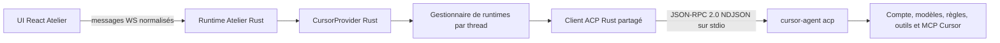

# Plan 055 — Cursor Agent natif via ACP, moteur Rust et intégration UI complète

> **Instructions d'exécution** : lire ce plan en entier avant toute
> modification. L'implémentation doit être réalisée dans un worktree dédié et
> suivre les portes dans l'ordre. Une condition **STOP** suspend le travail et
> impose de rapporter le contrat réellement observé avant de continuer.

## Statut

- **État** : TODO — plan seulement, aucune implémentation Cursor commencée
- **Date de rédaction** : 2026-07-20
- **Priorité proposée** : P1
- **Effort estimé** : XL, environ 7 à 10 jours d'ingénierie et de validation
- **Risque** : HIGH — processus ACP full-duplex, permissions interactives,
  sessions persistantes, extensions Cursor et intégration UI transversale
- **Branche cible** : `codex/cursor-cli-rust`
- **Worktree recommandé** :
  `/Users/tofunori/Documents/atelier-studio-cursor-cli-rust`
- **Backend produit** : Rust uniquement
- **Dépendance Node ajoutée** : aucune
- **Rebuild requis pour ce document** : non
- **Rebuild requis après implémentation** : oui, protocole `AGENTS.md` complet

## Verdict architectural

Cursor doit être intégré à Atelier en lançant le serveur ACP officiel :

```text
cursor-agent acp
```

Le chemin principal ne doit pas utiliser :

- `cursor-agent --print --output-format stream-json` ;
- un pseudo-terminal pilotant la TUI ;
- `@cursor/sdk` ou le SDK Python ;
- un proxy OpenAI-compatible ;
- un provider Node parallèle.

L'architecture cible est :



« Tout en Rust » signifie ici que toute la partie sensible de l'intégration est
en Rust : résolution du binaire, processus, protocole ACP, sessions,
permissions, configuration, annulation, reprise, watchdog, mapping des
événements, diagnostics et tests d'intégration. L'interface reste en
React/TypeScript parce que c'est l'interface native actuelle d'Atelier ; elle
ne doit contenir aucun parseur ACP ni aucune logique de processus Cursor.

## Références et preuves disponibles

### CLI installé, vérifié le 2026-07-20

```text
binary:  /Users/tofunori/.local/bin/cursor-agent
version: 2026.06.26-7079533
command: cursor-agent acp
help:    Start the Cursor Agent as an ACP (Agent Client Protocol) server
```

Le sous-processus ACP est donc une capacité réelle du CLI installé, même si le
help principal et une partie de la documentation publique restent moins
explicites que pour `stream-json`.

### Synara 0.5.3, audit local

Synara utilise lui aussi `cursor-agent acp`, avec notamment :

- un processus ACP persistant associé au fil ;
- des sessions Cursor durables et reprises ;
- le relais des permissions ;
- la découverte des modèles et options de configuration ;
- les extensions `cursor/ask_question`, `cursor/create_plan` et
  `cursor/update_todos` ;
- les notifications Cursor additionnelles ;
- l'affichage du thinking, des outils, des plans, des tâches et de l'usage ;
- un watchdog d'inactivité et une terminaison propre du processus.

La parité recherchée est comportementale. Il n'est pas demandé de reproduire
les structures Electron internes de Synara.

### Écosystème ACP

- Cursor annonce son intégration JetBrains par ACP :
  <https://cursor.com/fr/blog/jetbrains-acp>
- JetBrains distribue Cursor depuis l'ACP Registry :
  <https://blog.jetbrains.com/ai/2026/03/cursor-joined-the-acp-registry-and-is-now-live-in-your-jetbrains-ide/>
- Zed exécute les External Agents dans des processus séparés et leur laisse
  leur authentification, leurs modèles et leur configuration :
  <https://zed.dev/docs/ai/external-agents>
- Spécification ACP : <https://agentclientprotocol.com/>

Ces références confirment que le bon niveau d'intégration éditeur est ACP. Le
mode `stream-json` reste utile pour des scripts headless simples, pas pour une
expérience complète avec permissions et sessions interactives.

## Base Atelier existante à réutiliser

Atelier possède déjà les briques nécessaires :

- `rust/crates/atelier-providers/src/acp_rpc.rs` : processus ACP persistant,
  initialize, requêtes/réponses JSON-RPC, handlers par session, génération de
  process et refus sûr des permissions sans handler ;
- `rust/crates/atelier-providers/src/kimi.rs` : exemple complet de provider ACP
  Rust avec sessions, config, images, permissions, annulation, history et
  setup ;
- `rust/crates/atelier-providers/src/opencode.rs` : second consommateur du
  client ACP commun ;
- `rust/crates/atelier-providers/src/traits.rs` : contrat `Provider` et
  `SendRequest` ;
- `rust/crates/atelier-runtime/src/send.rs` : normalisation des interactions
  serveur-vers-client ;
- `rust/crates/atelier-runtime/src/ws_router.rs` : statut, sessions, commandes
  et routage WS ;
- `rust/crates/atelier-protocol/src/lib.rs` : catalogue et capabilities
  sérialisées ;
- `rust/crates/atelier-store/src/threads.rs` : persistance provider/session ;
- `src/lib/providers.ts` : contrat frontend du catalogue ;
- `src/components/Chat.tsx` et
  `src/components/chat/ComposerControls.tsx` : modèle, effort, permissions et
  capacités par provider ;
- `src/components/Settings.tsx` : Setup et visibilité des providers ;
- `src/App.tsx` : création de conversation et fenêtre New Chat.

Il faut étendre ces contrats, pas créer un deuxième bus Cursor à côté d'eux.

## Écarts actuels à combler

### Backend

1. Cursor n'existe pas dans `ProviderId`, le catalogue builtin ou le registre.
2. Aucun `CursorProvider` Rust n'existe.
3. `AcpServer` ne route actuellement que `session/update` comme notification ;
   les notifications `cursor/*` et `_x.ai/*` seraient ignorées.
4. Le transport ne permet pas encore de recevoir explicitement les détails de
   fin du processus ou un stderr borné pour le diagnostic.
5. Il faut caractériser la concurrence réellement acceptée par Cursor ACP avant
   de partager un processus entre plusieurs threads.
6. Le store Rust rejette actuellement `cursor` comme provider connu.

### Frontend

1. La fenêtre New Chat de `src/App.tsx` code en dur :

   ```text
   claude, codex, grok, kimi, opencode
   ```

2. Cette fenêtre considère aujourd'hui un provider absent du catalogue comme
   disponible, car `info?.ok !== false` vaut vrai lorsque `info` est absent.
3. Elle ne respecte ni `providerOrder` ni `hiddenProviders`.
4. Cursor n'a ni icône, ni état Setup dédié, ni libellés i18n.
5. Les options Cursor propres à la session ne sont pas présentées dans le
   composer.
6. Les plans, todos et questions Cursor doivent être rendus avec les composants
   de tour existants plutôt qu'en texte brut.

## Objectifs produit

1. Ajouter Cursor comme provider natif de premier rang dans Atelier.
2. Utiliser le compte et l'authentification existants du CLI Cursor.
3. Conserver les modèles, règles, MCP, outils et capacités du harnais Cursor.
4. Créer et reprendre une session Cursor durable par thread Atelier.
5. Afficher en direct texte, thinking, outils, sorties, éditions, plans, todos,
   questions et usage lorsque Cursor les transmet.
6. Relayer chaque permission interactive avec ses identifiants opaques exacts.
7. Permettre l'annulation sans processus orphelin.
8. Isoler strictement les projets et conversations.
9. Présenter Cursor dans New Chat, le composer, Settings, l'historique et les
   états d'erreur.
10. Garder le provider entièrement fonctionnel sans Node au runtime.

## Non-objectifs

- réécrire l'interface Atelier en Rust ;
- intégrer les Cursor Cloud Agents ;
- utiliser le SDK Cursor pour remplacer le CLI ;
- lire les tokens, cookies ou bases privées de Cursor ;
- parser directement le stockage interne de Cursor ;
- approuver automatiquement une permission inconnue ;
- inventer un coût, un usage token ou une taille de contexte absents du flux ;
- simuler un thinking que Cursor ne transmet pas ;
- ajouter une implémentation Node en miroir ;
- garantir la reprise d'une session créée par une version incompatible du CLI ;
- créer automatiquement un worktree, une branche, un commit, une PR ou un push
  au nom de l'utilisateur.

## Invariants de produit et de sécurité

### C1 — ACP est l'unique transport Cursor

Le provider démarre uniquement `cursor-agent acp`. Un échec ACP est affiché ;
il ne déclenche jamais silencieusement `stream-json`, OpenCode, Grok ou une API
générique.

### C2 — Le provider appartient au thread

- Un thread Cursor conserve `provider: "cursor"`.
- Le modèle, les options et la session sont associés à ce thread.
- Après le premier événement durable ou l'obtention d'une session, changer de
  provider passe par le handoff existant vers un nouveau thread.
- Une reprise ne peut jamais prendre « la dernière session Cursor » globale.

### C3 — Le cwd est autoritaire

Le chemin canonique du projet est validé avant `session/new`, `session/load` ou
`session/prompt`. Une session associée à un autre cwd est refusée et signalée.

### C4 — Aucun accord implicite

Une requête `session/request_permission` sans UI active, expirée, inconnue ou
fermée reçoit un résultat sûr de refus/annulation. Les IDs d'option font un
aller-retour opaque ; Atelier ne les reconstruit pas.

### C5 — Un seul tour actif par thread

Les envois concurrents dans un même thread sont sérialisés. La file Atelier
reste disponible si la capability `queue` est annoncée. Plusieurs threads
peuvent travailler en parallèle dans la limite globale configurée.

### C6 — Terminal unique

Chaque tour produit exactement un état final Atelier : réussi, refusé, annulé
ou échoué. Un EOF, un crash ou une réponse ACP incomplète ne peut pas laisser le
thread bloqué en `running`.

### C7 — Aucun événement fabriqué

Les capacités sont dérivées du handshake, des options de session et des
événements observés. Une donnée non fournie reste absente de l'UI.

### C8 — Isolation des processus

Un process Cursor appartient à un runtime identifié par thread et génération.
Un watcher ancien ne peut ni dispatcher vers, ni arrêter, un remplaçant.

### C9 — Logs expurgés et bornés

Les prompts, tokens d'authentification, variables d'environnement et contenus
de fichiers ne sont jamais copiés dans les logs de diagnostic. Stderr et les
payloads inconnus sont tronqués avant persistance ou télémétrie.

### C10 — Compatibilité prudente

Les champs JSON inconnus sont tolérés. Une version de protocole incompatible,
une forme terminale inconnue ou une permission sans option sûre provoque un
échec explicite.

### C11 — Backend Rust visible

Lorsque `/health` indique `backend: "node"`, Cursor est annoncé indisponible
avec une raison claire. Aucune implémentation Node partielle ne doit prétendre
fournir le provider.

### C12 — New Chat reflète la vérité du runtime

Une carte Cursor n'est activable que si `providerStatus` contient Cursor avec
`ok: true`. Une entrée absente ou un probe en erreur n'est jamais considérée
comme prête.

## Architecture Rust détaillée

### Modules prévus

```text
rust/crates/atelier-providers/src/
  cursor.rs            Provider, état par thread et cycle de vie
  cursor_map.rs        ACP Cursor -> AgentEvent Atelier
  cursor_probe.rs      binaire, version, auth et modèles sans quota
  acp_rpc.rs           extensions génériques minimales du transport partagé
  registry.rs          catalogue et construction du provider
  lib.rs               exports
```

Ne pas créer un `cursor_acp.rs` qui dupliquerait `acp_rpc.rs`. Les changements
du transport doivent rester génériques, couverts par les tests Kimi et
OpenCode, et ne contenir aucune règle métier Cursor.

### État provider

```rust
struct CursorProvider {
    bin: PathBuf,
    runtimes: Mutex<HashMap<String, Arc<CursorThreadRuntime>>>,
    catalogue: RwLock<CursorCatalogue>,
    process_limit: Arc<Semaphore>,
}

struct CursorThreadRuntime {
    thread_id: String,
    project_root: PathBuf,
    acp: AcpServer,
    session_id: Mutex<Option<String>>,
    active_turn_id: Mutex<Option<String>>,
    config: Mutex<CursorSessionConfig>,
    generation: AtomicU64,
    last_used_at: Mutex<Instant>,
    turn_lock: Mutex<()>,
}
```

### Choix d'isolation initial

La première version utilise **un processus ACP persistant par thread actif**,
comme l'intégration Synara auditée. Ce choix :

- empêche une session défectueuse de contaminer les autres ;
- simplifie l'annulation et l'ownership ;
- évite de supposer que Cursor accepte plusieurs prompts simultanés sur un
  même serveur ACP ;
- facilite un watchdog d'inactivité par thread.

Les processus inactifs sont arrêtés après 10 minutes. Une limite globale
initiale, par exemple 6 processus, protège la mémoire. Une optimisation vers un
serveur multiplexé ne sera envisagée qu'après une caractérisation explicite de
la concurrence et des mesures de ressources.

### Résolution du binaire

Ordre proposé :

1. `ATELIER_CURSOR_BIN`, seulement s'il s'agit d'un chemin absolu exécutable ;
2. `~/.local/bin/cursor-agent` ;
3. recherche déterministe dans le `PATH` du serveur ;
4. provider indisponible si aucun candidat valide.

Atelier affiche le chemin réellement sélectionné et détecte si un autre
binaire du même nom le masque dans le `PATH`. Aucune mise à jour automatique
de Cursor n'est lancée.

### Extension requise de `AcpServer`

Le client commun doit recevoir des options de spawn et des notifications
génériques :

```rust
struct AcpSpawnSpec {
    bin: PathBuf,
    args: Vec<OsString>,
    cwd: Option<PathBuf>,
    env: Vec<(OsString, OsString)>,
    stderr_limit: usize,
}
```

Ajouter, sans casser les appels existants :

- un handler de notification par session recevant `(method, params)` ;
- un handler de notification sans session pour les diagnostics strictement
  nécessaires ;
- une notification interne de fin de process avec génération et statut ;
- un stderr circulaire borné et expurgé ;
- un `shutdown()` idempotent avec attente du child ;
- la possibilité de fixer le cwd du processus ;
- des plafonds de taille de ligne et de message JSON.

Les réponses tardives et notifications d'une ancienne génération doivent
rester ignorées. Les tests existants Kimi/OpenCode sont une porte de non-
régression obligatoire.

## Cycle de vie ACP Cursor

### 1. Détection et Setup

La sonde sans consommation de modèle :

1. résout le binaire ;
2. exécute `cursor-agent --version` avec timeout ;
3. vérifie l'authentification par la commande non générative disponible ;
4. récupère `cursor-agent models` comme catalogue pré-session de repli ;
5. démarre brièvement ACP et exécute `initialize` ;
6. vérifie `protocolVersion`, `agentInfo`, `authMethods` et capabilities ;
7. arrête le processus de probe ;
8. ne conserve que les informations non sensibles.

États Setup :

```text
not_installed
version_unsupported
login_needed
ready
protocol_error
backend_unsupported
```

Le bouton de login ouvre dans le terminal Atelier la commande exacte et
explicite annoncée par le probe. Le frontend ne manipule jamais les secrets.

### 2. Spawn d'un runtime de thread

Au premier envoi :

1. canoniser le projet ;
2. acquérir un permis global de processus ;
3. créer `AcpServer::new("cursor")` ;
4. lancer `cursor-agent acp` avec le cwd canonique ;
5. effectuer `initialize` avec les capacités client réellement supportées ;
6. vérifier l'identité/version du serveur ;
7. enregistrer la génération et démarrer le watchdog ;
8. ouvrir ou charger la session du thread.

### 3. Nouvelle session

`session/new` reçoit le cwd et uniquement les capacités client supportées.
Atelier conserve :

- `sessionId` exact ;
- modèle courant et modèles disponibles lorsqu'ils sont fournis ;
- options de configuration ;
- modes et commandes annoncés ;
- capabilities de session.

Le `sessionId` est écrit dans le store Atelier dès que la session est ouverte,
même si le premier prompt échoue ensuite. Cela évite de perdre une session
créée mais jamais finalisée.

### 4. Reprise

Pour un thread possédant un `sessionId` :

1. tenter `session/load` si la capability existe ;
2. sinon utiliser `session/resume` seulement si le serveur l'annonce ;
3. vérifier le cwd et rattacher les handlers avant tout nouveau prompt ;
4. ne jamais appeler une commande globale de type « continue latest ».

Si la session n'existe plus, aucun remplacement silencieux n'est créé. Atelier
présente : **Démarrer une nouvelle session Cursor dans ce chat**. L'action
conserve l'historique visible Atelier, efface uniquement le lien natif mort et
crée une nouvelle session après confirmation.

### 5. Configuration de session

Les options sont découvertes depuis ACP. Les IDs et valeurs sont conservés
opaques. Lorsque disponible, utiliser :

```text
session/set_config_option
```

Axes attendus mais jamais supposés sans discovery :

- modèle ;
- effort ou thinking ;
- mode ask/plan/agent ;
- contexte étendu ;
- fast mode ;
- politique de permission.

Le catalogue `cursor-agent models` sert uniquement avant création de session
ou en repli de présentation. Dès que la session annonce ses modèles/options,
elle devient la source de vérité pour ce thread.

### 6. Prompt

Avant `session/prompt` :

- construire les blocs texte et ressources avec les helpers communs ;
- vérifier chaque input contre `promptCapabilities` ;
- rejeter une image ou ressource non supportée avant l'envoi ;
- attacher les handlers de notifications et de requêtes serveur ;
- enregistrer `(threadId, turnId, sessionId, generation)` ;
- ne jamais concaténer le prompt à une commande shell.

### 7. Annulation

Séquence :

1. envoyer une seule notification `session/cancel` ;
2. attendre la résolution bornée du prompt ;
3. si Cursor ne converge pas, arrêter le process group ;
4. terminer les outils ouverts comme annulés ;
5. émettre un seul terminal `cancelled` ;
6. invalider seulement la génération propriétaire.

### 8. Idle, suppression et arrêt serveur

- après 10 minutes sans prompt ni interaction, arrêter le runtime du thread ;
- lors d'un nouveau tour, recréer le process puis charger la session ;
- à la suppression d'un thread, annuler le tour et arrêter le process ;
- ne pas supprimer la session interne Cursor sur disque ;
- à l'arrêt du serveur Rust, drainer tous les runtimes avec un délai global
  borné puis tuer les survivants ;
- aucun child Cursor ne doit survivre à l'arrêt normal d'Atelier.

## Mapping ACP vers les événements Atelier

### ACP standard

| Source ACP | Événement Atelier | Règle |
|---|---|---|
| `agent_message_chunk` | `text`/`delta` | ordre conservé, coalescence bornée |
| `agent_thought_chunk` | `thinking` | seulement si transmis |
| `tool_call` | `tool_start` ou `tool_update` | ID opaque conservé |
| `tool_call_update` | `tool_update` | statut, sortie et fichiers normalisés |
| `plan` | `plan` | modèle de plan commun |
| `usage_update` | `usage` | aucune estimation ajoutée |
| `config_option_update` | état de session | pas de ligne de chat brute |
| `available_commands_update` | commandes du composer | filtrées par capabilities |
| résultat de `session/prompt` | `done` | stopReason traduit sans perte |

Le mapper Cursor reste séparé du mapper Kimi. Les deux peuvent partager des
helpers de blocs ou de statuts, mais leurs schémas spécifiques ne doivent pas
être confondus.

### Extensions Cursor observées

| Méthode | Traitement Atelier |
|---|---|
| `cursor/ask_question` | interaction utilisateur dédiée, réponse opaque |
| `cursor/create_plan` | création/remplacement du plan visible du tour |
| `cursor/update_todos` | liste de tâches avec états stables |
| `_x.ai/session_notification` | dispatcher selon subtype connu, ignorer prudemment le reste |

Avant de coder chaque mapping, P0 doit capturer une fixture expurgée de sa forme
réelle. Une méthode peut être une requête ou une notification selon la version ;
le transport doit respecter la présence d'un `id` plutôt que son nom.

### Questions et permissions

Les composants existants d'interaction doivent recevoir une spec normalisée :

```ts
type HarnessInteraction = {
  threadId: string;
  turnId: string;
  provider: "cursor";
  requestId: string;
  kind: "permission" | "question" | "plan-review";
  title: string;
  description?: string;
  options: Array<{ id: string; label: string; tone?: string }>;
  expiresAt?: string;
};
```

Les IDs de réponse restent ceux de Cursor. Une fermeture, un timeout, un
changement de thread ou un arrêt de l'app renvoie une annulation sûre.

### Outils et éditions

- catégoriser lecture, recherche, terminal, édition, MCP et sous-agent avec
  `toolPresentation.tsx` ;
- conserver le nom provider dans le détail repliable ;
- normaliser les chemins relativement au projet uniquement pour l'affichage ;
- ne jamais afficher comme fichier projet un chemin extérieur non autorisé ;
- associer les edits au diff Atelier lorsque les chemins et snapshots le
  permettent ;
- tronquer explicitement les grosses sorties sans transformer le succès en
  échec ;
- fermer tous les outils encore `running` au terminal du tour.

## Intégration UI complète

### 1. New Chat

#### Comportement cible

La boîte New Chat doit devenir une surface dynamique fondée sur
`providerStatus` :

1. utiliser `orderedVisibleProviders(providerList, settings)` ;
2. respecter `providerOrder` et `hiddenProviders` ;
3. afficher Cursor avec son icône, son nom et son état réel ;
4. activer la carte uniquement si `info?.ok === true` ;
5. afficher la valeur par défaut définie dans Settings ;
6. créer immédiatement le thread avec `provider: "cursor"` au clic ;
7. placer le focus dans le composer après création ;
8. conserver le projet déjà choisi par `newThread(projectRoot)` ;
9. ne pas précréer de session ACP avant le premier envoi ;
10. ouvrir Setup/Providers depuis une carte indisponible au lieu de créer un
    thread condamné à échouer.

#### États visuels

| État | Carte Cursor |
|---|---|
| catalogue en chargement | skeleton non cliquable |
| CLI absent | `Cursor Agent — Non installé`, action Setup |
| login requis | `Connexion requise`, action Setup/Login |
| protocole incompatible | erreur compacte, action Détails |
| backend Node actif | `Disponible avec le backend Rust` |
| prêt | version ou modèle par défaut, carte cliquable |
| masqué dans Settings | absent de New Chat |

#### Refactor prévu

Extraire la boîte aujourd'hui inline dans `src/App.tsx` vers :

```text
src/components/chat/NewChatDialog.tsx
src/components/chat/NewChatDialog.test.tsx
```

Props minimales :

```ts
type NewChatDialogProps = {
  open: boolean;
  projectRoot: string;
  providers: ProviderInfo[];
  settings: Settings;
  onCreate: (provider: ProviderId) => void;
  onOpenProviderSetup: (provider: ProviderId) => void;
  onClose: () => void;
};
```

Ne pas ajouter simplement `"cursor"` au tableau codé en dur : ce serait une
intégration visuelle fragile et laisserait les providers API ou futurs hors de
la source de vérité.

#### Tests New Chat obligatoires

- Cursor prêt est visible et crée un thread Cursor ;
- Cursor absent est désactivé et ouvre Setup ;
- une entrée absente du catalogue n'est jamais considérée disponible ;
- l'ordre configuré est respecté ;
- un provider masqué disparaît ;
- le défaut est indiqué sans écraser le choix utilisateur ;
- projet scoped et chat global conservent leur `projectRoot` ;
- navigation clavier, focus initial, Escape et lecteurs d'écran ;
- présentation correcte à 1512, 1280 et 800 px, clair et sombre.

### 2. Composer du chat Cursor

Le composer utilise le catalogue du thread :

- le provider Cursor est affiché avec son icône ;
- le provider reste verrouillé après le premier tour conformément au contrat de
  handoff ;
- le picker modèle utilise le catalogue session ACP dès qu'il existe ;
- le picker d'effort/thinking n'apparaît que si l'option est annoncée ;
- les modes de permission sont limités à `capabilities.permissionModes` ;
- plan/ask/agent sont présentés comme modes Cursor seulement s'ils sont
  réellement configurables ;
- fast et contexte étendu, s'ils existent, sont des options explicites et non
  des suffixes de modèle fabriqués ;
- une option rejetée par Cursor revient à la dernière valeur confirmée et
  affiche une erreur non bloquante ;
- les pièces jointes image apparaissent seulement si
  `promptCapabilities.image` est vrai ;
- la file est disponible, le steering reste masqué tant que Cursor ne le
  supporte pas.

Les choix par provider continuent à être persistés sous la clé de thread déjà
utilisée par `Chat.tsx`. Un changement de thread ne doit jamais écrire
transitoirement la sélection du précédent.

### 3. Timeline et interactions

La timeline doit rendre Cursor avec les primitives communes existantes :

- `Thinking` réel ou fallback unique, jamais les deux ;
- outils groupés et états `running/completed/failed/cancelled` ;
- sorties terminal et MCP repliables ;
- plan Cursor dans le composant de plan ;
- todos Cursor dans une carte de tâches mise à jour en place ;
- Ask Question dans `HarnessInteraction` ;
- permission avec boutons correspondant aux options exactes ;
- fichiers modifiés et diff dans les surfaces Atelier ;
- usage/coût uniquement lorsqu'ils sont fournis ;
- `Working`, `Worked for`, `Stopped after` et erreurs selon le modèle de tour
  canonique ;
- replay identique au rendu live.

Une notification Cursor inconnue ne devient jamais une bulle de texte brute.
Elle est ignorée ou exposée dans un diagnostic développeur expurgé.

### 4. Settings et Setup

Cursor apparaît automatiquement dans les deux surfaces :

#### Settings → Setup

- chemin du binaire ;
- version ;
- état auth ;
- état ACP ;
- nombre de modèles ;
- commande de login, si nécessaire ;
- dernier diagnostic expurgé ;
- bouton Refresh relançant uniquement le probe.

#### Settings → Providers

- ordre et visibilité ;
- modèle par défaut Cursor ;
- favoris de modèles si le catalogue est volumineux ;
- effort/thinking par défaut seulement si supporté ;
- lien vers la configuration native Cursor, sans éditer ses fichiers privés.

Le modèle par défaut ne doit pas être codé en dur dans
`DEFAULT_SETTINGS`. Il est choisi dynamiquement, puis persisté seulement après
une sélection explicite.

### 5. Historique, reprise et import

- les threads Atelier Cursor apparaissent dans la sidebar existante ;
- `getHistory` recharge le journal Atelier sans démarrer Cursor ;
- un nouveau prompt réveille ACP puis charge la session ;
- `listSessions` utilise l'API ACP si Cursor l'annonce ;
- l'import d'une session native crée un thread Atelier distinct ;
- le replay nettoie les blocs d'instructions Atelier et ne montre que le texte
  réellement utilisateur ;
- un fork Atelier crée une nouvelle session Cursor et conserve un lien de
  provenance ;
- déplacer un thread vers un autre projet invalide la session native ou exige
  un handoff explicite ;
- supprimer un thread ne détruit pas les données internes Cursor.

### 6. Erreurs et récupération

Messages utilisateur distincts :

- CLI Cursor introuvable ;
- connexion Cursor requise ;
- version ACP non supportée ;
- session disparue ;
- projet inaccessible ;
- modèle retiré du compte ;
- permission expirée ;
- crash du serveur ACP ;
- réponse vide ou terminal incohérent ;
- limite de contexte ou payload rapportée par Cursor ;
- backend Node actif.

Chaque message propose une action adaptée : Setup, reconnecter, choisir un
modèle, recréer la session, compacter si la commande existe, ou réessayer.
L'UI ne promet jamais qu'une compaction automatique contournera une limite
serveur mesurée en octets.

### 7. Icône, i18n et accessibilité

Fichiers :

```text
src/components/icons.tsx
src/lib/i18n.ts
src/App.css
```

Exigences :

- `CursorIcon` monochrome cohérente avec les autres providers ;
- libellés français et anglais ;
- aucune dépendance à la couleur seule pour l'état ;
- contraste conforme dans les thèmes sombre et clair ;
- nom accessible complet sur les boutons icône ;
- ordre de tabulation stable ;
- `aria-live` pour passage login/ready et erreurs de session ;
- reduced motion respecté ;
- carte New Chat utilisable à 200 % de zoom.

## Contrat de capabilities proposé

Le catalogue builtin reste conservateur, puis le probe/session l'affine :

| Capability | Valeur initiale | Source finale |
|---|---:|---|
| reasoning | false | chunks de pensée/config annoncés |
| resume | true | `loadSession` ou `resume` du handshake |
| steering | false | méthode explicitement annoncée |
| queue | true | orchestration Atelier |
| goals | false | aucune équivalence inventée |
| tools | true | updates ACP |
| toolOutput | true | updates ACP |
| permissions | true | `session/request_permission` |
| interactiveInput | true | `cursor/ask_question` observé |
| mcpElicitation | false | seulement si annoncé |
| mcpTools | true | capabilities ACP/MCP |
| mcpWidgets | false | aucune parité supposée |
| plugins | false | pas de contrôle natif Atelier |
| skills | true | capacités natives Cursor, si annoncées |
| skillsAttach | false | ne pas injecter un SKILL.md arbitraire |
| review | false | seulement si commande native découverte |
| compact | false | seulement si commande/méthode découverte |
| imageInput | false | `promptCapabilities.image` |
| durableHistory | true | sessionId + journal Atelier |

`ProviderCapabilities` sérialisé reste la seule source des contrôles UI. Les
conditions `provider === "cursor"` doivent être limitées à la présentation de
marque ou à un mapping explicitement spécifique.

## Fichiers touchés prévus

### Rust

```text
rust/crates/atelier-protocol/src/lib.rs
rust/crates/atelier-store/src/threads.rs
rust/crates/atelier-providers/src/lib.rs
rust/crates/atelier-providers/src/registry.rs
rust/crates/atelier-providers/src/traits.rs              si capability dynamique nécessaire
rust/crates/atelier-providers/src/acp_rpc.rs
rust/crates/atelier-providers/src/cursor.rs               nouveau
rust/crates/atelier-providers/src/cursor_map.rs           nouveau
rust/crates/atelier-providers/src/cursor_probe.rs         nouveau
rust/crates/atelier-runtime/src/state.rs                  lifecycle global
rust/crates/atelier-runtime/src/send.rs                   interactions Cursor
rust/crates/atelier-runtime/src/ws_router.rs              setup/status/sessions
rust/crates/atelier-runtime/src/server.rs                 shutdown si nécessaire
```

### Frontend

```text
src/App.tsx
src/App.css
src/lib/providers.ts
src/lib/settings.ts
src/lib/i18n.ts
src/lib/harnessEvents.ts                                  si nouveau mapping normalisé
src/components/icons.tsx
src/components/Settings.tsx
src/components/Chat.tsx
src/components/chat/ComposerControls.tsx
src/components/chat/NewChatDialog.tsx                     nouveau
src/components/chat/NewChatDialog.test.tsx                nouveau
src/components/chat/HarnessInteraction.tsx                si nouvelle question
src/components/chat/toolPresentation.tsx
src/components/chat/turns.tsx ou la projection canonique correspondante
```

### Node

Aucun provider Cursor Node. Les seules modifications Node admises seraient des
tests ou un catalogue explicitement nécessaire pour annoncer
`backend_unsupported`; elles ne doivent ni lancer Cursor ni parser ACP.

## Plan d'exécution détaillé

### P0 — Capturer le contrat réel

1. Créer le worktree depuis le commit courant après inventaire des changements.
2. Capturer `--version`, `acp --help` et le catalogue sans données de compte.
3. Écrire un probe Rust minimal utilisant le framing réel d'`AcpServer`.
4. Capturer et expurger `initialize`.
5. Dans un dépôt fixture temporaire, capturer `session/new`.
6. Capturer un prompt read-only nominal.
7. Capturer texte, thinking, outil lecture et terminal.
8. Capturer une permission refusée puis acceptée une fois.
9. Capturer Ask Question, plan et todos.
10. Capturer annulation et reprise de session.
11. Caractériser deux sessions concurrentes et mesurer mémoire/processus.
12. Versionner les fixtures expurgées avec le numéro du CLI.

**STOP** si ACP n'est pas stable, si la version de protocole est incompatible,
si les réponses nécessitent un TTY non relayable ou si la capture contient des
secrets impossibles à expurger sûrement.

### P1 — Étendre le transport ACP commun

1. Introduire `AcpSpawnSpec` sans casser l'API existante.
2. Ajouter le routing de notifications génériques par session.
3. Ajouter l'observation de fin de process par génération.
4. Borner lignes, stderr et messages.
5. Rendre `shutdown` idempotent et attendu.
6. Ajouter les fixtures ACP génériques requête/notification/crash.
7. Rejouer tous les tests Kimi et OpenCode.

**Gate P1** : aucune régression des providers ACP existants et aucune
notification tardive dispatchée à une nouvelle génération.

### P2 — Provider Cursor Rust minimal

1. Ajouter les modules Cursor.
2. Résoudre le binaire sans shell.
3. Construire un runtime isolé par thread.
4. Implémenter initialize/new/load/prompt/cancel.
5. Mapper texte, outils et terminal de tour.
6. Persister le sessionId.
7. Implémenter le watchdog et la limite globale.
8. Garantir le cleanup sur toutes les erreurs.

**Gate P2** : conversation multi-tour et reprise après respawn réussies avec
la fixture Rust, sans Node ni réseau.

### P3 — Permissions et extensions Cursor

1. Relayer `session/request_permission`.
2. Relayer `cursor/ask_question`.
3. Mapper `cursor/create_plan`.
4. Mapper `cursor/update_todos`.
5. Mapper les notifications `_x.ai` connues.
6. Ajouter timeout, fermeture sûre et IDs opaques.
7. Tester réponses tardives et changements de thread.

**Gate P3** : aucune approbation implicite, aucun deadlock pendant qu'une
interaction reste ouverte.

### P4 — Setup, auth, modèles et options

1. Ajouter `cursor_probe.rs`.
2. Publier Cursor dans `providerStatus` et `setupStatus`.
3. Découvrir le catalogue pré-session.
4. Réconcilier les modèles/options depuis la session.
5. Implémenter `session/set_config_option` selon discovery.
6. Gérer modèle retiré et option rejetée.
7. Exposer login sans secret.

**Gate P4** : aucun appel génératif dans Setup et aucun modèle codé en dur
utilisé comme autorité.

### P5 — Protocole, store et lifecycle runtime

1. Ajouter `cursor` au catalogue builtin et à `ProviderId`.
2. Ajouter `cursor` aux providers connus du store.
3. Enregistrer le provider dans `build_registry`.
4. Brancher interruption, suppression et shutdown.
5. Brancher historique/session listing si annoncé.
6. Tester reload du store et thread provider immuable.
7. Tester le refus du backend Node.

### P6 — New Chat dynamique

1. Extraire `NewChatDialog`.
2. Remplacer le tableau codé en dur par le catalogue ordonné/visible.
3. Ajouter Cursor, icône et états.
4. Corriger `info?.ok !== false` en exigence positive de disponibilité.
5. Relier les cartes indisponibles à Setup/Providers.
6. Ajouter focus, clavier, responsive et tests.
7. Vérifier que `createChat` persiste `provider: "cursor"`.

**Gate P6** : Cursor prêt peut être choisi depuis New Chat ; Cursor absent ne
peut créer aucun thread trompeur.

### P7 — Composer et réglages par thread

1. Afficher Cursor dans le provider picker/handoff.
2. Brancher modèles dynamiques.
3. Brancher options effort/thinking/fast/contexte annoncées.
4. Brancher modes de permission et plan/ask.
5. Gérer attachments selon capabilities.
6. Persister les sélections par thread.
7. Tester hydratation et changement de thread sans fuite de sélection.

### P8 — Timeline, plans, todos et interactions

1. Ajouter les fixtures de rendu Cursor.
2. Valider texte/thinking sans doublon.
3. Valider outils et sorties.
4. Rendre plans et todos en place.
5. Rendre questions et permissions accessibles.
6. Afficher usage/coût uniquement si officiel.
7. Valider terminal, interruption et erreur.
8. Vérifier parité live/replay.

### P9 — Historique et récupération

1. Reprendre après redémarrage de l'app.
2. Réveiller après eviction du watchdog.
3. Gérer session native manquante.
4. Importer/lister seulement si capabilities présentes.
5. Nettoyer le replay des blocs injectés.
6. Tester fork, handoff, déplacement et suppression.

### P10 — Hardening et tests adversariaux

1. JSON invalide et ligne surdimensionnée.
2. EOF pendant initialize et prompt.
3. crash après outil démarré.
4. stderr volumineux.
5. process enfant descendant.
6. annulation pendant permission.
7. notification tardive d'une ancienne génération.
8. sessionId/cwd incohérents.
9. changement de version du CLI.
10. six threads concurrents et septième mis en attente.
11. arrêt app pendant plusieurs tours.
12. vérification qu'aucun `cursor-agent acp` ne reste orphelin.

### P11 — Validation complète et visible

Exécuter depuis le worktree Cursor, exactement selon `AGENTS.md` :

```bash
npx tsc --noEmit
npx vite build
(cd sidecar && npx vitest run)
cargo test --manifest-path rust/Cargo.toml --workspace --locked
```

Puis tuer tous les anciens processus, construire uniquement l'app macOS avec
`npm run tauri:build:app`, relancer le bundle du worktree et vérifier :

- `tauri-app` vient du bon worktree ;
- `/health` annonce `backend: "rust"` ;
- une seule instance Atelier tourne ;
- aucun ancien sidecar/serveur galerie ne survit ;
- New Chat montre Cursor et crée le bon thread ;
- un tour réel Cursor texte fonctionne ;
- un outil, une permission, une question, un plan et une annulation sont
  visibles ;
- le thread reprend après fermeture et relance de l'app ;
- le processus disparaît après suppression/idle/arrêt ;
- les thèmes sombre/clair et large/étroit sont visuellement corrects.

La suite réelle avec compte Cursor est un smoke test explicitement identifié ;
les tests automatiques ne doivent pas consommer de quota ni dépendre du réseau.

## Stratégie de tests

### Tests Rust unitaires

- résolution et precedence du binaire ;
- parsing version/catalogue sans données de compte ;
- mapping de chaque update ACP ;
- extensions Cursor connues ;
- terminal unique ;
- config option opaque ;
- normalisation de chemin ;
- refus sûr des permissions ;
- cleanup/idle/LRU ;
- store accepte `cursor`.

### Faux serveur ACP

Ajouter un binaire fixture Rust, par exemple :

```text
rust/crates/atelier-providers/src/bin/fake_cursor_acp.rs
```

Scénarios : initialize, auth required, session new/load, modèles, texte,
thinking, outils, plan, todos, Ask Question, permission, usage, annulation,
crash, hang, payload invalide, notifications tardives et enfant descendant.

### Tests runtime Rust

- providerStatus/setupStatus ;
- create/upsert/reload thread Cursor ;
- envoi et reprise ;
- interrupt/delete/shutdown ;
- interactions WS et réponse corrélée ;
- backend Node non pris en charge ;
- handoff vers et depuis Cursor.

### Tests frontend

- `NewChatDialog.test.tsx` ;
- `Composer.characterization.test.tsx` enrichi ;
- Settings Cursor prêt/absent/login/protocol error ;
- capabilities masquent les contrôles non supportés ;
- rendu plan/todos/question/permission ;
- replay identique ;
- i18n français/anglais ;
- focus et navigation clavier.

### Tests visuels

Captures obligatoires :

```text
New Chat — Cursor prêt — 1512 dark
New Chat — Cursor absent — 1280 light
New Chat — liste étroite — 800 dark
Chat Cursor — modèle/options ouverts
Chat Cursor — permission en attente
Chat Cursor — plan + todos + outils terminés
Settings Setup — login requis
Settings Providers — Cursor visible et réordonnable
```

Les tests DOM seuls ne suffisent pas pour valider le comportement visible de
l'app buildée.

## Observabilité minimale

Ajouter des métriques locales sans contenu utilisateur :

- `cursor_acp_spawn_total` ;
- `cursor_acp_spawn_failure_total` ;
- `cursor_acp_restart_total` ;
- `cursor_acp_active_processes` ;
- `cursor_acp_handshake_ms` ;
- `cursor_acp_first_event_ms` ;
- `cursor_acp_turn_ms` ;
- `cursor_acp_permission_wait_ms` ;
- `cursor_acp_cancel_ms` ;
- `cursor_acp_idle_evictions_total` ;
- `cursor_acp_protocol_error_total`.

Les diagnostics doivent inclure provider, version, génération, méthode et
classe d'erreur, jamais prompt, output complet, token ou email.

## Conditions STOP

Arrêter l'implémentation et rapporter les faits si :

1. `cursor-agent acp` disparaît ou change de framing ;
2. `protocolVersion` n'est pas compatible avec le client Atelier ;
3. une permission requiert une TUI impossible à relayer proprement ;
4. une extension Cursor critique ne fournit aucun identifiant corrélable ;
5. le cwd d'une session ne peut pas être vérifié ;
6. Cursor réutilise un sessionId entre projets ;
7. l'annulation laisse régulièrement un processus ou un outil actif ;
8. l'extension du client ACP casse Kimi ou OpenCode ;
9. les fixtures contiennent des secrets ou du code utilisateur non expurgeable ;
10. le runtime actif pendant la validation n'est pas le backend Rust ou ne
    provient pas du worktree testé.

Ne pas contourner une condition STOP avec `--force`, une approbation globale,
un fallback `stream-json` ou un parseur du stockage privé Cursor.

## Critères de complétion

Le plan est terminé uniquement lorsque :

- [ ] Cursor apparaît dans Setup avec chemin, version, auth et état ACP réels.
- [ ] Cursor apparaît dynamiquement dans Settings → Providers.
- [ ] Cursor apparaît dans New Chat quand il est prêt.
- [ ] Cursor indisponible ne peut pas créer un thread trompeur.
- [ ] New Chat respecte ordre, visibilité, projet et accessibilité.
- [ ] Le thread créé contient `provider: "cursor"`.
- [ ] Le premier tour crée et persiste une session ACP.
- [ ] Les tours suivants reprennent exactement cette session.
- [ ] Le modèle et les options viennent de Cursor, sans catalogue autoritaire
      codé en dur.
- [ ] Texte, thinking, outils, sorties et edits sont rendus.
- [ ] Ask Question, permissions, plans et todos sont interactifs.
- [ ] Les IDs de réponse Cursor restent opaques.
- [ ] L'annulation converge et ne laisse aucun zombie.
- [ ] L'idle watchdog arrête le process et la reprise le recrée.
- [ ] Une session manquante produit une récupération explicite.
- [ ] Live et replay ont le même rendu.
- [ ] Kimi et OpenCode n'ont aucune régression ACP.
- [ ] Les tests Rust, frontend et sidecar sont verts.
- [ ] L'app du bon worktree est buildée et relancée selon `AGENTS.md`.
- [ ] `/health` confirme le backend Rust.
- [ ] La validation visuelle couvre New Chat, composer, interactions, Setup et
      reprise après relance.

## Ordre recommandé des commits

1. `test(cursor): capture sanitized ACP fixtures`
2. `refactor(acp): route generic notifications and process lifecycle`
3. `feat(cursor): add native Rust ACP provider`
4. `feat(cursor): map permissions plans todos and questions`
5. `feat(cursor): add setup models and session configuration`
6. `feat(protocol): persist and advertise Cursor provider`
7. `feat(chat): make New Chat provider catalog dynamic`
8. `feat(chat): integrate Cursor models modes and interactions`
9. `test(cursor): harden lifecycle replay and UI coverage`
10. `docs(cursor): record validated contract and operational limits`

Les commits doivent rester assez séparés pour pouvoir bisecter une régression
du client ACP commun sans retirer toute l'intégration UI.

## Résultat attendu

À la fin, Atelier doit offrir Cursor comme un véritable harnais natif :

- sélectionnable depuis New Chat ;
- configurable depuis le composer et Settings ;
- authentifié avec le compte Cursor existant ;
- piloté par un moteur ACP Rust persistant et isolé ;
- capable de reprendre ses sessions ;
- fidèle aux outils, permissions, questions, plans et todos Cursor ;
- sans proxy Node, sans `stream-json` et sans comportement inventé ;
- validé dans l'application macOS réellement buildée depuis le bon worktree.
