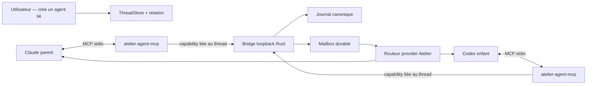

# Plan 057 — Sessions liées cross-provider via Atelier Sessions MCP

## Statut

- **État** : TODO — contrat prêt pour implémentation
- **Priorité** : P1
- **Effort** : XL
- **Backend cible** : Rust uniquement
- **Dépendances** : backend Rust 033, journal canonique/harness 025, providers
  persistants 046/056
- **Périmètre MVP obligatoire** : Claude Code + Codex
- **Périmètre de parité après MVP** : Kimi, Grok et OpenCode lorsque leur
  transport ACP accepte l'injection MCP par session
- **Implémentation recommandée** : worktree dédié; ne pas travailler directement
  dans un checkout contenant des modifications utilisateur non liées

## Verdict architectural

Atelier peut permettre à une nouvelle session Codex d'utiliser le contexte
d'une session Claude **sans copier tout le transcript dans le prompt** et sans
simuler des frappes clavier.

Le bon modèle est :

1. l'utilisateur crée explicitement un agent lié depuis un thread existant;
2. le backend persiste une relation parent/enfant limitée au même projet;
3. chaque session compatible reçoit un MCP `atelier-sessions` en `stdio`;
4. un petit binaire MCP authentifié appelle le backend Rust sur loopback;
5. le backend résout l'identité du caller depuis une capability opaque, jamais
   depuis un `threadId` affirmé par le modèle;
6. le premier tour de l'enfant reçoit une enveloppe déterministe et bornée;
7. le reste du contexte est lu à la demande depuis le journal canonique;
8. les messages inter-agents passent par le routeur sémantique Atelier et une
   mailbox durable, jamais par injection clavier dans un terminal.



Le MCP ne transmet pas la mémoire interne d'un modèle. Il transmet uniquement
des informations observables et autorisées : messages visibles, décisions,
plans, outils résumés, fichiers modifiés, résultats et état des threads.

## Références

- [Unpeel Sessions MCP](https://unpeel.com/docs/sessions-mcp) — inspiration
  produit pour les relations parent/enfant et la coordination de sessions.
- [SDK Rust MCP officiel](https://github.com/modelcontextprotocol/rust-sdk) —
  transport `stdio`, serveur et schémas d'outils. Utiliser une version crates.io
  verrouillée dans `Cargo.lock`, jamais une branche Git flottante.
- `rust/crates/atelier-store/src/threads.rs` — source de vérité des threads.
- `rust/crates/atelier-store/src/journal.rs` — journal canonique et replay.
- `rust/crates/atelier-runtime/src/send.rs` — création/reprise d'un tour.
- `rust/crates/atelier-runtime/src/state.rs` — état partagé et verrou d'écriture
  par projet.
- `rust/crates/atelier-runtime/src/ws_router.rs` — mutations de thread et
  interactions frontend.
- `rust/crates/atelier-providers/src/{claude,codex,kimi,grok,opencode}.rs` —
  points d'injection provider.
- `src/lib/ws.ts` et `src/lib/harnessEvents.ts` — contrat frontend/replay.

## Base Atelier vérifiée le 2026-07-20

### Ce qui existe déjà

- `ThreadStore` persiste `id`, `projectRoot`, `provider`, `sessionId`, `status`,
  les timestamps et préserve les champs inconnus via `extra`.
- `HarnessJournal` fournit un historique append-only, dédupliqué et
  matérialisable par thread.
- Le handoff provider actuel crée un nouveau thread, copie le journal et injecte
  un contexte borné dans le premier prompt.
- Le fork contextuel crée une session provider indépendante et n'associe jamais
  un identifiant natif Claude à Codex ou inversement.
- `AppState` possède déjà le bus multi-client, le catalogue provider, les
  interactions et un verrou empêchant deux agents écrivains de modifier le même
  projet simultanément.
- Claude est lancé en `stream-json`; Codex utilise `codex app-server`; Kimi,
  Grok et OpenCode utilisent ACP.
- Les appels ACP `session/new`, `session/load` ou `session/resume` reçoivent déjà
  un tableau `mcpServers`, actuellement vide.
- Le bundle embarque les binaires Rust à travers
  `scripts/stage-rust-server.sh` et `src-tauri/rust-server-dist/`.

### Écarts à combler

- Aucun thread ne possède encore de relation parent/enfant typée.
- Aucun MCP Atelier commun n'est injecté dans les providers.
- Le backend ne possède pas de capability par thread pour authentifier un agent.
- Le journal ne fournit pas encore une projection de contexte explicitement
  expurgée, paginée et bornée pour un autre agent.
- Le routeur n'a pas de mailbox durable pour les messages inter-agents.
- Le frontend ne permet ni de créer un agent lié, ni de voir/révoquer le lien.
- Le rendu ne distingue pas encore un message utilisateur d'un message reçu
  depuis un autre agent.

## Expérience produit cible

### 1. Reprendre avec un autre provider

Le comportement existant reste disponible : **Reprendre avec Codex** crée un
handoff vers un nouveau thread. Cette action est adaptée quand l'utilisateur
veut remplacer Claude par Codex.

Le plan 057 ne supprime ni ne réécrit ce chemin avant un soak dédié.

### 2. Ajouter un agent lié

Depuis le menu du thread ou son header :

1. l'utilisateur choisit **Ajouter un agent lié…**;
2. il sélectionne le provider, le modèle, l'effort et le mode de permission;
3. Atelier crée un nouveau thread dans le même projet;
4. le nouveau thread affiche une capsule
   `Lié à Claude · contexte accessible`;
5. aucun appel modèle n'est lancé tant que l'utilisateur n'envoie pas un
   premier message;
6. au premier tour, l'enfant reçoit l'enveloppe de contexte et peut lire la
   suite avec `atelier-sessions`.

### 3. Collaborer

Le parent et l'enfant peuvent ensuite :

- inspecter l'état de l'autre;
- lire une projection autorisée de son historique;
- lui envoyer un message structuré;
- attendre une mise à jour sans polling agressif;
- rapporter un résultat au parent.

Tous les échanges sont visibles dans les deux timelines et peuvent déclencher
des appels modèle facturés. La création du lien doit donc afficher clairement
le budget d'auto-livraison.

### 4. Délier

**Délier cet agent** révoque immédiatement les capabilities et l'accès futur.
Chaque thread conserve son propre historique, mais ne peut plus relire ou
écrire dans l'autre.

## Objectifs

1. Permettre le scénario Claude → nouveau Codex lié en trois gestes maximum.
2. Éviter l'injection de centaines de milliers de caractères au premier tour.
3. Préserver les sessions natives propres à chaque provider.
4. Exposer une surface MCP identique et compacte à tous les providers capables.
5. Authentifier le caller sans faire confiance aux arguments générés par le
   modèle.
6. Limiter l'accès aux relations explicitement créées par l'utilisateur.
7. Rendre les messages inter-agents sémantiques, durables, dédupliqués et
   visibles.
8. Respecter le verrou d'écriture par projet et éviter les deadlocks.
9. Révoquer les accès sans redémarrer l'application.
10. Ne jamais modifier les configurations MCP globales de l'utilisateur.

## Non-objectifs

- Partager le raisonnement caché ou l'état interne d'un modèle.
- Donner accès automatiquement à tous les chats du même projet.
- Autoriser un agent à créer des threads, liens, worktrees ou providers.
- Autoriser les écritures entre sessions non liées.
- Exécuter deux agents écrivains en parallèle dans le même checkout.
- Remplacer le handoff existant dans le même changement.
- Implémenter la fonctionnalité dans le fallback Node.
- Ajouter le support des providers API sans MCP/outils.
- Concevoir un protocole distribué entre plusieurs Mac.
- Ajouter le contrôle du bureau ou du terminal.
- Fournir une mémoire vectorielle ou une synthèse générée automatiquement.

## Vocabulaire canonique

- **Thread Atelier** : conversation persistée dans `ThreadStore`.
- **Session native** : identifiant Claude/Codex/ACP conservé dans `sessionId`.
- **Parent** : thread depuis lequel l'utilisateur crée l'agent lié.
- **Enfant** : nouveau thread créé par l'utilisateur sous le parent.
- **Lien** : relation explicite parent/enfant, limitée au même `projectRoot`.
- **Caller** : thread dont le provider a lancé le processus MCP.
- **Capability** : bearer opaque et éphémère liant le processus MCP à un seul
  thread.
- **Enveloppe** : contexte déterministe, borné, injecté au premier tour enfant.
- **Projection** : version expurgée et paginée du journal pour un agent lié.
- **Mailbox** : file durable des messages sémantiques inter-agents.
- **Hop** : livraison automatique d'un message d'un thread vers un autre.

## Invariants de produit et de sécurité

### S1 — Le lien est une action utilisateur

Seul le frontend autorisé peut créer ou supprimer un lien. Le MCP n'expose
aucune action `create_thread`, `create_link`, `relink` ou `create_worktree`.

### S2 — Même projet obligatoire

Parent et enfant doivent avoir le même `projectRoot` canonique. Le backend ne
fait jamais confiance à un chemin fourni par le MCP.

### S3 — Accès par lignée directe uniquement

Un caller peut accéder à son parent direct et à ses enfants directs. Il ne peut
pas accéder aux siblings, ancêtres, descendants indirects ou threads seulement
présents dans le même projet.

### S4 — Identité issue de la capability

`callerThreadId` n'est jamais un argument public faisant autorité. Le backend
résout le caller depuis la capability et vérifie ensuite chaque cible.

### S5 — Aucun master token dans le provider

Le token global du sidecar ne doit jamais être transmis au CLI, au modèle ou au
MCP. Chaque MCP reçoit uniquement une capability propre à son thread.

### S6 — Capability éphémère et révocable

Une capability expire avec le process backend, la suppression du thread, le
déplacement du projet, le retrait du lien ou un changement de session native.

### S7 — Contexte observable seulement

La projection exclut par défaut `thinking`, secrets, réponses d'interactions,
inputs MCP bruts, data URLs, contenu complet des pièces jointes et sorties
d'outils non bornées.

### S8 — Contexte borné

Chaque réponse MCP possède un plafond en entrées, caractères et octets. Toute
troncature est signalée avec un curseur de pagination.

### S9 — Écriture sémantique

Un message inter-agent passe par `handle_send` et le journal Atelier. Il n'est
jamais envoyé comme une séquence de touches au terminal du provider.

### S10 — Un writer par projet

Le plan ne contourne jamais `project_writers`. Deux threads liés dans le même
checkout alternent leurs tours écrivains.

### S11 — Pas d'attente circulaire

Si le caller détient le writer lock et attend un target bloqué derrière ce même
lock, `wait` retourne `would_deadlock` au lieu de bloquer.

### S12 — Idempotence

Toute mutation MCP exige un `requestId`. Répéter le même appel ne crée pas un
deuxième message ni un deuxième tour.

### S13 — Coût visible et borné

Chaque lien possède un budget d'auto-livraison. Une fois le budget atteint, les
messages restent en pause jusqu'à une action utilisateur.

### S14 — Pas de boucle autonome infinie

Une chaîne de messages possède un `traceId`, un `hop` et un plafond. Aucun
message ne peut cibler sa propre source ou faire dépasser la limite.

### S15 — Révocation immédiate

La suppression du lien invalide les capabilities et fait échouer les prochains
appels, même si le provider natif continue de tourner.

### S16 — stdout MCP pur

Le binaire `atelier-agent-mcp` écrit uniquement les frames MCP sur stdout. Les
diagnostics expurgés vont sur stderr.

### S17 — Aucun écrit dans le bundle

Le binaire MCP est posé au build. Les configurations temporaires éventuelles
sont créées sous Application Support avec mode `0600`, jamais dans `.app`.

### S18 — Backend Rust visible

L'UI n'affiche la fonctionnalité que si `/health` confirme le backend Rust et
si le provider annonce l'injection `atelierSessionsMcp: true`.

## Modèle de données

### Relation persistée

Ajouter un champ typé au `Thread` Rust et au type TypeScript :

```ts
type AgentLink = {
  parentThreadId: string;
  role: "collaborator";
  access: "read_write";
  createdAt: string;
  createdBy: "user";
  autoDeliveryLimit: number;
  autoDeliveryUsed: number;
  paused: boolean;
};
```

Le champ vit uniquement sur l'enfant. Les enfants d'un parent sont dérivés par
index `parentThreadId`; aucune seconde liste ne doit diverger.

`handoff` reste inchangé et ne devient pas implicitement un `AgentLink` dans le
MVP.

### État non persistant de capability

```rust
struct AgentCapabilityGrant {
    token_hash: [u8; 32],
    caller_thread_id: String,
    project_root: String,
    provider: String,
    session_id: Option<String>,
    issued_at: Instant,
    expires_at: Instant,
    generation: u64,
}
```

- Le bearer brut existe seulement dans la configuration du subprocess MCP.
- `AppState` conserve uniquement son hash.
- Un restart backend invalide naturellement toutes les grants.
- Une nouvelle ouverture provider régénère une grant.

### Message durable

```ts
type AgentMailboxMessage = {
  id: string;
  requestId: string;
  traceId: string;
  hop: number;
  fromThreadId: string;
  toThreadId: string;
  relation: "parent_to_child" | "child_to_parent";
  kind: "message" | "report";
  text: string;
  structured?: {
    summary?: string;
    details?: string;
    proof?: string[];
    changedPaths?: string[];
    blockers?: string[];
    questions?: string[];
    nextSteps?: string[];
  };
  status: "queued" | "delivering" | "delivered" | "paused" | "failed";
  createdAt: string;
  updatedAt: string;
  errorCode?: string;
};
```

Persister cette file dans un store Rust dédié sous Application Support. Éviter
de placer un tableau mutable dans `Thread.extra`.

### Événement harness

Ajouter `agent_message` aux kinds durables :

```ts
{
  kind: "agent_message";
  messageId: string;
  direction: "sent" | "received";
  peerThreadId: string;
  peerProvider: string;
  peerTitle: string;
  messageKind: "message" | "report";
  text: string;
  status: "queued" | "delivering" | "delivered" | "paused" | "failed";
  meta: HarnessEventMeta;
}
```

La réduction compacte les mises à jour ayant le même `messageId` dans un même
thread au lieu de créer plusieurs cartes.

## Contrat MCP public

Exposer un seul outil `atelier_sessions` afin de limiter le coût en contexte.
L'outil accepte un champ `action`; `help` charge les détails à la demande.

| Action | Effet | Mutation | Cible autorisée |
|---|---|---:|---|
| `help` | Documentation des actions | non | aucune |
| `current` | Identité, parent, enfants, grants et limites | non | caller |
| `list` | Threads directement liés et état compact | non | lignée directe |
| `inspect` | Métadonnées + petite projection récente | non | lignée directe |
| `read_context` | Projection paginée du journal | non | lignée directe |
| `wait` | Attendre status, séquence ou mailbox | non | lignée directe |
| `send_message` | Enqueue un message sémantique | oui | parent/enfant direct |
| `report_to_parent` | Enqueue un rapport structuré | oui | parent direct uniquement |

### Schéma commun

```json
{
  "action": "inspect",
  "targetThreadId": "uuid",
  "requestId": "uuid",
  "afterSequence": 120,
  "beforeSequence": null,
  "limit": 20,
  "includeTools": true,
  "text": null,
  "report": null,
  "timeoutMs": 30000
}
```

Les champs non pertinents pour une action sont refusés; ils ne sont pas ignorés
silencieusement.

### Codes d'erreur stables

- `mcp_disabled`
- `caller_unknown`
- `capability_invalid`
- `capability_expired`
- `thread_not_found`
- `relation_required`
- `cross_project_denied`
- `self_target_denied`
- `link_paused`
- `budget_exhausted`
- `target_running`
- `would_deadlock`
- `queue_full`
- `payload_too_large`
- `provider_mcp_unsupported`
- `backend_unavailable`
- `request_timeout`

Les messages humains peuvent être localisés par l'UI; le modèle reçoit toujours
le code stable.

## Projection de contexte

### Événements inclus par défaut

- `user`
- `text`
- `todos`
- `goal`
- `proposed_plan`
- `edit` avec chemins relatifs et résumé
- `tool_update` avec nom, statut et sortie courte expurgée
- `done` et `error` avec résultat borné
- `agent_message`

### Événements exclus par défaut

- `thinking`
- `permission`
- `interaction` et réponses associées
- inputs complets d'outils/MCP
- sorties brutes de terminal
- data URLs et contenu binaire
- contenu intégral de pièces jointes
- valeurs ressemblant à des secrets ou tokens

### Bornes

- `inspect` : 8 événements maximum, 12 000 caractères maximum.
- `read_context` : 50 événements maximum par page.
- Réponse MCP : 64 Kio utiles maximum.
- Message inter-agent : 32 Kio maximum.
- Rapport structuré : 64 Kio maximum après sérialisation.
- Toute sortie d'outil individuelle : 2 000 caractères maximum.
- Les chemins sont relatifs au projet lorsque possible.

### Pagination

Retourner :

```json
{
  "events": [],
  "firstSequence": 101,
  "lastSequence": 150,
  "hasMoreBefore": true,
  "hasMoreAfter": false,
  "nextBeforeSequence": 101,
  "truncated": false
}
```

Ne jamais reconstruire la pagination depuis l'ordre du tableau frontend; la
séquence canonique du journal fait autorité.

## Enveloppe du premier tour enfant

Au premier `send` réussi d'un enfant lié, `send.rs` préfixe au prompt provider
une enveloppe interne qui n'apparaît pas dans la bulle utilisateur :

```text
[Contexte Atelier — session liée]
Tu es un agent lié à une session parent créée explicitement par l'utilisateur.
Parent : Claude Code — <titre>
Projet : <racine canonique>
État : idle

Extrait déterministe récent :
<derniers événements user/text expurgés et bornés>

Pour davantage de contexte, utilise atelier_sessions avec current, inspect ou
read_context. Ne prétends pas avoir reçu le raisonnement caché du parent.
[Fin du contexte Atelier]
```

Règles :

- maximum 16 000 caractères;
- aucun résumé généré par modèle;
- pas de `thinking`;
- pas de duplication dans le journal utilisateur;
- marquer `agentContextSeededAt` seulement après ouverture réussie de la session
  provider;
- réessayer après un échec d'ouverture;
- ne pas réinjecter à chaque reprise.

## Bridge MCP interne

### Processus

Créer un binaire Rust séparé :

```text
atelier-agent-mcp
```

Il implémente MCP `stdio` avec le SDK Rust officiel et relaie les actions vers
le backend Atelier.

### Variables d'environnement du subprocess MCP

- `ATELIER_MCP_ENDPOINT=http://127.0.0.1:<port>/internal/agent-mcp`
- `ATELIER_MCP_CAPABILITY=<bearer opaque>`
- `ATELIER_MCP_CALLER_LABEL=<provider lisible>` — diagnostic seulement

Ne pas passer le bearer dans les arguments de processus.

### Route backend

Ajouter une route dédiée :

```text
POST /internal/agent-mcp
Header: x-atelier-agent-capability: <bearer>
Body: { action, arguments, requestId }
```

Contraintes :

- accepter uniquement une connexion loopback;
- refuser `Origin` non vide;
- ne pas réutiliser `x-atelier-token`;
- comparer le hash de capability en temps constant;
- corps maximum 256 Kio;
- réponse maximum 128 Kio avant encodage MCP;
- ne jamais journaliser le header, le bearer ou le body complet;
- appliquer un timeout par action;
- exposer cette route uniquement dans `atelier-runtime`, jamais dans la gateway
  mobile distante.

### Cycle de vie

1. `send.rs` demande une grant pour le thread avant ouverture provider.
2. Le provider injecte la commande MCP et son environnement.
3. Le client MCP lance `atelier-agent-mcp` en enfant.
4. Le shim initialise MCP sur stdin/stdout.
5. Chaque call est relayé avec la capability.
6. Suppression, unlink ou restart invalide la grant.
7. Un prochain tour régénère une grant si nécessaire.

## Injection par provider

### P0 obligatoire avant modification structurelle

Construire des sondes sans prompt modèle lorsque possible. Capturer les requêtes
réelles et prouver l'identité par thread.

| Provider | Chemin envisagé | Porte obligatoire |
|---|---|---|
| Claude | `--mcp-config` généré par thread, mode `0600` | le config est chargé sur nouveau tour et resume |
| Codex | override `config.mcp_servers` dans `thread/start`/`thread/resume` | chaque thread lance un MCP avec sa propre env |
| Kimi | `mcpServers` de `session/new`/`session/resume` | ACP conserve la config et appelle l'outil |
| Grok | `mcpServers` de `session/new`/`session/load` | runtime de thread isolé, aucune fuite inter-thread |
| OpenCode | `mcpServers` de `session/new`/`session/load` | config acceptée et reprise exacte |

Si Codex ne permet pas une capability distincte par thread avec son app-server
partagé, **STOP**. Ne pas :

- mettre une capability globale dans `codex app-server`;
- demander au modèle d'envoyer son propre `callerThreadId` comme preuve;
- écrire dans `~/.codex/config.toml`;
- remplacer silencieusement l'app-server partagé par un process Codex par thread.

Une alternative doit alors faire l'objet d'un addendum architectural approuvé.

### Contrat provider commun

Étendre `SendRequest` avec une configuration construite uniquement par le
runtime :

```rust
pub struct AtelierMcpLaunch {
    pub command: PathBuf,
    pub server_name: String,
    pub env: HashMap<String, String>,
}
```

Le frontend ne peut jamais définir `command`, `env`, endpoint ou capability.

Chaque provider expose une capability interne distincte :

```text
atelierSessionsMcp: supported | unsupported | probe_failed
```

`mcpTools` général ne suffit pas à annoncer cette fonctionnalité.

### Configs temporaires

Si Claude exige un fichier :

- répertoire `Application Support/atelier-studio/mcp-configs/` en `0700`;
- nom basé sur le hash du thread, jamais son titre;
- fichier atomique `0600`;
- aucun master token;
- suppression sur delete/unlink;
- nettoyage au boot des configs orphelins;
- aucune écriture dans le bundle.

## Mailbox et ordonnancement

### Pourquoi une mailbox est obligatoire

Le caller exécute l'outil MCP pendant son propre tour. S'il détient le verrou
d'écriture du projet, démarrer immédiatement le target dans le même checkout
créerait un conflit ou un deadlock.

`send_message` doit donc :

1. valider et persister le message;
2. écrire les événements `agent_message` source et cible;
3. retourner `queued` au caller;
4. laisser le scheduler livrer le message lorsque le writer lock est libre.

### Livraison

Le scheduler :

- recharge les messages `queued` au boot;
- refuse de livrer si le lien n'existe plus;
- attend que le target soit idle et sans interaction bloquante;
- construit provider, modèle, effort, permission et cwd depuis le thread cible;
- appelle `handle_send` avec `origin: agent_link`;
- utilise `clientMessageId = agent:<messageId>` pour la déduplication;
- ne produit pas une deuxième bulle `user`;
- met à jour `agent_message` vers `delivered` ou `failed`;
- relance le drain après la fin d'un tour et après libération du writer lock.

### Prompt livré au provider

```text
[Message d'un agent Atelier lié]
Source : Claude Code — <titre>
Relation : parent
Message :
<texte expurgé et borné>
[Fin du message lié]
```

### Budget et anti-boucle

- limite par défaut : 8 auto-livraisons par lien;
- maximum configurable dans le dialogue : 1 à 20;
- hop maximum : 4;
- queue maximum : 100 messages par lien;
- un report ne peut pas répondre automatiquement à un report si le budget est
  épuisé;
- le scheduler ne réessaie pas une erreur non retryable;
- après trois erreurs retryable, statut `paused` et intervention utilisateur.

### `wait`

`wait` écoute le bus backend et retourne lors d'un changement de status,
sequence ou mailbox.

- timeout par défaut : 30 s;
- maximum : 60 s;
- annulation MCP propagée;
- aucun polling inférieur à 500 ms;
- détection `would_deadlock` avant attente.

## Mutations de threads

### Création

Ajouter un message WS :

```ts
{
  type: "createLinkedThread";
  sourceThreadId: string;
  targetThreadId: string;
  targetProvider: string;
  model?: string;
  effort?: string;
  permissionMode?: string;
  autoDeliveryLimit: number;
}
```

Le backend valide :

- source existante et idle;
- target inexistante;
- provider installé et compatible MCP;
- projectRoot absolu et identique;
- aucune interaction source en attente;
- limite d'enfants raisonnable, initialement 8;
- aucun identifiant natif copié.

### Unlink

Ajouter :

```ts
{ type: "unlinkThread", threadId: string }
```

Effets atomiques :

- supprimer `agentLink` de l'enfant;
- révoquer les grants parent/enfant;
- passer les messages queued à `failed: relation_required`;
- conserver les deux historiques;
- broadcaster la nouvelle liste.

### Move

Refuser `moveThread` lorsque le thread est parent ou enfant d'un lien actif.
Message : délier avant de déplacer. Ne pas déplacer silencieusement un arbre.

### Delete

- supprimer un enfant : révoquer grants et mailbox associée;
- supprimer un parent : détacher ses enfants, révoquer les accès et marquer les
  messages queued en échec;
- ne jamais supprimer automatiquement les enfants.

### Fork et handoff

- un fork ordinaire ne copie pas `agentLink`;
- un handoff ne copie pas `agentLink`;
- `copy_thread` continue de ne copier que le journal demandé;
- une relation doit toujours être recréée explicitement par l'utilisateur.

## Interface utilisateur

### Menu du thread

Ajouter après les actions de reprise/fork :

- **Ajouter un agent lié…**
- **Voir le parent** / **Voir les agents liés**
- **Délier cet agent**

L'action est désactivée avec raison visible lorsque :

- backend Node;
- thread en cours;
- interaction en attente;
- projet absent;
- aucun provider compatible disponible;
- limite d'enfants atteinte.

### Dialogue de création

Réutiliser les primitives existantes :

- provider;
- modèle;
- effort;
- permissions;
- budget d'échanges automatiques;
- avertissement de coût;
- résumé des droits : parent/enfant uniquement, même projet.

Ne créer une nouvelle primitive shadcn que si nécessaire; dans ce cas suivre le
workflow shadcn du dépôt avant toute modification.

### Header et timeline

- Capsule cliquable `Lié à Claude` dans le header.
- État `actif`, `en pause`, `budget atteint` ou `source supprimée`.
- Carte `agent_message` avec provider source, direction, statut et lien vers le
  thread pair.
- Les messages inter-agents ne doivent jamais adopter le style d'une bulle
  utilisateur.
- Les statuts live et replay doivent produire le même rendu.

### Sidebar

Afficher les enfants directement sous leur parent lorsque les deux sont dans le
modèle visible. Un léger trait/indentation suffit; ne transformer pas toute la
sidebar en explorateur récursif dans ce plan.

### Accessibilité et i18n

- navigation clavier du dialogue;
- retour focus après fermeture;
- labels de relation non dépendants de la couleur;
- annonces `aria-live` pour création, pause et unlink;
- clés françaises et anglaises dans `src/lib/i18n.ts`;
- aucune chaîne métier codée en dur dans les composants.

## Packaging

### Nouveau crate

Créer :

```text
rust/crates/atelier-agent-mcp/
  Cargo.toml
  src/main.rs
  src/server.rs
  src/bridge.rs
  src/schema.rs
```

Ajouter le crate au workspace `rust/Cargo.toml`.

### Staging

Mettre à jour `scripts/stage-rust-server.sh` :

- builder `atelier-agent-mcp` en release;
- l'ajouter à `BIN_NAMES`;
- le copier dans `src-tauri/rust-server-dist/`;
- lui appliquer le bit exécutable au build;
- l'inclure dans `BUILD_STAMP.txt`;
- vérifier sa présence avant de terminer.

La ressource Tauri `rust-server-dist -> rust-server` couvre déjà le répertoire;
ne pas ajouter un deuxième emplacement de bundle.

## Fichiers prévus

### Rust — nouveaux

- `rust/crates/atelier-agent-mcp/Cargo.toml`
- `rust/crates/atelier-agent-mcp/src/main.rs`
- `rust/crates/atelier-agent-mcp/src/server.rs`
- `rust/crates/atelier-agent-mcp/src/bridge.rs`
- `rust/crates/atelier-agent-mcp/src/schema.rs`
- `rust/crates/atelier-runtime/src/agent_mcp.rs`
- `rust/crates/atelier-runtime/src/agent_links.rs`
- `rust/crates/atelier-runtime/src/agent_mailbox.rs`
- `rust/crates/atelier-store/src/agent_mailbox.rs`

### Rust — modifications

- `rust/Cargo.toml`
- `rust/Cargo.lock`
- `rust/crates/atelier-protocol/src/lib.rs`
- `rust/crates/atelier-store/src/lib.rs`
- `rust/crates/atelier-store/src/threads.rs`
- `rust/crates/atelier-store/src/journal.rs`
- `rust/crates/atelier-harness/src/kinds.rs`
- `rust/crates/atelier-runtime/src/lib.rs`
- `rust/crates/atelier-runtime/src/state.rs`
- `rust/crates/atelier-runtime/src/server.rs`
- `rust/crates/atelier-runtime/src/send.rs`
- `rust/crates/atelier-runtime/src/ws_router.rs`
- `rust/crates/atelier-providers/src/traits.rs`
- `rust/crates/atelier-providers/src/registry.rs`
- `rust/crates/atelier-providers/src/claude.rs`
- `rust/crates/atelier-providers/src/codex.rs`
- `rust/crates/atelier-providers/src/codex_rpc.rs`
- `rust/crates/atelier-providers/src/kimi.rs`
- `rust/crates/atelier-providers/src/grok.rs`
- `rust/crates/atelier-providers/src/opencode.rs`

### Frontend — nouveaux possibles

- `src/components/linked-agents/LinkedAgentDialog.tsx`
- `src/components/linked-agents/LinkedAgentCapsule.tsx`
- `src/components/chat/AgentMessageCard.tsx`
- tests colocalisés correspondants

### Frontend — modifications

- `src/lib/ws.ts`
- `src/lib/providers.ts`
- `src/lib/settings.ts`
- `src/lib/harnessEvents.ts`
- `src/lib/i18n.ts`
- `src/App.tsx`
- `src/components/Sidebar.tsx`
- `src/components/sidebar/ThreadRow.tsx`
- header de chat réellement utilisé dans la branche au moment de
  l'implémentation
- `src/components/chat/ChatTimeline.tsx`
- `src/App.css`

### Packaging, docs et parité

- `scripts/stage-rust-server.sh`
- `src-tauri/rust-server-dist/README.md`
- `plans/README.md`
- `docs/PIEGES_CONNUS.md` si un nouveau piège de lifecycle est découvert
- `sidecar/router.mjs` uniquement pour un refus explicite
  `feature_requires_rust_backend` si la matrice de parité l'exige

## Plan d'exécution

### P0 — Preflight et sondes provider

1. Travailler dans un worktree dédié.
2. Capturer `git status --short` et `git worktree list --porcelain`.
3. Ne pas écraser les modifications locales existantes.
4. Vérifier les versions réelles de Claude, Codex, Kimi, Grok et OpenCode.
5. Prouver l'injection d'un MCP factice par thread sans prompt modèle lorsque
   le protocole le permet.
6. Prouver surtout que deux threads Codex du même app-server peuvent recevoir
   deux environments/capabilities distincts.
7. Documenter les requêtes JSON-RPC/ACP exactes dans des fixtures expurgées.
8. Décider la version crates.io du SDK Rust MCP et la verrouiller.

**Porte P0** : Claude et Codex doivent tous deux lancer un MCP distinct lié au
bon thread. Sinon STOP.

### P1 — Types et relation persistée

1. Ajouter `AgentLink` au protocole Rust et TypeScript.
2. Ajouter un champ typé à `Thread` tout en lisant les anciens JSON.
3. Construire l'index parent → enfants à la lecture du store.
4. Valider same-project, source idle et target inexistant.
5. Implémenter `createLinkedThread` et `unlinkThread`.
6. Durcir move/delete/fork/handoff.
7. Ajouter les tests de migration et de cycles.

**Porte P1** : restart du store, unlink, delete et move ne produisent aucun lien
orphelin exploitable.

### P2 — Capability et bridge interne

1. Ajouter le registre éphémère de grants dans `AppState`.
2. Générer des bearers cryptographiquement aléatoires.
3. Stocker uniquement leur hash.
4. Ajouter la route loopback interne et ses limites.
5. Implémenter les contrôles lignée/projet/caller.
6. Ajouter la révocation et le nettoyage.
7. Écrire les tests auth, scope, timeout et taille.

**Porte P2** : un token global, un faux caller ID ou un thread sibling ne peut
jamais lire une projection.

### P3 — Binaire MCP read-only

1. Créer `atelier-agent-mcp` avec `rmcp`.
2. Exposer un seul outil `atelier_sessions`.
3. Implémenter `help`, `current`, `list`, `inspect`, `read_context`, `wait`.
4. Garder stdout strictement protocolaire.
5. Propager cancellation et erreurs stables.
6. Ajouter un test subprocess MCP complet : initialize, tools/list, tools/call,
   shutdown.

**Porte P3** : le binaire fonctionne depuis le chemin stagé, pas seulement
depuis `cargo run`.

### P4 — Projection et enveloppe initiale

1. Ajouter la projection expurgée du journal.
2. Ajouter pagination et caps.
3. Construire l'enveloppe déterministe.
4. Injecter seulement au premier tour réussi d'un enfant.
5. Ne pas modifier la bulle utilisateur.
6. Tester secrets, data URL, thinking, gros outils et journal vide.

**Porte P4** : un enfant reçoit assez de contexte pour identifier l'objectif et
les derniers choix, sans recevoir le thinking ni un transcript illimité.

### P5 — Injection Claude et Codex

1. Étendre `SendRequest` avec `AtelierMcpLaunch` construit par le runtime.
2. Injecter le MCP dans Claude sans configuration globale.
3. Injecter une capability distincte dans chaque thread Codex.
4. Conserver resume, modèles, effort, permissions et steering.
5. Nettoyer configs/process MCP sur stop/delete/unlink.
6. Ajouter fixtures et tests de non-régression provider.

**Porte P5** : deux threads simultanés ne partagent jamais leur capability et
les tours sans lien ne voient pas `atelier-sessions`.

### P6 — UX de création et lecture

1. Ajouter les actions menu/header.
2. Ajouter le dialogue provider/modèle/effort/budget.
3. Créer le thread uniquement après validation backend.
4. Afficher capsule, relation sidebar et navigation parent/enfant.
5. Ajouter pause/unlink et erreurs explicites.
6. Ajouter i18n et a11y.

**Porte P6** : le scénario Claude → Ajouter Codex lié → premier prompt est
compréhensible sans documentation externe.

### P7 — Mailbox durable

1. Créer le store mailbox et son replay au boot.
2. Ajouter idempotence par `requestId`.
3. Ajouter `agent_message` aux événements durables.
4. Ajouter `send_message` et `report_to_parent` au MCP.
5. Implémenter caps, budget, hop et queue.
6. Ajouter les cartes timeline et leur compactage.

**Porte P7** : répéter un appel MCP ou redémarrer le backend ne livre jamais
deux fois le même message.

### P8 — Scheduler et concurrence

1. Livrer seulement lorsque target et writer lock le permettent.
2. Relancer le drain à la fin d'un tour.
3. Détecter `would_deadlock`.
4. Mettre en pause après budget ou erreurs.
5. Garantir un seul writer par checkout.
6. Tester deux agents liés qui alternent leurs tours.

**Porte P8** : aucune exécution parallèle écrivaine dans le même projet et
aucune attente infinie.

### P9 — Parité ACP

1. Injecter le même `AtelierMcpLaunch` dans Kimi.
2. Injecter dans Grok sans casser son runtime par thread.
3. Injecter dans OpenCode.
4. Conserver load/resume et historique.
5. N'annoncer le support qu'après test réel.
6. Laisser les providers non compatibles sans outil et sans faux succès.

**Porte P9** : matrice provider explicite, tests ACP verts, aucune fuite de grant
entre sessions.

### P10 — Hardening et observabilité

1. Ajouter métriques sans contenu : calls, latence, refus, queue, budget.
2. Ajouter nettoyage configs/grants/mailbox orphelins.
3. Tester payloads adversariaux et tool output volumineux.
4. Tester unlink/delete pendant read/wait/send.
5. Tester crash backend et restart provider.
6. Vérifier qu'aucun token n'apparaît dans logs, events, ps args ou exports.

### P11 — Validation complète et visible

1. Exécuter toute la matrice automatisée.
2. Builder le `.app` du bon worktree selon `AGENTS.md`.
3. Vérifier le binaire MCP embarqué et exécutable.
4. Relancer l'app du worktree.
5. Confirmer PID, chemin du bundle et `/health` Rust.
6. Créer une session Claude de test dans un projet temporaire.
7. Créer un Codex lié depuis l'UI.
8. Vérifier visuellement la capsule et la relation sidebar.
9. Demander à Codex d'identifier une décision du thread Claude via MCP.
10. Envoyer un report au parent et vérifier les deux timelines.
11. Délier et prouver que l'appel suivant est refusé.
12. Vérifier qu'un thread unrelated du même projet reste inaccessible.

## Stratégie de tests

### Store et protocole

- migration d'un ancien `threads.json` sans `agentLink`;
- persistance d'un lien;
- index parent/enfants;
- source/target invalides;
- same-project;
- move refusé;
- delete parent détache sans supprimer enfant;
- fork/handoff n'héritent pas du lien;
- mailbox append/reload/idempotence.

### Capability et bridge

- bearer absent, incorrect, expiré ou révoqué;
- caller supprimé;
- target sibling;
- target autre projet;
- self target;
- payload trop gros;
- body malformé;
- Origin non vide;
- appel non-loopback dans un test de router;
- timeout et cancellation;
- absence de token dans logs.

### Projection

- ordre par `meta.sequence`;
- pagination stable;
- troncature explicite;
- thinking absent;
- interaction/permission absent;
- tool inputs secrets absents;
- chemins relatifs;
- gros outputs bornés;
- data URLs retirées;
- journal vide.

### MCP subprocess

- initialize/initialized;
- une seule définition d'outil;
- `help`;
- validation stricte par action;
- erreurs structurées;
- stdout sans logs;
- bridge indisponible;
- SIGTERM/shutdown propre;
- cancellation d'un `wait`.

### Providers

- Claude args/config et permissions `0600`;
- Claude resume conserve le MCP;
- Codex `thread/start` et `thread/resume` reçoivent une grant distincte;
- Codex steer/interrupt inchangés;
- Kimi/Grok/OpenCode ACP reçoivent `mcpServers` seulement si le thread est lié;
- providers API ne revendiquent pas le support;
- arrêt provider détruit les grants actives.

### Runtime et scheduler

- first-turn envelope une seule fois;
- échec d'ouverture ne marque pas seeded;
- send_message queued pendant writer lock;
- drain après done;
- idempotence clientMessageId;
- budget atteint;
- hop atteint;
- queue pleine;
- target supprimé ou unlinked;
- deadlock détecté;
- restart recharge queued sans double livraison.

### Frontend

- action désactivée avec raison;
- dialogue clavier et retour focus;
- provider picker filtré;
- création optimiste interdite avant ack;
- capsule parent/enfant;
- navigation vers pair;
- carte sent/received et statuts;
- unlink;
- live/replay identiques;
- erreurs backend localisées;
- backend Node masque la feature.

## Commandes de vérification

Avant validation native :

```bash
cargo fmt --manifest-path rust/Cargo.toml --all -- --check
cargo test --manifest-path rust/Cargo.toml --locked
cargo clippy --manifest-path rust/Cargo.toml --workspace --all-targets -- -D warnings
npx tsc --noEmit
npx vite build
(cd sidecar && npx vitest run)
bash scripts/stage-rust-server.sh
test -x src-tauri/rust-server-dist/atelier-agent-mcp
```

Ajouter des commandes ciblées pour le nouveau crate et les tests frontend avant
la suite complète.

La validation finale suit ensuite **exactement** le protocole de `AGENTS.md` :
kill exhaustif, `npm run tauri:build:app`, vérification du log, lancement du
bundle du bon worktree, PID `tauri-app` et chemin du binaire. Aucun DMG.

## Observabilité minimale

Ajouter des compteurs/états sans contenu :

- `agent_mcp_calls_total{action,result}`
- `agent_mcp_call_duration_ms`
- `agent_mcp_active_grants`
- `agent_links_active`
- `agent_mailbox_queued`
- `agent_mailbox_paused`
- `agent_messages_delivered_total`
- `agent_messages_failed_total{code}`
- `agent_context_bytes`
- `agent_context_truncated_total`
- `agent_deadlock_prevented_total`

`/health` peut exposer un bloc agrégé, jamais les IDs, titres, textes ou tokens.

## Conditions STOP

Arrêter l'implémentation et demander une décision si :

1. Codex ne peut pas recevoir une capability distincte par thread avec
   l'app-server actuel.
2. Un provider exige une modification globale de `~/.codex`, `~/.claude` ou
   d'une autre configuration utilisateur.
3. Le master token du sidecar devrait être exposé au provider.
4. La feature nécessiterait de contourner `project_writers`.
5. Un thread unrelated peut lire ou écrire après les contrôles backend.
6. L'injection MCP casse resume, steering, permissions ou interactions natives.
7. Le binaire MCP n'est fonctionnel que hors bundle.
8. Le fallback Node est sélectionné et l'UI propose tout de même la feature.
9. Les modifications locales du checkout se chevauchent avec les fichiers
   requis et ne peuvent être préservées proprement.
10. Une validation réelle nécessiterait de lancer des agents payants sans
    consentement explicite.

## Critères de complétion

- [ ] `atelier-agent-mcp` est un binaire Rust embarqué, signé avec l'app et
  fonctionnel en `stdio`.
- [ ] Un seul outil `atelier_sessions` est exposé.
- [ ] Le caller est authentifié par une capability propre au thread.
- [ ] Aucun master token n'est transmis à un provider.
- [ ] Seuls parent et enfants directs sont visibles.
- [ ] Les threads du même projet mais non liés restent inaccessibles.
- [ ] Claude peut recevoir et appeler le MCP.
- [ ] Codex peut recevoir une capability distincte par thread et appeler le MCP.
- [ ] Une session Codex liée reçoit l'enveloppe Claude une seule fois.
- [ ] Codex peut paginer le contexte Claude sans transcript géant.
- [ ] Thinking, secrets et interactions privées sont exclus.
- [ ] Les messages inter-agents sont sémantiques, visibles et durables.
- [ ] `requestId` empêche les doubles livraisons.
- [ ] Le writer lock par projet est toujours respecté.
- [ ] Les deadlocks sont détectés.
- [ ] Le budget et le hop limitent les boucles autonomes.
- [ ] Unlink révoque immédiatement lecture et écriture.
- [ ] Delete/move/fork/handoff ne produisent aucun lien exploitable orphelin.
- [ ] Kimi/Grok/OpenCode n'annoncent le support qu'après preuve.
- [ ] Le fallback Node ne produit aucun faux succès.
- [ ] Live et replay rendent les mêmes cartes agent_message.
- [ ] Les tests Rust, frontend et sidecar sont verts.
- [ ] Le binaire stagé est identique à celui construit.
- [ ] L'app du bon worktree est buildée et relancée selon `AGENTS.md`.
- [ ] `/health` confirme le backend Rust.
- [ ] La preuve visible Claude → Codex → report → unlink est capturée.

## Ordre recommandé des commits

1. `feat(protocol): add linked-agent relation and capability contracts`
2. `feat(runtime): add scoped agent MCP bridge and context projection`
3. `feat(mcp): add packaged atelier-agent-mcp stdio server`
4. `feat(providers): inject scoped sessions MCP into Claude and Codex`
5. `feat(ui): create and inspect linked agent sessions`
6. `feat(runtime): add durable inter-agent mailbox and scheduler`
7. `feat(ui): render linked-agent messages and controls`
8. `feat(providers): extend linked sessions MCP to ACP providers`
9. `test(linked-agents): harden auth lifecycle replay and packaging`

Chaque commit doit rester réversible. Ne pas mélanger le nouveau MCP avec une
refonte générale de `App.tsx`, des providers ou de la sidebar.

## Handoff d'implémentation pour Grok

Avant de modifier le code, Grok doit :

1. lire `AGENTS.md` intégralement;
2. lire ce plan intégralement;
3. confirmer le worktree et le statut Git;
4. exécuter P0 et produire les preuves d'injection Claude/Codex;
5. s'arrêter si la porte Codex échoue;
6. implémenter porte par porte, avec tests visibles après chaque phase;
7. ne pas fusionner, pousser, supprimer de branches ou écraser les changements
   d'un autre agent;
8. laisser un résumé final indiquant commits, fichiers, tests, limites et chemin
   exact du `.app` validé.

## Contrat de vérification ultérieure par Codex

La revue ne doit pas se limiter au diff. Elle doit contrôler :

1. les preuves P0 et la séparation réelle des capabilities Codex;
2. les contrôles d'autorisation backend, avec tests adversariaux;
3. la projection et l'absence de contenu interdit;
4. l'idempotence mailbox et le respect du writer lock;
5. le packaging réel du binaire MCP;
6. la parité live/replay;
7. l'expérience visible dans l'app du bon worktree;
8. le statut Git final et l'absence de modifications utilisateur écrasées.

Le verdict final doit séparer clairement : **implémenté**, **testé en fixture**,
**validé avec providers réels**, **validé visuellement**, et **reste à faire**.

